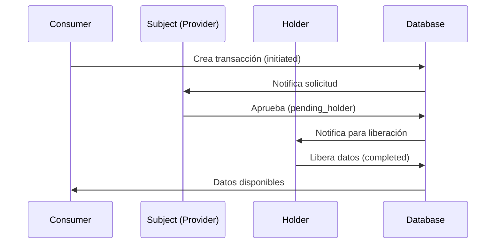

# PROCUREDATA - Documento de Contexto Maestro

> **Versión**: 2.5  
> **Última actualización**: 2026-01-05  
> **Propósito**: Fuente de verdad para agentes de IA y desarrolladores

---

## 1. Resumen Ejecutivo del Proyecto

### ¿Qué es PROCUREDATA?

**PROCUREDATA** es la primera plataforma de orquestación de datos diseñada para la **Economía Descentralizada**. A diferencia de los Data Lakes tradicionales, no almacenamos datos; gestionamos **acuerdos soberanos** entre quienes tienen los datos y quienes los necesitan.

### Problema que Resuelve

El intercambio de datos B2B es actualmente:
- **Lento**: Meses de negociación legal
- **Inseguro**: Sin garantías de cumplimiento
- **Manual**: Emails, PDFs, firmas físicas

PROCUREDATA lo transforma en un **Marketplace Transaccional** instantáneo con:
- Gobernanza automática (ODRL 2.0)
- Seguridad financiera integrada
- Calidad técnica garantizada

### Modelo de Negocio: El Triángulo de Confianza


| Rol | Descripción | Ejemplo |
|-----|-------------|---------|
| **Provider** | Dueño intelectual del dato. Define precio y reglas ODRL | Iberdrola Data Hub |
| **Data Holder** | Infraestructura técnica que almacena y sirve los datos | AWS S3, Azure |
| **Consumer** | Adquirente que paga y usa el dato bajo licencia | NovaTech Solutions |

### Estado Actual

- **Production-Ready** ✅
- Auditoría de seguridad completada: 2025-11-30
- Modo Demo funcional con datos sintéticos

---

## 2. Tech Stack Completo

### Frontend

| Tecnología | Versión | Propósito |
|------------|---------|-----------|
| React | 18.3.1 | Framework UI |
| Vite | - | Build tool |
| TypeScript | - | Tipado estático |
| Tailwind CSS | - | Estilos utility-first |
| Framer Motion | 12.23.24 | Animaciones |

### Componentes UI

| Librería | Cantidad | Notas |
|----------|----------|-------|
| Shadcn/UI | 49 componentes | En `/src/components/ui/` |
| Lucide React | 0.462.0 | Iconografía |
| Recharts | 2.15.4 | Gráficos |

### Estado y Data Fetching

| Tecnología | Propósito |
|------------|-----------|
| TanStack Query v5 | Cache y fetching |
| React Context | Estado global (Auth, Org) |
| React Hook Form | Formularios |
| Zod | Validación de esquemas |

### Backend (Supabase/Lovable Cloud)

| Servicio | Uso |
|----------|-----|
| PostgreSQL | Base de datos principal |
| Supabase Auth | Autenticación |
| Edge Functions | Lógica serverless |
| RLS (Row Level Security) | Seguridad multi-tenant |

### Utilidades

| Librería | Propósito |
|----------|-----------|
| date-fns | Manejo de fechas |
| jsPDF | Generación de PDFs |
| React Joyride | Tours guiados |
| Sonner | Notificaciones toast |

---

## 3. Estructura de Directorios

```
procuredata/
├── docs/                     # Documentación técnica
│   └── ContextDocument.md    # Este archivo
│
├── src/
│   ├── components/           # 35+ componentes custom
│   │   ├── ui/               # 49 componentes Shadcn/UI (NO EDITAR)
│   │   ├── AppLayout.tsx     # Layout principal con Sidebar
│   │   ├── AppSidebar.tsx    # Navegación lateral
│   │   ├── AIConcierge.tsx   # Asistente IA flotante
│   │   ├── WalletButton.tsx  # Gestión de billetera
│   │   ├── OrganizationSwitcher.tsx  # Multi-tenancy
│   │   ├── ProtectedRoute.tsx # Guard de autenticación
│   │   ├── DataLineage.tsx   # Visualización de linaje
│   │   ├── NegotiationChat.tsx # Chat en tiempo real
│   │   ├── PaymentGateway.tsx # Modal de pago
│   │   ├── SmartContractViewer.tsx # Visor ODRL
│   │   ├── CodeIntegrationModal.tsx # Snippets API
│   │   ├── DemoTour.tsx      # Onboarding guiado
│   │   ├── DemoBanner.tsx    # Banner modo demo
│   │   ├── NotificationsBell.tsx # Campana notificaciones
│   │   ├── ThemeToggle.tsx   # Cambio tema claro/oscuro
│   │   └── ...
│   │
│   ├── pages/                # 26 páginas de la aplicación
│   │   ├── Landing.tsx       # Página principal pública
│   │   ├── Auth.tsx          # Login/Registro
│   │   ├── Dashboard.tsx     # Centro de mando
│   │   ├── Catalog.tsx       # Marketplace
│   │   ├── ProductDetail.tsx # Detalle de producto
│   │   ├── Requests.tsx      # Lista de transacciones
│   │   ├── RequestWizard.tsx # Wizard de solicitud
│   │   ├── Data.tsx          # Datos comprados
│   │   ├── DataView.tsx      # Visualización + Export
│   │   ├── Opportunities.tsx # Demandas de datos
│   │   ├── InnovationLab.tsx # Herramientas IA
│   │   ├── Sustainability.tsx # Panel ESG
│   │   ├── Services.tsx      # Servicios de valor
│   │   ├── SellerAnalytics.tsx # Analytics vendedores
│   │   ├── Reports.tsx       # Informes
│   │   ├── Notifications.tsx # Centro notificaciones
│   │   ├── Settings.tsx      # Configuración general
│   │   ├── SettingsOrganization.tsx # Config org
│   │   ├── SettingsPreferences.tsx # Preferencias
│   │   ├── ERPConfig.tsx     # Integraciones ERP
│   │   ├── WebhookSettings.tsx # Webhooks
│   │   ├── AuditLogs.tsx     # Logs de auditoría
│   │   ├── Guide.tsx         # Documentación
│   │   ├── Architecture.tsx  # Info técnica
│   │   └── NotFound.tsx      # 404
│   │
│   ├── hooks/                # 6 hooks personalizados
│   │   ├── useAuth.tsx       # Autenticación Supabase
│   │   ├── useOrganizationContext.tsx # Contexto multi-tenant
│   │   ├── useNotifications.tsx # Sistema notificaciones
│   │   ├── useOrgSector.tsx  # Sector de organización
│   │   ├── use-mobile.tsx    # Detección mobile
│   │   └── use-toast.ts      # Hook para toasts
│   │
│   ├── integrations/
│   │   └── supabase/
│   │       ├── client.ts     # Cliente Supabase (NO EDITAR)
│   │       └── types.ts      # Tipos auto-generados (NO EDITAR)
│   │
│   ├── types/
│   │   └── database.extensions.ts # Extensiones TypeScript
│   │
│   ├── utils/
│   │   └── pdfGenerator.ts   # Generación PDFs
│   │
│   ├── lib/
│   │   └── utils.ts          # Función cn() para clases
│   │
│   ├── App.tsx               # Componente raíz + Routes
│   ├── main.tsx              # Entry point
│   └── index.css             # Variables CSS globales
│
├── supabase/
│   ├── functions/            # 3 Edge Functions
│   │   ├── erp-api-tester/   # Test conexión ERP
│   │   ├── erp-data-uploader/ # Envío datos a ERP
│   │   └── notification-handler/ # Emails Resend
│   │
│   ├── migrations/           # Migraciones SQL (NO EDITAR)
│   └── config.toml           # Configuración (NO EDITAR)
│
├── public/                   # Assets estáticos
├── .env                      # Variables de entorno (NO EDITAR)
└── tailwind.config.ts        # Configuración Tailwind
```

---

## 4. Arquitectura y Lógica de Negocio

### 4.1 Flujo de Datos Principal



### 4.2 Máquina de Estados de Transacciones


### 4.3 Gestión de Estado

#### AuthProvider (`src/hooks/useAuth.tsx`)
```typescript
// Proporciona:
- user: User | null        // Usuario actual
- signIn(email, password)  // Login
- signUp(email, password)  // Registro
- signOut()                // Logout
```

#### OrganizationProvider (`src/hooks/useOrganizationContext.tsx`)
```typescript
// Proporciona:
- currentOrganization: Organization | null  // Org activa
- userOrganizations: Organization[]         // Orgs del usuario
- setCurrentOrganization(org)               // Cambiar contexto
- refreshOrganizations()                    // Recargar lista
```

### 4.4 Seguridad

#### Row Level Security (RLS)
Todas las tablas tienen políticas RLS activas que garantizan:
- **Aislamiento multi-tenant**: Usuarios solo ven datos de sus organizaciones
- **Control por rol**: Acciones limitadas según `app_role`

#### Funciones de Seguridad
```sql
-- Verificar rol de usuario
has_role(_user_id, _organization_id, _role) → boolean

-- Obtener organización del usuario
get_user_organization(_user_id) → uuid
```

#### Protección de Rutas
```tsx
// src/components/ProtectedRoute.tsx
<ProtectedRoute>
  <AppLayout />  {/* Solo usuarios autenticados */}
</ProtectedRoute>
```

---

## 5. Base de Datos (Supabase)

### 5.1 Diagrama Entidad-Relación


### 5.2 Tablas Principales

#### Organizaciones y Usuarios

| Tabla | Columnas Clave | Descripción |
|-------|----------------|-------------|
| `organizations` | id, name, type, sector, kyb_verified | Empresas del sistema |
| `user_profiles` | user_id, organization_id, full_name | Perfiles de usuario |
| `user_roles` | user_id, organization_id, role | Roles por organización |

#### Catálogo de Datos

| Tabla | Columnas Clave | Descripción |
|-------|----------------|-------------|
| `data_products` | id, name, category, schema_definition | Plantillas de productos |
| `data_assets` | id, product_id, holder_org_id, price | Activos disponibles |
| `catalog_metadata` | asset_id, tags, categories, visibility | Metadatos de catálogo |

#### Transacciones

| Tabla | Columnas Clave | Descripción |
|-------|----------------|-------------|
| `data_transactions` | id, asset_id, consumer_org_id, subject_org_id, holder_org_id, status | Transacciones |
| `approval_history` | transaction_id, actor_org_id, action, notes | Historial de aprobaciones |
| `data_policies` | transaction_id, odrl_policy_json | Smart Contracts ODRL |
| `data_payloads` | transaction_id, schema_type, data_content | Contenido de datos |
| `transaction_messages` | transaction_id, sender_org_id, content | Chat de negociación |

#### Finanzas

| Tabla | Columnas Clave | Descripción |
|-------|----------------|-------------|
| `wallets` | organization_id, balance, currency, address | Billeteras |
| `wallet_transactions` | from_wallet_id, to_wallet_id, amount, type | Movimientos |

#### Otros

| Tabla | Descripción |
|-------|-------------|
| `audit_logs` | Trazabilidad de acciones |
| `esg_reports` | Reportes de sostenibilidad |
| `marketplace_opportunities` | Demandas de datos |
| `erp_configurations` | Integraciones ERP |
| `supplier_data` | Datos estructurados de proveedores |
| `value_services` | Servicios adicionales |
| `organization_reviews` | Reseñas entre organizaciones |

### 5.3 Enums

```typescript
type organization_type = 'consumer' | 'provider' | 'data_holder';

type transaction_status = 
  | 'initiated'      // Creada por consumer
  | 'pending_subject' // Esperando provider
  | 'pending_holder'  // Esperando holder
  | 'approved'        // Lista para entrega
  | 'denied_subject'  // Rechazada por provider
  | 'denied_holder'   // Rechazada por holder
  | 'completed'       // Datos entregados
  | 'cancelled';      // Cancelada

type app_role = 'admin' | 'approver' | 'viewer' | 'api_configurator';

type approval_action = 'pre_approve' | 'approve' | 'deny' | 'cancel';
```

### 5.4 Vistas

```sql
-- marketplace_listings: Vista unificada del marketplace
-- Combina data_assets + data_products + organizations + esg_reports
```

---

## 6. Catálogo de Componentes

### 6.1 Componentes de Layout

| Componente | Ubicación | Propósito |
|------------|-----------|-----------|
| `AppLayout` | `/components/AppLayout.tsx` | Layout principal con Sidebar, Header, Outlet |
| `AppSidebar` | `/components/AppSidebar.tsx` | Navegación lateral colapsable |
| `DynamicBreadcrumbs` | `/components/DynamicBreadcrumbs.tsx` | Breadcrumbs automáticos |

### 6.2 Componentes de Negocio

| Componente | Propósito |
|------------|-----------|
| `OrganizationSwitcher` | Selector de organización activa |
| `WalletButton` | Muestra balance y transacciones |
| `NotificationsBell` | Campana de notificaciones |
| `AIConcierge` | Chat flotante con asistente IA |
| `DataLineage` | Visualización de flujo de datos |
| `NegotiationChat` | Chat en sala de negociación |
| `PaymentGateway` | Modal de procesamiento de pagos |
| `SmartContractViewer` | Visualizador de políticas ODRL |
| `CodeIntegrationModal` | Snippets de integración API |
| `DemoTour` | Tour guiado con React Joyride |
| `DemoBanner` | Banner indicador de modo demo |

### 6.3 Componentes de Visualización de Datos

| Componente | Propósito |
|------------|-----------|
| `ESGDataView` | Visualización de datos ESG |
| `IoTDataView` | Visualización de telemetría IoT |
| `ArrayDataView` | Tablas de datos genéricas |
| `GenericJSONView` | Visualizador JSON |
| `InnovationChart` | Gráficos del Innovation Lab |

### 6.4 Sistema de Diseño

#### Variables CSS (`src/index.css`)

```css
:root {
  --background: 0 0% 100%;
  --foreground: 222.2 84% 4.9%;
  --primary: 221.2 83.2% 53.3%;
  --secondary: 210 40% 96.1%;
  --muted: 210 40% 96.1%;
  --accent: 210 40% 96.1%;
  --destructive: 0 84.2% 60.2%;
  /* ... */
}

.dark {
  --background: 222.2 84% 4.9%;
  --foreground: 210 40% 98%;
  /* ... */
}
```

#### Uso de Colores

```tsx
// ✅ CORRECTO: Usar tokens semánticos
className="bg-background text-foreground"
className="bg-primary text-primary-foreground"
className="text-muted-foreground"

// ❌ INCORRECTO: Colores directos
className="bg-white text-black"
className="bg-blue-500"
```

#### Variantes de Botón

```tsx
<Button variant="default">Principal</Button>
<Button variant="secondary">Secundario</Button>
<Button variant="outline">Contorno</Button>
<Button variant="ghost">Fantasma</Button>
<Button variant="destructive">Peligro</Button>
<Button variant="premium">Premium</Button>
<Button variant="hero">Hero</Button>
```

---

## 7. Mapa de Rutas

### 7.1 Rutas Públicas

| Ruta | Componente | Descripción |
|------|------------|-------------|
| `/` | `Landing` | Página de marketing |
| `/auth` | `Auth` | Login y registro |
| `/guide` | `Guide` | Documentación del ecosistema |
| `/architecture` | `Architecture` | Información técnica |

### 7.2 Rutas Protegidas

| Ruta | Componente | Descripción |
|------|------------|-------------|
| `/dashboard` | `Dashboard` | Centro de mando principal |
| `/catalog` | `Catalog` | Marketplace de datos |
| `/catalog/product/:id` | `ProductDetail` | Detalle de producto |
| `/requests` | `Requests` | Lista de transacciones |
| `/requests/new` | `RequestWizard` | Wizard de nueva solicitud |
| `/data` | `Data` | Datos comprados |
| `/data/view/:id` | `DataView` | Visualización y exportación |
| `/opportunities` | `Opportunities` | Demandas de datos |
| `/innovation` | `InnovationLab` | Herramientas IA |
| `/sustainability` | `Sustainability` | Panel ESG |
| `/services` | `Services` | Servicios de valor añadido |
| `/analytics` | `SellerAnalytics` | Analytics para vendedores |
| `/reports` | `Reports` | Informes |
| `/notifications` | `Notifications` | Centro de notificaciones |
| `/settings` | `Settings` | Configuración general |
| `/settings/organization` | `SettingsOrganization` | Configuración de organización |
| `/settings/preferences` | `SettingsPreferences` | Preferencias de usuario |
| `/settings/erp-config` | `ERPConfig` | Integraciones ERP |
| `/settings/webhooks` | `WebhookSettings` | Configuración webhooks |
| `/settings/audit` | `AuditLogs` | Logs de auditoría |

---

## 8. Integraciones y Servicios

### 8.1 Edge Functions

#### `erp-api-tester`
```typescript
// Propósito: Probar conectividad con APIs ERP
// Método: POST
// Input: { configId: string }
// Output: { success: boolean, responseTime: number }
```

#### `erp-data-uploader`
```typescript
// Propósito: Enviar datos a sistemas ERP externos
// Método: POST
// Input: { configId: string, data: object }
// Output: { success: boolean, message: string }
```

#### `notification-handler`
```typescript
// Propósito: Enviar emails transaccionales
// Servicio: Resend
// Eventos: Aprobaciones, rechazos, mensajes
```

### 8.2 Secrets Configurados

| Secret | Propósito |
|--------|-----------|
| `RESEND_API_KEY` | API de emails |
| `SUPABASE_URL` | URL del proyecto |
| `SUPABASE_ANON_KEY` | Clave anónima |
| `SUPABASE_SERVICE_ROLE_KEY` | Clave de servicio |

### 8.3 Integraciones Preparadas (Pendientes)

- **Gaia-X**: Conectores EDC
- **SSI Wallet**: Identidad auto-soberana
- **Stripe Connect**: Pagos marketplace

---

## 9. Convenciones de Código

### 9.1 Reglas Generales

```typescript
// ✅ Usar alias para imports
import { Button } from "@/components/ui/button";
import { useAuth } from "@/hooks/useAuth";

// ❌ No usar rutas relativas largas
import { Button } from "../../../components/ui/button";
```

### 9.2 Nomenclatura

| Elemento | Convención | Ejemplo |
|----------|------------|---------|
| Componentes | PascalCase | `OrganizationSwitcher.tsx` |
| Hooks | camelCase con prefijo `use` | `useOrganizationContext.tsx` |
| Utilidades | camelCase | `pdfGenerator.ts` |
| Constantes | UPPER_SNAKE_CASE | `MAX_UPLOAD_SIZE` |
| Variables CSS | kebab-case con `--` | `--primary-foreground` |

### 9.3 Componentes

```tsx
// Estructura recomendada
import { useState } from "react";
import { Button } from "@/components/ui/button";

interface MyComponentProps {
  title: string;
  onAction?: () => void;
}

export function MyComponent({ title, onAction }: MyComponentProps) {
  const [isOpen, setIsOpen] = useState(false);
  
  return (
    <div className="p-4 bg-background text-foreground">
      <h2>{title}</h2>
      <Button onClick={onAction}>Acción</Button>
    </div>
  );
}
```

### 9.4 Queries Supabase

```typescript
// ✅ SIEMPRE especificar .select() explícito
const { data } = await supabase
  .from("organizations")
  .select("id, name, type, sector")
  .eq("id", orgId)
  .single();

// ✅ Manejar null safety
const orgName = data?.name || "Sin nombre";

// ❌ No asumir que data existe
const orgName = data.name; // Puede fallar
```

### 9.5 Formularios

```typescript
// Usar React Hook Form + Zod
import { useForm } from "react-hook-form";
import { zodResolver } from "@hookform/resolvers/zod";
import { z } from "zod";

const schema = z.object({
  name: z.string().min(1, "Requerido"),
  email: z.string().email("Email inválido"),
});

const form = useForm({
  resolver: zodResolver(schema),
});
```

### 9.6 Notificaciones

```typescript
// Usar Sonner para toasts
import { toast } from "sonner";

toast.success("Operación exitosa");
toast.error("Ha ocurrido un error");
toast.info("Información importante");
```

### 9.7 Archivos que NO se deben editar

| Archivo | Razón |
|---------|-------|
| `src/integrations/supabase/client.ts` | Auto-generado |
| `src/integrations/supabase/types.ts` | Auto-generado |
| `supabase/config.toml` | Configuración sistema |
| `supabase/migrations/*` | Historial de migraciones |
| `.env` | Variables de entorno |

---

## 10. Modo Demo

### 10.1 Acceso

- **Email**: `demo@procuredata.app`
- **Password**: `demo123456`

### 10.2 Características

- Datos sintéticos pre-cargados
- Múltiples organizaciones de ejemplo
- Transacciones en varios estados
- Tour guiado interactivo

### 10.3 Trigger de Configuración

```sql
-- setup_demo_user() se ejecuta automáticamente
-- al crear el usuario demo, generando:
-- - 12 perfiles de organización
-- - 12 roles de usuario
-- - 7 transacciones de ejemplo
-- - 4 registros de supplier_data
-- - Historial de aprobaciones
```

---

## 11. Checklist para Nuevas Funcionalidades

Antes de implementar cualquier feature nueva:

- [ ] ¿Se necesita nueva tabla? → Usar migration tool
- [ ] ¿Tiene RLS configurado? → Añadir políticas
- [ ] ¿Afecta multi-tenancy? → Usar `get_user_organization()`
- [ ] ¿Requiere autenticación? → Dentro de `ProtectedRoute`
- [ ] ¿Usa colores? → Tokens semánticos de CSS
- [ ] ¿Maneja errores? → Try-catch + toast.error
- [ ] ¿Tiene null safety? → Operadores `?.` y `||`

---

## 12. Contacto y Recursos

- **Documentación en app**: `/guide`
- **Arquitectura técnica**: `/architecture`
- **Repositorio**: Lovable Project
- **Base de datos**: Lovable Cloud (Supabase)

---

*Documento generado para uso con agentes de IA (Claude, Gemini, GPT). Mantener actualizado con cada cambio significativo.*
