# DOCUMENTO TÉCNICO - PROCUREDATA v3.1

## Plataforma de Soberanía de Datos para Cadenas de Suministro

**Versión:** 3.1 (Web3 Enabled + UX Improvements)  
**Fecha de Actualización:** 05 Enero 2026  
**Clasificación:** Documentación Técnica Interna  
**Estado:** Production-Ready ✅ | Web3 Enabled ✅

---

## Índice

1. [Changelog desde v3.0](#1-changelog-desde-v30)
2. [Visión General del Sistema](#2-visión-general-del-sistema)
3. [Arquitectura de la Plataforma](#3-arquitectura-de-la-plataforma)
4. [Componentes del Espacio de Datos (Gaia-X)](#4-componentes-del-espacio-de-datos-gaia-x)
5. [Catálogo de Componentes Técnicos](#5-catálogo-de-componentes-técnicos)
6. [Hooks Personalizados](#6-hooks-personalizados)
7. [Interfaces y Páginas Principales](#7-interfaces-y-páginas-principales)
8. [Personas de Usuario (Roles Técnicos)](#8-personas-de-usuario-roles-técnicos)
9. [Modelo de Gobernanza Técnica](#9-modelo-de-gobernanza-técnica)
10. [Seguridad y Auditoría](#10-seguridad-y-auditoría)
11. [Casos de Uso Principales](#11-casos-de-uso-principales)
12. [Mejoras de UX v3.1](#12-mejoras-de-ux-v31)
13. [Edge Functions](#13-edge-functions)
14. [Guía de Desarrollo](#14-guía-de-desarrollo)
15. [Estado de Auditoría](#15-estado-de-auditoría)
16. [Anexos](#16-anexos)
17. [Historial de Versiones](#17-historial-de-versiones)

---

## 1. Changelog desde v3.0

### v3.1 - 05 Enero 2026

#### 🔗 Integración Web3 Completa
- **Web3StatusWidget**: Nuevo widget en Dashboard mostrando:
  - Balance EUROe (token ERC-20)
  - Balance GX (gas nativo Pontus-X)
  - DID verificado (`did:ethr:0x7ecc:...`)
  - Link al Block Explorer
- **AuthContext híbrido**: Fusión de autenticación Supabase + Web3 wallet
- **Hook useWeb3Wallet**: Gestión dedicada de conexión/desconexión wallet con auto-reconnect
- **Servicio pontusXService**: Singleton para todas las operaciones blockchain

#### 📊 Capacidades Realtime
- **ActivityFeed**: Suscripción a `approval_history` via Supabase Realtime
- Invalidación automática de queries con `queryClient.invalidateQueries`
- Cleanup correcto con `supabase.removeChannel()`

#### 🎨 Mejoras de UX
- **Requests.tsx**: Estados de carga individuales por botón (`processingId`)
- **Opportunities.tsx**: AlertDialog de confirmación antes de propuestas
- **Auth.tsx**: Validación Zod para email y contraseña
- **SettingsPreferences.tsx**: Skeleton de carga durante fetch de preferencias
- **EmptyState component**: Estados vacíos consistentes con iconos y acciones

#### 🔒 Seguridad y Privacidad
- **usePrivacyPreferences hook**: Persistencia de preferencias de privacidad
- Updates optimistas con rollback en error
- Campos: `profile_visible`, `show_access_history`, `access_alerts`, `anonymous_research`

#### 📖 Documentación Interactiva
- **Página `/architecture`**: 4 tabs interactivos con diagramas Mermaid renderizados
- **Componente MermaidDiagram.tsx**: Renderizado de diagramas con soporte dark mode
- **Dependencia mermaid@11.12.2**: Visualización de flujos y arquitectura

#### 🛠 Infraestructura
- Limpieza de logs de desarrollo en producción
- Tipos Web3 en `src/types/web3.types.ts`
- Extensión global de `Window.ethereum`

---

## 2. Visión General del Sistema

### 2.1 Propósito

PROCUREDATA es una **plataforma de soberanía de datos** diseñada para facilitar el intercambio seguro y trazable de información empresarial entre organizaciones de la cadena de suministro. No almacena datos; gestiona **acuerdos soberanos** entre quienes tienen los datos y quienes los necesitan.

La plataforma implementa los principios del ecosistema **Gaia-X** y el estándar **IDSA (International Data Spaces Association)** para garantizar:

- **Soberanía de Datos**: Los propietarios de los datos mantienen control total sobre quién accede a su información y bajo qué condiciones.
- **Trazabilidad Inmutable**: Cada acceso y transacción queda registrado en blockchain, creando un historial auditable.
- **Interoperabilidad**: Compatibilidad con sistemas ERP existentes (SAP, Oracle, Salesforce) mediante conectores estandarizados.
- **Cumplimiento Normativo**: Diseñado para satisfacer requisitos GDPR, CSRD, y regulaciones sectoriales.

### 2.2 Modelo Tripartito de Roles

PROCUREDATA implementa un modelo de tres roles fundamentales basado en el estándar IDSA:

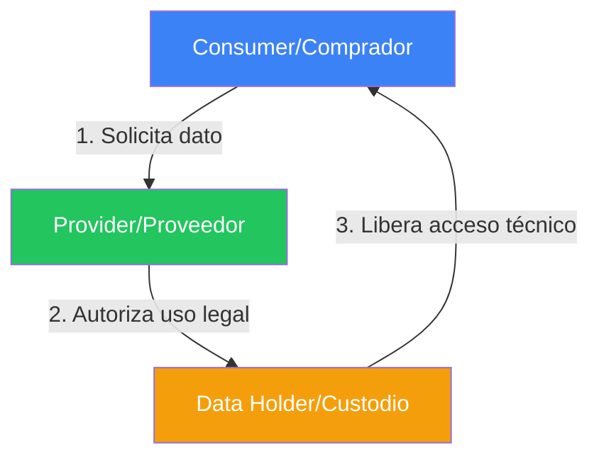

| Rol | Responsabilidad | Ejemplo en Cadena de Suministro |
|-----|-----------------|--------------------------------|
| **Data Consumer** | Solicita acceso a datos para un propósito específico | Empresa compradora que necesita validar proveedores |
| **Data Subject (Provider)** | Propietario original de los datos, decide sobre su uso | Proveedor cuyos datos fiscales se solicitan |
| **Data Holder** | Custodio técnico que almacena y entrega los datos | Agencia tributaria, cámara de comercio, certificadora |

### 2.3 Arquitectura Híbrida Web2 + Web3

PROCUREDATA utiliza una **arquitectura híbrida** que combina:

- **Capa Web2 (Lovable Cloud/Supabase)**: Almacenamiento de metadatos, gestión de usuarios, lógica de negocio, y APIs RESTful.
- **Capa Web3 (Pontus-X Blockchain)**: Registro inmutable de transacciones, verificación de identidad (DID), y pagos con tokens EUROe.

```
┌─────────────────────────────────────────────────────────────────┐
│                        USUARIO FINAL                            │
│                   (Navegador Web + MetaMask)                    │
└─────────────────────────────────────────────────────────────────┘
                              │
                              ▼
┌─────────────────────────────────────────────────────────────────┐
│                      FRONTEND (React + Vite)                    │
│  ┌──────────────┐  ┌──────────────┐  ┌──────────────┐          │
│  │   useAuth    │  │ useWeb3Wallet│  │  React Query │          │
│  │   Context    │  │    Hook      │  │    Cache     │          │
│  └──────────────┘  └──────────────┘  └──────────────┘          │
└─────────────────────────────────────────────────────────────────┘
                              │
              ┌───────────────┴───────────────┐
              ▼                               ▼
┌─────────────────────────┐     ┌─────────────────────────┐
│     BACKEND WEB2        │     │      LAYER WEB3         │
│   (Lovable Cloud)       │     │     (Pontus-X)          │
│  ┌─────────────────┐    │     │  ┌─────────────────┐    │
│  │   PostgreSQL    │    │     │  │   Ethers.js     │    │
│  │   (28 tablas)   │    │     │  │   v6.16.0       │    │
│  ├─────────────────┤    │     │  ├─────────────────┤    │
│  │  Supabase Auth  │    │     │  │  Token EUROe    │    │
│  │     (JWT)       │    │     │  │   (ERC-20)      │    │
│  ├─────────────────┤    │     │  ├─────────────────┤    │
│  │ Edge Functions  │    │     │  │  DID Registry   │    │
│  │   (Deno)        │    │     │  │ (did:ethr)      │    │
│  ├─────────────────┤    │     │  ├─────────────────┤    │
│  │   Realtime      │    │     │  │  Block Explorer │    │
│  │  (WebSockets)   │    │     │  │  (Verificación) │    │
│  └─────────────────┘    │     │  └─────────────────┘    │
└─────────────────────────┘     └─────────────────────────┘
```

### 2.4 Estado Actual

| Característica | Estado |
|----------------|--------|
| Production-Ready | ✅ |
| Web3 Enabled | ✅ |
| Auditoría de seguridad | Completada |
| Modo Demo funcional | ✅ (datos sintéticos) |
| Tour guiado interactivo | 6 pasos |

---

## 3. Arquitectura de la Plataforma

### 3.1 Stack Tecnológico Completo

#### Frontend

| Tecnología | Versión | Propósito |
|------------|---------|-----------|
| **React** | 18.3.1 | Biblioteca de UI con hooks y concurrent mode |
| **Vite** | Latest | Bundler y dev server con HMR instantáneo |
| **TypeScript** | 5.x | Tipado estático para seguridad en desarrollo |
| **Tailwind CSS** | 3.x | Utilidades CSS con sistema de diseño tokenizado |
| **Shadcn/ui** | Latest | 49 componentes accesibles basados en Radix UI |
| **Framer Motion** | 12.23.24 | Animaciones declarativas y transiciones |
| **Lucide React** | 0.462.0 | Iconografía SVG consistente |
| **Recharts** | 2.15.4 | Visualización de datos y gráficos |
| **Mermaid** | 11.12.2 | Diagramas y visualizaciones (NUEVO v3.1) |

#### Estado y Data Fetching

| Tecnología | Versión | Propósito |
|------------|---------|-----------|
| **TanStack Query** | 5.83.0 | Cache, sincronización y estado servidor |
| **React Context** | Built-in | Estado global para auth y preferencias |
| **React Hook Form** | 7.61.1 | Gestión de formularios performante |
| **Zod** | 3.25.76 | Validación de esquemas en runtime |

#### Backend (Lovable Cloud)

| Tecnología | Versión | Propósito |
|------------|---------|-----------|
| **PostgreSQL** | 15.x | Base de datos relacional con RLS (28 tablas) |
| **Supabase Auth** | Latest | Autenticación JWT con múltiples providers |
| **Edge Functions** | Deno | Serverless functions para lógica backend |
| **Realtime** | WebSockets | Suscripciones a cambios en tiempo real |
| **Storage** | S3-compatible | Almacenamiento de archivos |

#### Layer Web3 (Trust Layer)

| Tecnología | Versión | Propósito |
|------------|---------|-----------|
| **Ethers.js** | 6.16.0 | Interacción con blockchain EVM |
| **Pontus-X Testnet** | Chain 0x7ECC (32460) | Red blockchain del ecosistema Gaia-X |
| **MetaMask/Rabby** | Latest | Wallets compatibles Web3 |
| **EUROe Token** | ERC-20 | Stablecoin para pagos en plataforma |
| **DID (did:ethr)** | W3C Standard | Identificadores descentralizados |

#### Utilidades

| Tecnología | Versión | Propósito |
|------------|---------|-----------|
| **date-fns** | 3.6.0 | Manipulación de fechas |
| **jsPDF** | 3.0.4 | Generación de documentos PDF |
| **React Joyride** | 2.9.3 | Tours guiados de onboarding |
| **Sonner** | 1.7.4 | Sistema de notificaciones toast |

### 3.2 Diagrama de Arquitectura de Alto Nivel

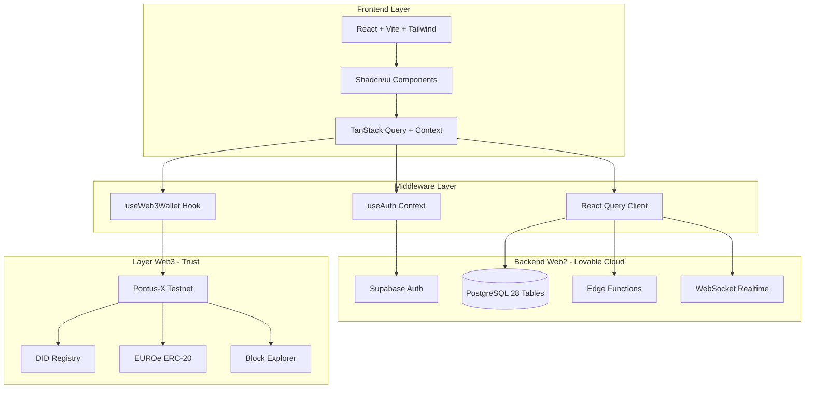

### 3.3 Flujo de Datos Principal

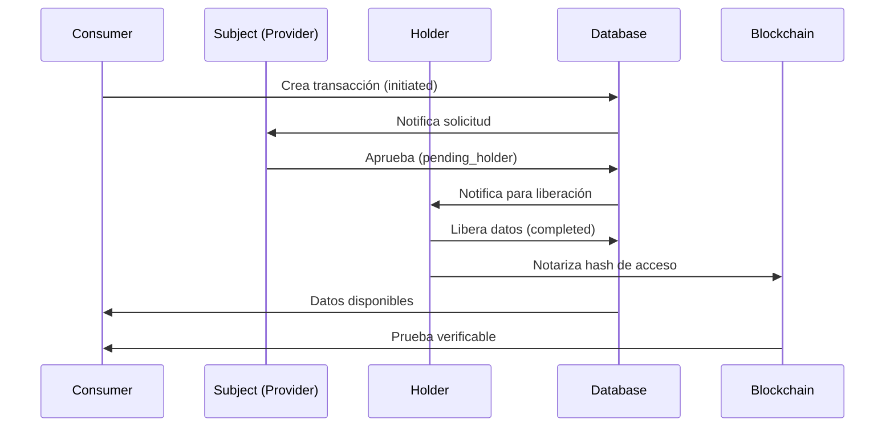

### 3.4 Máquina de Estados de Transacciones

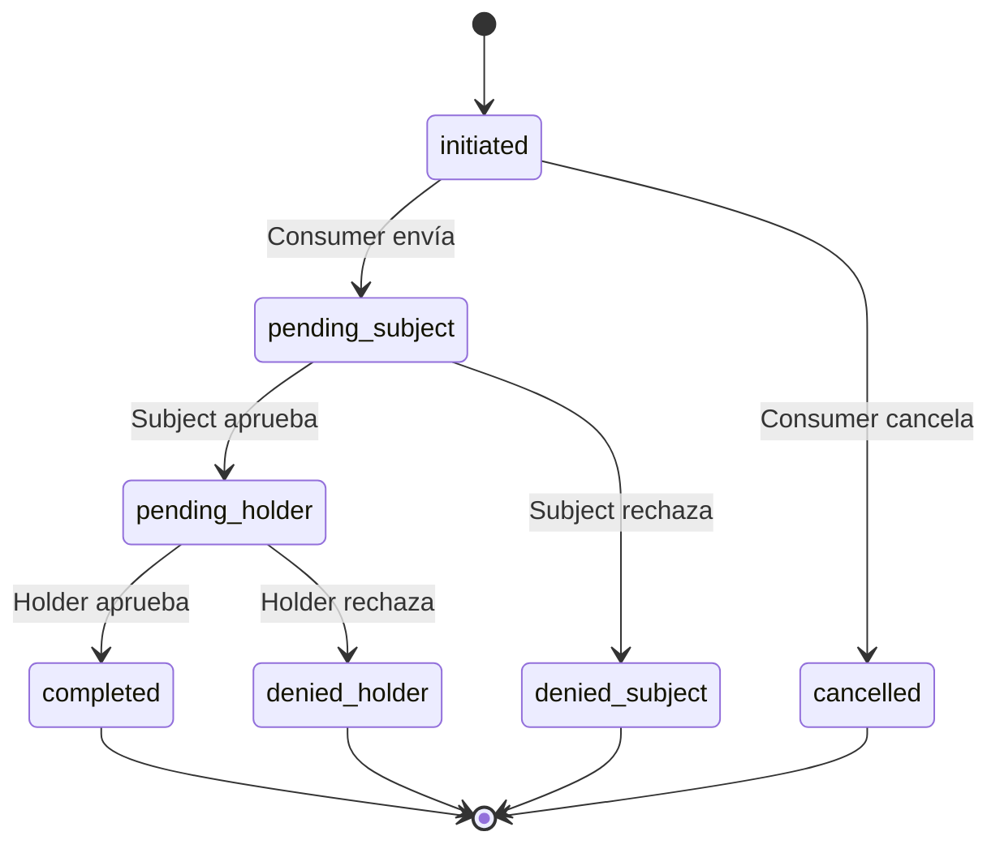

---

## 4. Componentes del Espacio de Datos (Gaia-X)

### 4.1 Identidad Soberana (Self-Sovereign Identity - SSI)

PROCUREDATA implementa **Identificadores Descentralizados (DIDs)** siguiendo el estándar W3C DID Core 1.0, específicamente el método `did:ethr` para redes Ethereum-compatibles.

#### Generación de DID

El servicio `pontusXService` genera DIDs automáticamente al conectar una wallet:

```typescript
// src/services/pontusX.ts
generateDID(address: string): string {
  // Formato estándar: did:ethr:<chainId>:<ethereumAddress>
  return `did:ethr:${PONTUSX_NETWORK_CONFIG.chainId}:${address.toLowerCase()}`;
}

// Resultado ejemplo:
// did:ethr:0x7ecc:0x742d35cc6634c0532925a3b844bc9e7595f8fe00
```

#### Estructura del DID

| Componente | Valor | Descripción |
|------------|-------|-------------|
| Scheme | `did` | Prefijo estándar W3C |
| Method | `ethr` | Método Ethereum DID |
| Network | `0x7ecc` | Chain ID Pontus-X Testnet (32460 decimal) |
| Identifier | `0x742d...` | Dirección Ethereum de la wallet |

#### Tipos TypeScript para SSI

```typescript
// src/types/web3.types.ts
export interface DecentralizedIdentifier {
  did: string;           // Formato: did:ethr:0x7ecc:0x...
  address: string;       // Dirección Ethereum 0x...
  chainId: string;       // Chain ID en Hex (ej: 0x7ecc)
  verified: boolean;     // Estado de verificación local
}

export interface VerifiableCredential {
  id: string;
  type: string[];
  issuer: string;
  issuanceDate: string;
  expirationDate?: string;
  credentialSubject: {
    id: string;
    [key: string]: unknown;
  };
  proof?: {
    type: string;
    created: string;
    verificationMethod: string;
    proofPurpose: string;
    proofValue: string;
  };
}
```

### 4.2 Conector de Datos (Data Connector)

El servicio `PontusXService` actúa como el **conector de datos** que facilita la comunicación entre la aplicación y la red blockchain.

#### Clase PontusXService Completa

```typescript
// src/services/pontusX.ts
import { ethers } from 'ethers';
import type { WalletState } from '@/types/web3.types';

export const PONTUSX_NETWORK_CONFIG = {
  chainId: '0x7ecc',           // 32460 en decimal
  chainName: 'Pontus-X Testnet',
  nativeCurrency: {
    name: 'Pontus-X Token',
    symbol: 'GX',
    decimals: 18,
  },
  rpcUrls: ['https://rpc.dev.pontus-x.eu'],
  blockExplorerUrls: ['https://explorer.pontus-x.eu/'],
};

const EUROE_CONTRACT_ADDRESS = "0xA0b86991c6218b36c1d19D4a2e9Eb0cE3606eB48";

const ERC20_ABI = [
  "function balanceOf(address owner) view returns (uint256)",
  "function decimals() view returns (uint8)",
  "function symbol() view returns (string)",
  "function transfer(address to, uint amount) returns (bool)"
];

class PontusXService {
  private provider: ethers.BrowserProvider | null = null;
  private signer: ethers.JsonRpcSigner | null = null;
  private euroeContract: ethers.Contract | null = null;

  constructor() {
    if (typeof window !== 'undefined' && window.ethereum) {
      this.provider = new ethers.BrowserProvider(window.ethereum);
    }
  }

  // Métodos principales
  isWeb3Available(): boolean
  async connectWallet(): Promise<WalletState>
  disconnect(): WalletState
  async switchNetwork(): Promise<void>
  async getEUROeBalance(address: string): Promise<string>
  generateDID(address: string): string
  async signMessage(message: string): Promise<string>
  async revokeAccess(did: string, resourceId: string): Promise<string>
  onAccountsChanged(callback: (accounts: string[]) => void): void
  onChainChanged(callback: (chainId: string) => void): void
  removeListeners(): void
}

// Exportar una instancia Singleton
export const pontusXService = new PontusXService();
```

#### Métodos del Servicio

| Método | Descripción | Retorno |
|--------|-------------|---------|
| `isWeb3Available()` | Detecta wallet instalada | `boolean` |
| `connectWallet()` | Conecta + switch red + balances | `WalletState` |
| `disconnect()` | Limpia estado de wallet | `WalletState` |
| `switchNetwork()` | Fuerza cambio a Pontus-X | `void` |
| `getEUROeBalance(address)` | Lee balance del token ERC-20 | `string` |
| `generateDID(address)` | Genera `did:ethr:chainId:address` | `string` |
| `signMessage(message)` | Firma SIWE para verificación | `string` |
| `revokeAccess(did, resourceId)` | Ejecuta revocación on-chain | `string` (txHash) |

### 4.3 Catálogo Federado

El catálogo de PROCUREDATA implementa la especificación **DCAT (Data Catalog Vocabulary)** adaptada para espacios de datos industriales.

#### Vista Materializada: marketplace_listings

```sql
CREATE VIEW marketplace_listings AS
SELECT 
  da.id AS asset_id,
  dp.id AS product_id,
  dp.name AS product_name,
  dp.description AS product_description,
  dp.category,
  dp.version,
  da.price,
  da.currency,
  da.pricing_model,
  da.billing_period,
  o.id AS provider_id,
  o.name AS provider_name,
  o.kyb_verified,
  o.seller_category,
  esg.energy_renewable_percent,
  -- Badges calculados
  (esg.energy_renewable_percent >= 80) AS has_green_badge,
  -- Métricas de reputación
  (SELECT AVG(rating) FROM organization_reviews WHERE target_org_id = o.id) AS reputation_score,
  (SELECT COUNT(*) FROM organization_reviews WHERE target_org_id = o.id) AS review_count
FROM data_assets da
JOIN data_products dp ON da.product_id = dp.id
JOIN organizations o ON da.subject_org_id = o.id
LEFT JOIN esg_reports esg ON o.id = esg.organization_id
WHERE da.is_public_marketplace = true AND da.status = 'active';
```

#### Funcionalidades del Catálogo

| Funcionalidad | Implementación |
|---------------|----------------|
| Vista Grid/Lista | Toggle con estado local |
| Filtro por categoría | Dropdown con enum de categorías |
| Filtro por precio | Slider con rango min/max |
| Badges ESG | `has_green_badge` de la vista |
| Badge KYB | `kyb_verified` de organizations |
| Comparación | Checkbox multi-selección |
| Wishlist | Tabla `user_wishlist` |

### 4.4 Contratos de Uso (Usage Policies - ODRL)

PROCUREDATA genera políticas de uso siguiendo el estándar **ODRL (Open Digital Rights Language)** almacenadas en la tabla `data_policies`.

#### Estructura de Política ODRL

```json
{
  "@context": "http://www.w3.org/ns/odrl/2/",
  "@type": "Agreement",
  "uid": "policy:procuredata:550e8400-e29b...",
  "profile": "http://example.org/gaiax-profile",
  "permission": [{
    "target": "asset:procuredata:33333333-...",
    "action": "use",
    "constraint": [{
      "leftOperand": "dateTime",
      "operator": "lteq",
      "rightOperand": "2026-04-05T00:00:00Z"
    }],
    "duty": [{
      "action": "compensate",
      "constraint": [{
        "leftOperand": "payAmount",
        "operator": "eq",
        "rightOperand": { "@value": "500", "@type": "xsd:decimal" },
        "unit": "EUR"
      }]
    }]
  }],
  "prohibition": [{
    "target": "asset:procuredata:33333333-...",
    "action": "transfer"
  }]
}
```

#### Tabla data_policies

```sql
CREATE TABLE data_policies (
  id UUID PRIMARY KEY DEFAULT gen_random_uuid(),
  transaction_id UUID REFERENCES data_transactions(id),
  odrl_policy_json JSONB NOT NULL,
  generated_at TIMESTAMPTZ DEFAULT now()
);
```

---

## 5. Catálogo de Componentes Técnicos

### 5.1 Componentes Core/Web3

| Componente | Archivo | Responsabilidad Técnica | Versión |
|------------|---------|-------------------------|---------|
| **WalletButton** | `src/components/WalletButton.tsx` | Gestión completa de sesión Web3: conexión, visualización de perfil (DID, balances GX/EUROe), dropdown con acciones. Usa `useWeb3Wallet` hook. | v3.0 |
| **Web3StatusWidget** | `src/components/Web3StatusWidget.tsx` | Widget de dashboard que muestra estado de wallet, balances, y DID verificado. Tres estados: sin wallet detectada, no conectada, conectada. | **v3.1** |
| **RevokeAccessButton** | `src/components/RevokeAccessButton.tsx` | Kill-switch para revocación de acceso a recursos. AlertDialog de confirmación con advertencia de irreversibilidad. Llama a `pontusXService.revokeAccess()`. | v3.0 |

#### Estados del Web3StatusWidget

1. **Sin Web3**: Muestra botón para instalar MetaMask
2. **No conectado**: Muestra botón "Conectar Wallet"
3. **Conectado**: Muestra:
   - Balance EUROe
   - Balance GX (gas)
   - DID truncado con botón copiar
   - Link al Block Explorer

### 5.2 Componentes Feature/Audit

| Componente | Archivo | Responsabilidad Técnica |
|------------|---------|-------------------------|
| **DataLineageBlockchain** | `src/components/DataLineageBlockchain.tsx` | Timeline visual de eventos de trazabilidad. Muestra hashes de transacción, timestamps, actores. Botón para copiar hash y link a Pontus-X Explorer. |
| **DataLineage** | `src/components/DataLineage.tsx` | Visualización de lineage de datos desde Supabase. Complementa DataLineageBlockchain con datos on-chain. |
| **SmartContractViewer** | `src/components/SmartContractViewer.tsx` | Visor de código y estado de smart contracts. Permite inspeccionar funciones y eventos. |

### 5.3 Componentes Feature/Commerce

| Componente | Archivo | Responsabilidad Técnica |
|------------|---------|-------------------------|
| **PaymentGateway** | `src/components/PaymentGateway.tsx` | Pasarela de pagos híbrida con 3 tabs: Tarjeta (Stripe), Wallet (EUROe), Transferencia. Integración con `pontusXService` para pagos crypto. |
| **OrderSummary** | `src/components/OrderSummary.tsx` | Resumen de pedido con desglose de precios, impuestos, y total. Soporta múltiples monedas. |

### 5.4 Componentes Core/UX

| Componente | Archivo | Responsabilidad Técnica | Versión |
|------------|---------|-------------------------|---------|
| **NotificationsBell** | `src/components/NotificationsBell.tsx` | Consumidor de Supabase Realtime WebSockets. Muestra contador de no leídas, dropdown con lista, mark as read. | v3.0 |
| **ActivityFeed** | `src/components/ActivityFeed.tsx` | Feed de actividad con suscripción Realtime a `approval_history`. Invalidación automática de queries. Cleanup correcto con `removeChannel()`. | **v3.1** |
| **EmptyState** | `src/components/EmptyState.tsx` | Estados vacíos consistentes con iconos y acciones. Reutilizable en múltiples páginas. | **v3.1** |
| **DemoBanner** | `src/components/DemoBanner.tsx` | Banner informativo para modo demo. Detecta usuario demo y muestra instrucciones. | v3.0 |
| **DemoTour** | `src/components/DemoTour.tsx` | Tour guiado con React Joyride. Steps configurables por página. | v3.0 |
| **CommandMenu** | `src/components/CommandMenu.tsx` | Paleta de comandos estilo Spotlight/Alfred. Navegación rápida y acciones. | v3.0 |

### 5.5 Componentes UI/Layout

| Componente | Archivo | Responsabilidad Técnica |
|------------|---------|-------------------------|
| **AppLayout** | `src/components/AppLayout.tsx` | Layout principal con Sidebar, Header, y área de contenido. Gestiona responsive. |
| **AppSidebar** | `src/components/AppSidebar.tsx` | Navegación lateral con secciones colapsables. Integra OrganizationSwitcher. |
| **DynamicBreadcrumbs** | `src/components/DynamicBreadcrumbs.tsx` | Migas de pan generadas dinámicamente desde la ruta actual. |
| **ThemeToggle** | `src/components/ThemeToggle.tsx` | Switch de tema claro/oscuro con persistencia en localStorage. |
| **ProtectedRoute** | `src/components/ProtectedRoute.tsx` | HOC que verifica autenticación y redirige a /auth si no hay sesión. |
| **MermaidDiagram** | `src/components/MermaidDiagram.tsx` | Renderizado de diagramas Mermaid con soporte dark mode. **NUEVO v3.1** |

### 5.6 Componentes Feature/Data

| Componente | Archivo | Responsabilidad Técnica |
|------------|---------|-------------------------|
| **ESGDataView** | `src/components/ESGDataView.tsx` | Visualización de datos ESG: emisiones scope 1/2, mix energético, certificaciones. Gráficos con Recharts. |
| **IoTDataView** | `src/components/IoTDataView.tsx` | Renderizado de datos de telemetría IoT. Series temporales y alertas. |
| **ArrayDataView** | `src/components/ArrayDataView.tsx` | Vista genérica para arrays de datos. Tabla paginada con sorting. |
| **GenericJSONView** | `src/components/GenericJSONView.tsx` | Visor de JSON con syntax highlighting y collapse/expand. |

### 5.7 Componentes Feature/Collaboration

| Componente | Archivo | Responsabilidad Técnica |
|------------|---------|-------------------------|
| **NegotiationChat** | `src/components/NegotiationChat.tsx` | Chat embebido para negociación de contratos. Mensajes almacenados en `transaction_messages`. |
| **TeamManagement** | `src/components/TeamManagement.tsx` | Gestión de miembros del equipo y roles. CRUD sobre `user_roles`. |
| **AIConcierge** | `src/components/AIConcierge.tsx` | Asistente virtual con IA para guiar usuarios. Integración con Lovable AI Gateway. |

### 5.8 Componentes Shadcn/UI (49 componentes)

Directorio: `src/components/ui/`

| Componente | Propósito |
|------------|-----------|
| accordion, alert, alert-dialog | Contenedores de información expandibles |
| avatar, badge, button | Elementos de identidad e interacción |
| calendar, card, carousel | Visualización de datos |
| checkbox, collapsible, command | Controles de formulario |
| context-menu, dialog, drawer | Menús y modales |
| dropdown-menu, form, hover-card | Interacciones complejas |
| input, input-otp, label | Campos de entrada |
| menubar, navigation-menu | Navegación |
| pagination, popover, progress | Navegación y feedback |
| radio-group, resizable, scroll-area | Controles avanzados |
| select, separator, sheet | Selección y layout |
| sidebar, skeleton, slider | Layout y estados de carga |
| sonner, switch, table | Notificaciones, toggles, tablas |
| tabs, textarea, toast, toaster | Organización y notificaciones |
| toggle, toggle-group, tooltip | Interacciones menores |

---

## 6. Hooks Personalizados

### 6.1 useAuth - Autenticación Híbrida

```typescript
// src/hooks/useAuth.tsx
interface AuthContextType {
  // Supabase Auth
  user: User | null;
  session: Session | null;
  loading: boolean;
  signUp: (email: string, password: string) => Promise<AuthResponse>;
  signIn: (email: string, password: string) => Promise<AuthResponse>;
  signOut: () => Promise<void>;
  
  // Web3 Identity (NUEVO v3.1)
  walletAddress: string | null;
  did: string | null;
  isWeb3Connected: boolean;
  connectWallet: (silent?: boolean) => Promise<void>;
  disconnectWallet: () => void;
}
```

#### Flujo de Autenticación

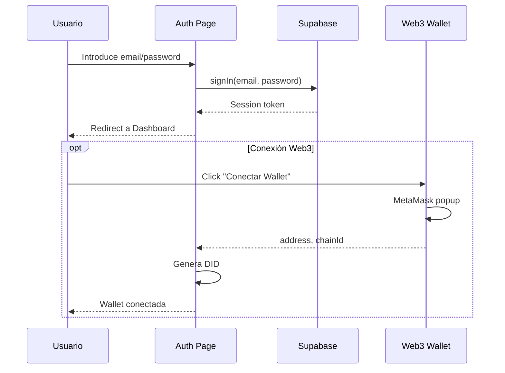

### 6.2 useWeb3Wallet - Gestión de Wallet (NUEVO v3.1)

```typescript
// src/hooks/useWeb3Wallet.tsx
import { useState, useEffect, useCallback } from 'react';
import { pontusXService } from '@/services/pontusX';
import type { WalletState } from '@/types/web3.types';
import { toast } from 'sonner';

const INITIAL_STATE: WalletState = {
  address: null,
  chainId: null,
  balance: null,
  euroeBalance: null,
  did: null,
  isConnected: false
};

export const useWeb3Wallet = () => {
  const [wallet, setWallet] = useState<WalletState>(INITIAL_STATE);
  const [isConnecting, setIsConnecting] = useState(true);
  const [hasWeb3, setHasWeb3] = useState(false);

  // Check Web3 availability on mount
  useEffect(() => {
    setHasWeb3(pontusXService.isWeb3Available());
  }, []);

  const connect = useCallback(async (silent = false) => {
    if (!silent) setIsConnecting(true);
    try {
      const state = await pontusXService.connectWallet();
      setWallet(state);
      if (!silent) {
        toast.success("Billetera Conectada", {
          description: `Cuenta: ${state.address?.slice(0, 6)}...${state.address?.slice(-4)}`
        });
      }
    } catch (error: unknown) {
      const message = error instanceof Error ? error.message : "Error desconocido";
      console.error("Connection failed:", error);
      if (!silent) {
        toast.error("Error al conectar", { description: message });
      }
    } finally {
      setIsConnecting(false);
    }
  }, []);

  const disconnect = useCallback(() => {
    pontusXService.disconnect();
    setWallet(INITIAL_STATE);
    toast.info("Desconectado", {
      description: "Has cerrado la sesión de tu wallet."
    });
  }, []);

  // Auto-connection and event listeners
  useEffect(() => {
    const checkConnection = async () => {
      if (window.ethereum) {
        try {
          const accounts = await window.ethereum.request({ 
            method: 'eth_accounts' 
          }) as string[];
          if (accounts.length > 0) {
            await connect(true); // Silently reconnect
          }
        } catch (err) {
          console.error("Error checking accounts:", err);
        }
      }
      setIsConnecting(false);
    };

    checkConnection();

    // Setup MetaMask event listeners
    if (window.ethereum) {
      const handleAccountsChanged = (accounts: unknown) => {
        const accountList = accounts as string[];
        if (accountList.length > 0) {
          connect(true);
        } else {
          setWallet(INITIAL_STATE);
          toast.info("Desconexión detectada en MetaMask");
        }
      };

      const handleChainChanged = () => {
        window.location.reload();
      };

      window.ethereum.on('accountsChanged', handleAccountsChanged);
      window.ethereum.on('chainChanged', handleChainChanged);

      return () => {
        window.ethereum?.removeListener('accountsChanged', handleAccountsChanged);
        window.ethereum?.removeListener('chainChanged', handleChainChanged);
      };
    }
  }, [connect]);

  return { 
    wallet, 
    isConnecting, 
    hasWeb3, 
    connect: () => connect(false), 
    disconnect 
  };
};
```

#### Retorno del Hook

| Propiedad | Tipo | Descripción |
|-----------|------|-------------|
| `wallet` | `WalletState` | Estado completo de la wallet |
| `isConnecting` | `boolean` | Indicador de conexión en progreso |
| `hasWeb3` | `boolean` | Si hay wallet Web3 disponible |
| `connect` | `() => Promise<void>` | Función para conectar wallet |
| `disconnect` | `() => void` | Función para desconectar |

### 6.3 usePrivacyPreferences - Persistencia Optimista (NUEVO v3.1)

```typescript
// src/hooks/usePrivacyPreferences.tsx
interface UserPreferences {
  profile_visible: boolean;
  show_access_history: boolean;
  access_alerts: boolean;
  anonymous_research: boolean;
}

const DEFAULT_PREFERENCES: UserPreferences = {
  profile_visible: true,
  show_access_history: true,
  access_alerts: true,
  anonymous_research: false,
};

export function usePrivacyPreferences() {
  const { user } = useAuth();
  const [preferences, setPreferences] = useState<UserPreferences>(DEFAULT_PREFERENCES);
  const [loading, setLoading] = useState(true);

  // Load preferences
  useEffect(() => {
    if (!user?.id) return;
    
    const loadPreferences = async () => {
      const { data } = await supabase
        .from('privacy_preferences')
        .select('*')
        .eq('user_id', user.id)
        .single();
      
      if (data) setPreferences(data);
      setLoading(false);
    };

    loadPreferences();
  }, [user?.id]);

  // Update with optimistic rollback
  const updatePreference = useCallback(async (
    key: keyof UserPreferences, 
    value: boolean
  ) => {
    const previousValue = preferences[key];
    
    // Optimistic update
    setPreferences(prev => ({ ...prev, [key]: value }));

    try {
      const { error } = await supabase
        .from('privacy_preferences')
        .update({ [key]: value, updated_at: new Date().toISOString() })
        .eq('user_id', user?.id);

      if (error) throw error;
      toast.success('Preferencia actualizada');
    } catch (error) {
      // Rollback on error
      setPreferences(prev => ({ ...prev, [key]: previousValue }));
      toast.error('Error al actualizar preferencia');
    }
  }, [user?.id, preferences]);

  return { preferences, loading, updatePreference };
}
```

#### Campos de Preferencias

| Campo | Tipo | Descripción |
|-------|------|-------------|
| `profile_visible` | boolean | Perfil visible en marketplace |
| `show_access_history` | boolean | Mostrar historial de accesos |
| `access_alerts` | boolean | Notificaciones de acceso a datos |
| `anonymous_research` | boolean | Permitir uso anónimo para investigación |

### 6.4 useOrganizationContext - Multi-tenant

```typescript
// src/hooks/useOrganizationContext.tsx
interface OrganizationContextType {
  currentOrg: Organization | null;
  organizations: Organization[];
  switchOrganization: (orgId: string) => void;
  isLoading: boolean;
}
```

### 6.5 useNotifications - Sistema de Notificaciones

```typescript
// src/hooks/useNotifications.tsx
interface UseNotificationsReturn {
  notifications: Notification[];
  unreadCount: number;
  markAsRead: (id: string) => Promise<void>;
  markAllAsRead: () => Promise<void>;
  isLoading: boolean;
}
```

### 6.6 useOrgSector - Sector de Organización

```typescript
// src/hooks/useOrgSector.tsx
// Determina el sector de la organización actual para renderizar iconos y UI contextual
```

---

## 7. Interfaces y Páginas Principales

### 7.1 Mapa de Rutas Completo (27 rutas)

#### Rutas Públicas

| Ruta | Componente | Descripción |
|------|------------|-------------|
| `/` | `Landing.tsx` | Página de marketing con hero, features, success stories |
| `/auth` | `Auth.tsx` | Login/Registro con validación Zod |
| `/guide` | `Guide.tsx` | Guía del ecosistema |
| `/architecture` | `Architecture.tsx` | **Documentación técnica interactiva con 4 tabs y Mermaid (v3.1)** |
| `/whitepaper` | `InteractiveWhitepaper.tsx` | Tech Whitepaper interactivo |

#### Rutas Protegidas (AppLayout)

| Ruta | Componente | Descripción |
|------|------------|-------------|
| `/dashboard` | `Dashboard.tsx` | Centro de mando + Web3Widget + ActivityFeed |
| `/catalog` | `Catalog.tsx` | Marketplace federado |
| `/catalog/product/:id` | `ProductDetail.tsx` | Detalle de producto con muestra y solicitud |
| `/requests` | `Requests.tsx` | Lista de transacciones con estados y loading states |
| `/requests/new` | `RequestWizard.tsx` | Wizard de 5 pasos para crear solicitud |
| `/data` | `Data.tsx` | Lista de activos de datos adquiridos |
| `/data/view/:id` | `DataView.tsx` | Vista de consumo con DataLineage y exportación |
| `/opportunities` | `Opportunities.tsx` | Oportunidades de mercado con AlertDialog |
| `/services` | `Services.tsx` | Catálogo de servicios de valor añadido |
| `/reports` | `Reports.tsx` | Generación y descarga de informes |
| `/sustainability` | `Sustainability.tsx` | Dashboard ESG con métricas ambientales |
| `/innovation` | `InnovationLab.tsx` | Conceptos de innovación y análisis predictivo |
| `/analytics` | `SellerAnalytics.tsx` | Analytics para vendedores de datos |
| `/notifications` | `Notifications.tsx` | Centro de notificaciones con historial |
| `/settings` | `Settings.tsx` | Hub de configuración |
| `/settings/organization` | `SettingsOrganization.tsx` | Configuración de organización + Team |
| `/settings/preferences` | `SettingsPreferences.tsx` | **Preferencias de privacidad con hook optimista (v3.1)** |
| `/settings/webhooks` | `WebhookSettings.tsx` | Configuración de webhooks |
| `/settings/erp-config` | `ERPConfig.tsx` | Integración con sistemas ERP |
| `/settings/audit` | `AuditLogs.tsx` | Logs de auditoría con filtros |
| `*` | `NotFound.tsx` | Página 404 con navegación |

### 7.2 Páginas Clave Detalladas

#### Dashboard (/dashboard)

**Propósito**: Centro de mando principal con KPIs y accesos rápidos.

**Componentes v3.1**:
- `Web3StatusWidget` - Estado de wallet y balances
- `ActivityFeed` - Feed con Realtime subscriptions
- `DashboardStats` - Tarjetas de estadísticas

#### Architecture (/architecture) - NUEVO v3.1

**Propósito**: Documentación técnica interactiva.

**Estructura**:
- 4 tabs: Base de Datos, Seguridad & RLS, Tech Stack, Flujos de Datos
- Diagramas Mermaid renderizados con soporte dark mode
- Cards explicativas con código de ejemplo

#### DataView (/data/:id)

**Propósito**: Visualización de datos adquiridos con auditoría integrada.

**Componentes utilizados**:
- `ESGDataView` / `IoTDataView` / `GenericJSONView` (según tipo de datos)
- `DataLineageBlockchain` (trazabilidad)
- `RevokeAccessButton` (revocación)

**Funcionalidades**:
```typescript
// Exportación a ERP
const handleExportERP = async () => {
  await supabase.functions.invoke('erp-data-uploader', {
    body: { transactionId, configId: selectedConfig }
  });
};

// Descarga CSV
const handleDownloadCSV = () => {
  const csv = convertToCSV(data);
  downloadFile(csv, `data-${transactionId}.csv`);
};
```

#### RequestWizard (/requests/new)

**Propósito**: Flujo guiado de 5 pasos para crear solicitudes de datos.

**Pasos del wizard**:
1. **Selección de Producto**: Grid de productos disponibles
2. **Propósito y Justificación**: Formulario con validación Zod
3. **Duración de Acceso**: Selector de días (30/60/90/180/365)
4. **Revisión de Política**: Vista previa de ODRL generado
5. **Confirmación y Pago**: PaymentGateway integrado

**Persistencia**: Auto-guardado en localStorage para recuperar sesión.

#### SettingsPreferences (/settings/preferences)

**Propósito**: Panel de control de privacidad del usuario.

**Hook utilizado**: `usePrivacyPreferences` (v3.1)

```typescript
const { preferences, updatePreference, loading } = usePrivacyPreferences();

// Toggle con persistencia optimista
<Switch
  checked={preferences.profile_visible}
  onCheckedChange={(checked) => updatePreference('profile_visible', checked)}
/>
```

---

## 8. Personas de Usuario (Roles Técnicos)

### 8.1 Sistema de Roles

PROCUREDATA implementa un sistema de roles basado en la tabla `user_roles` con Row Level Security (RLS).

#### Enum de Roles

```sql
CREATE TYPE public.app_role AS ENUM (
  'admin',          -- Control total de la organización
  'approver',       -- Puede aprobar/rechazar transacciones
  'viewer',         -- Solo lectura
  'api_configurator' -- Gestión de integraciones ERP
);
```

#### Tabla user_roles

```sql
CREATE TABLE public.user_roles (
  id UUID PRIMARY KEY DEFAULT gen_random_uuid(),
  user_id UUID REFERENCES auth.users(id) ON DELETE CASCADE,
  organization_id UUID REFERENCES organizations(id),
  role app_role NOT NULL,
  created_at TIMESTAMPTZ DEFAULT now(),
  UNIQUE (user_id, organization_id, role)
);
```

#### Función de Verificación

```sql
CREATE FUNCTION public.has_role(_user_id UUID, _organization_id UUID, _role app_role)
RETURNS BOOLEAN
LANGUAGE SQL STABLE SECURITY DEFINER
SET search_path = public
AS $$
  SELECT EXISTS (
    SELECT 1 FROM public.user_roles
    WHERE user_id = _user_id
      AND organization_id = _organization_id
      AND role = _role
  )
$$;
```

### 8.2 Roles por Tipo de Organización

| Tipo de Org | Rol Típico | Permisos Principales |
|-------------|------------|---------------------|
| **Consumer** | viewer, approver | Ver catálogo, crear solicitudes, aprobar pagos |
| **Provider (Subject)** | admin, approver | Gestionar activos, aprobar/rechazar solicitudes |
| **Data Holder** | admin, api_configurator | Custodia de datos, configurar ERPs, segunda aprobación |

### 8.3 Flujos por Rol

#### Data Consumer

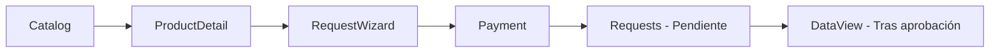

#### Data Provider (Subject)

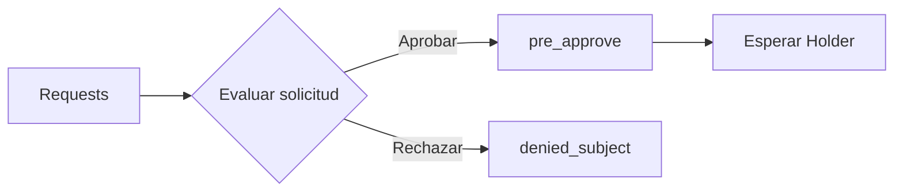

#### Data Holder

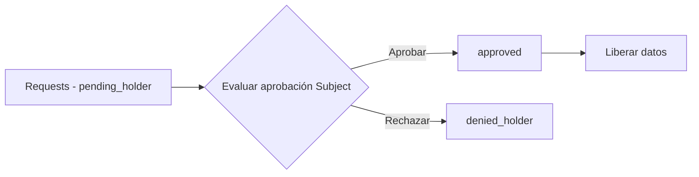

---

## 9. Modelo de Gobernanza Técnica

### 9.1 Políticas de Acceso

#### Flujo de Aprobación Multi-Etapa

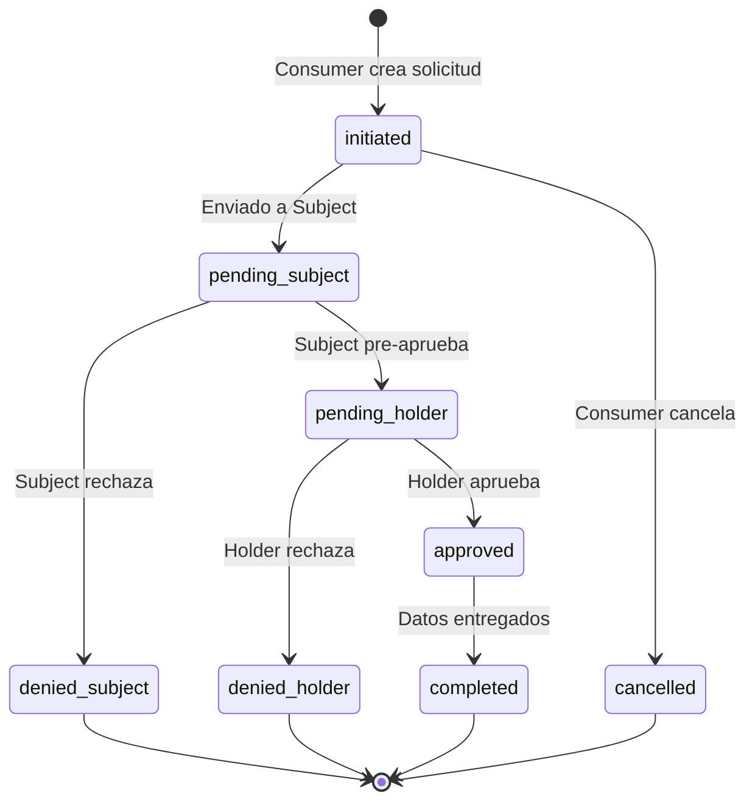

#### Estados de Transacción

```sql
CREATE TYPE public.transaction_status AS ENUM (
  'initiated',       -- Solicitud creada
  'pending_subject', -- Esperando aprobación del propietario
  'pending_holder',  -- Esperando aprobación del custodio
  'approved',        -- Aprobada por todos
  'denied_subject',  -- Rechazada por propietario
  'denied_holder',   -- Rechazada por custodio
  'completed',       -- Datos entregados
  'cancelled'        -- Cancelada por solicitante
);
```

#### Tabla approval_history

```sql
CREATE TABLE public.approval_history (
  id UUID PRIMARY KEY DEFAULT gen_random_uuid(),
  transaction_id UUID REFERENCES data_transactions(id),
  actor_org_id UUID REFERENCES organizations(id),
  actor_user_id UUID,
  action approval_action NOT NULL, -- 'pre_approve' | 'approve' | 'deny' | 'cancel'
  notes TEXT,
  created_at TIMESTAMPTZ DEFAULT now()
);
```

### 9.2 Mecanismo de Consentimiento

El hook `usePrivacyPreferences` gestiona las preferencias de privacidad con persistencia optimista. Ver [Sección 6.3](#63-useprivacypreferences---persistencia-optimista-nuevo-v31).

### 9.3 Revocación de Acceso

#### Componente RevokeAccessButton

```typescript
// src/components/RevokeAccessButton.tsx
const handleRevoke = async () => {
  if (!wallet.isConnected) {
    await connect();
    return;
  }

  setIsRevoking(true);
  try {
    const txHash = await pontusXService.revokeAccess(wallet.did!, resourceId);
    toast.success('Acceso revocado', {
      description: `Transacción: ${txHash.slice(0, 10)}...`
    });
    onRevoked?.(txHash);
  } catch (error) {
    toast.error('Error al revocar acceso');
  } finally {
    setIsRevoking(false);
    setDialogOpen(false);
  }
};
```

#### Flujo de Revocación

1. Usuario hace click en "Revocar Acceso"
2. AlertDialog solicita confirmación explícita
3. Si wallet no conectada, se solicita conexión
4. `pontusXService.revokeAccess(did, resourceId)` ejecuta transacción
5. Hash de transacción se registra para auditoría
6. UI se actualiza reflejando revocación

---

## 10. Seguridad y Auditoría

### 10.1 Autenticación Dual

PROCUREDATA implementa un modelo de **autenticación dual** que combina:

#### Supabase Auth (Web2)

```typescript
// src/hooks/useAuth.tsx
const signIn = async (email: string, password: string) => {
  const { data, error } = await supabase.auth.signInWithPassword({
    email,
    password,
  });
  if (error) throw error;
  return data;
};

// JWT almacenado en localStorage por Supabase SDK
// Refresh automático antes de expiración
```

#### Web3 Signature (SIWE)

```typescript
// src/services/pontusX.ts
async signMessage(message: string): Promise<string> {
  if (!this.signer) throw new Error('Wallet not connected');
  
  // Sign-In With Ethereum (SIWE) message
  const siweMessage = `
    PROCUREDATA Authentication
    
    I authorize this application to access my wallet.
    
    Nonce: ${Date.now()}
    Message: ${message}
  `;
  
  return await this.signer.signMessage(siweMessage);
}
```

#### Validación Zod (Auth.tsx) - NUEVO v3.1

```typescript
const authSchema = z.object({
  email: z
    .string()
    .trim()
    .min(1, "El email es obligatorio")
    .email("Introduce un email válido")
    .max(255, "Email demasiado largo"),
  password: z
    .string()
    .min(6, "La contraseña debe tener al menos 6 caracteres")
    .max(72, "Contraseña demasiado larga"),
});
```

### 10.2 Row Level Security (RLS)

#### Políticas Implementadas

```sql
-- Ejemplo: Transacciones visibles solo para organizaciones involucradas
CREATE POLICY "Users can view transactions of their organization"
ON public.data_transactions
FOR SELECT
USING (
  consumer_org_id = public.get_user_organization(auth.uid())
  OR subject_org_id = public.get_user_organization(auth.uid())
  OR holder_org_id = public.get_user_organization(auth.uid())
);

-- Ejemplo: Solo admins pueden modificar configuraciones
CREATE POLICY "Only admins can update organization settings"
ON public.organizations
FOR UPDATE
USING (
  public.has_role(auth.uid(), id, 'admin')
);
```

#### Funciones Security Definer

```sql
CREATE FUNCTION public.get_user_organization(_user_id UUID)
RETURNS UUID
LANGUAGE SQL STABLE SECURITY DEFINER
SET search_path = public
AS $$
  SELECT organization_id
  FROM public.user_profiles
  WHERE user_id = _user_id
  LIMIT 1
$$;
```

### 10.3 Trazabilidad End-to-End

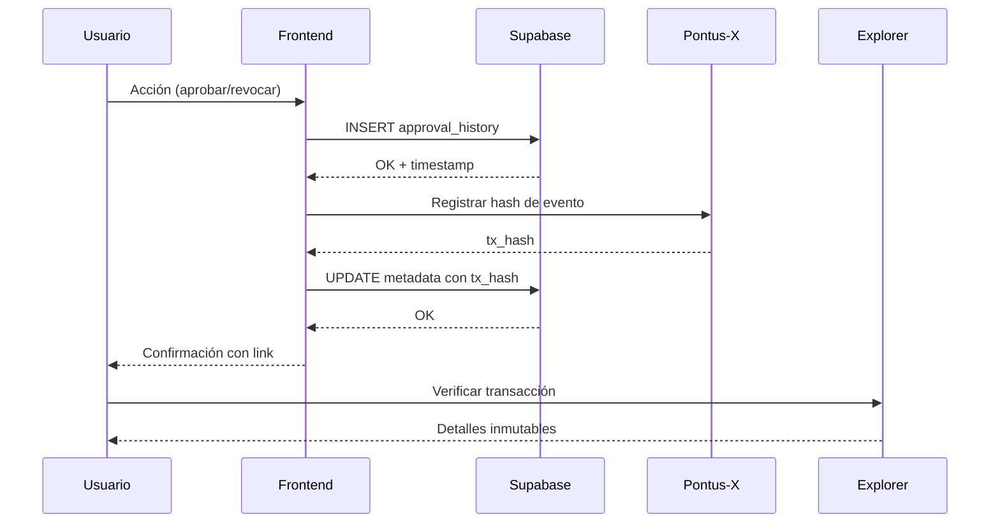

### 10.4 Audit Logs

```sql
CREATE TABLE public.audit_logs (
  id UUID PRIMARY KEY DEFAULT gen_random_uuid(),
  organization_id UUID REFERENCES organizations(id),
  actor_id UUID,
  actor_email TEXT,
  action TEXT NOT NULL,        -- 'create' | 'update' | 'delete' | 'access'
  resource TEXT,               -- 'transaction' | 'asset' | 'organization'
  details JSONB,               -- Payload completo del evento
  ip_address TEXT,
  created_at TIMESTAMPTZ DEFAULT now()
);

-- RLS: Solo admins pueden ver logs de su organización
ALTER TABLE audit_logs ENABLE ROW LEVEL SECURITY;

CREATE POLICY "Admins can view audit logs"
ON audit_logs FOR SELECT
USING (public.has_role(auth.uid(), organization_id, 'admin'));
```

---

## 11. Casos de Uso Principales

### 11.1 Caso 1: Onboarding Web3

**Objetivo**: Usuario conecta su wallet y obtiene identidad verificable.

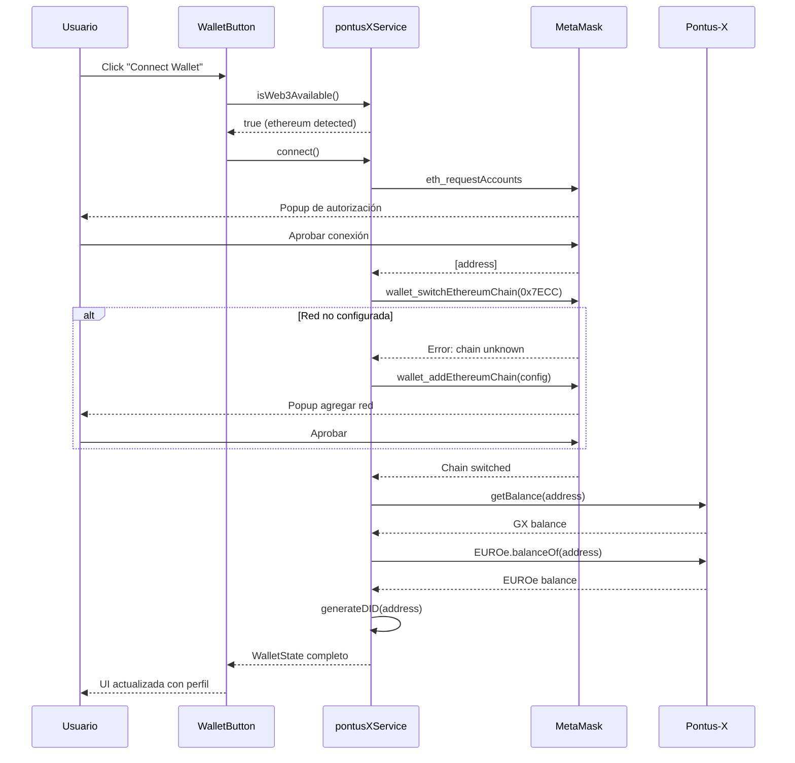

### 11.2 Caso 2: Intercambio de Datos con EUROe

**Objetivo**: Consumer adquiere acceso a datos pagando con token EUROe.

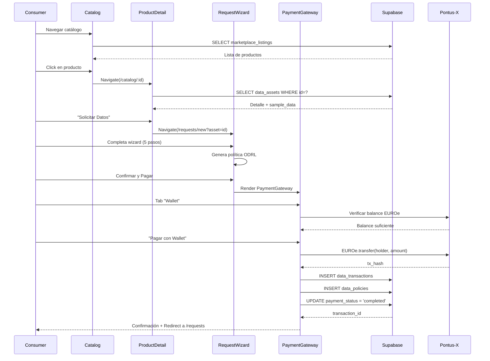

### 11.3 Caso 3: Auditoría Forense

**Objetivo**: Verificar la integridad de un acceso a datos mediante blockchain.

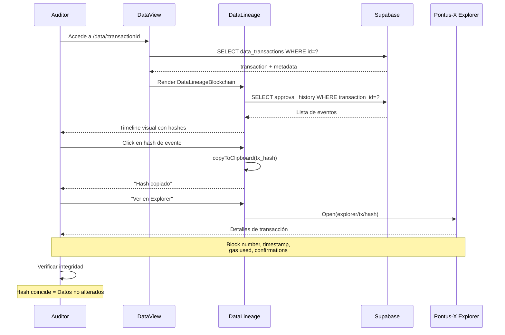

**Verificación de integridad**:

```typescript
// Componente DataLineageBlockchain
const verifyIntegrity = (event: LineageEvent) => {
  // 1. Hash registrado en Supabase
  const storedHash = event.metadata.tx_hash;
  
  // 2. Hash verificable en blockchain
  const explorerUrl = `${PONTUSX_NETWORK_CONFIG.blockExplorerUrls[0]}tx/${storedHash}`;
  
  // 3. Si el hash existe en el explorer, el evento es inmutable
  return {
    isVerified: true,
    explorerUrl,
    blockNumber: event.metadata.block_number,
    timestamp: event.metadata.confirmed_at,
  };
};
```

---

## 12. Mejoras de UX v3.1

### 12.1 Loading States Individuales (Requests.tsx)

```typescript
const [processingId, setProcessingId] = useState<string | null>(null);

const handleApprove = async (transactionId: string) => {
  setProcessingId(transactionId);
  try {
    await supabase.from('data_transactions').update({ ... });
    toast.success('Transacción aprobada');
  } finally {
    setProcessingId(null);
  }
};

// En el botón:
<Button
  onClick={() => handleApprove(transaction.id)}
  disabled={processingId !== null}
>
  {processingId === transaction.id ? (
    <Loader2 className="h-4 w-4 animate-spin" />
  ) : (
    <CheckCircle className="h-4 w-4" />
  )}
</Button>
```

### 12.2 Confirmación con AlertDialog (Opportunities.tsx)

```tsx
<AlertDialog>
  <AlertDialogTrigger asChild>
    <Button>Proponer mis Datos</Button>
  </AlertDialogTrigger>
  <AlertDialogContent>
    <AlertDialogHeader>
      <AlertDialogTitle>Confirmar Propuesta</AlertDialogTitle>
      <AlertDialogDescription>
        ¿Estás seguro? Los datos serán compartidos según el contrato.
      </AlertDialogDescription>
    </AlertDialogHeader>
    <AlertDialogFooter>
      <AlertDialogCancel>Cancelar</AlertDialogCancel>
      <AlertDialogAction onClick={() => handleProposal(opp.id)}>
        Confirmar
      </AlertDialogAction>
    </AlertDialogFooter>
  </AlertDialogContent>
</AlertDialog>
```

### 12.3 Skeleton Loaders (SettingsPreferences.tsx)

```tsx
{loading ? (
  <div className="space-y-4">
    <Skeleton className="h-12 w-full" />
    <Skeleton className="h-12 w-full" />
    <Skeleton className="h-12 w-full" />
  </div>
) : (
  <div className="space-y-4">
    {/* Contenido real */}
  </div>
)}
```

### 12.4 Validación Zod (Auth.tsx)

```typescript
const authSchema = z.object({
  email: z
    .string()
    .trim()
    .min(1, "El email es obligatorio")
    .email("Introduce un email válido")
    .max(255, "Email demasiado largo"),
  password: z
    .string()
    .min(6, "La contraseña debe tener al menos 6 caracteres")
    .max(72, "Contraseña demasiado larga"),
});

// Uso con React Hook Form
const form = useForm({
  resolver: zodResolver(authSchema),
});
```

### 12.5 Estados Vacíos Consistentes (EmptyState)

```tsx
// src/components/EmptyState.tsx
interface EmptyStateProps {
  icon?: LucideIcon;
  title: string;
  description?: string;
  action?: {
    label: string;
    onClick: () => void;
  };
}

<EmptyState
  icon={FileText}
  title="No hay transacciones"
  description="Cuando realices solicitudes de datos, aparecerán aquí."
  action={{
    label: "Explorar Catálogo",
    onClick: () => navigate('/catalog')
  }}
/>
```

---

## 13. Edge Functions

### 13.1 erp-api-tester

**Propósito**: Test de conectividad a APIs ERP externas

**Ruta**: `POST /functions/v1/erp-api-tester`

```typescript
// Request
{
  apiUrl: string;
  apiKey: string;
  method: 'GET' | 'POST';
}

// Response
{
  success: boolean;
  responseTime: number;
  statusCode: number;
}
```

### 13.2 erp-data-uploader

**Propósito**: Envío de datos estructurados a sistemas ERP

**Ruta**: `POST /functions/v1/erp-data-uploader`

```typescript
// Request
{
  configId: string;
  transactionId: string;
  data: object;
}

// Response
{
  success: boolean;
  externalId: string;
}
```

### 13.3 notification-handler

**Propósito**: Emails transaccionales via Resend

**Ruta**: `POST /functions/v1/notification-handler`

```typescript
// Request
{
  type: 'pre_approved' | 'approved' | 'denied' | 'completed';
  transactionId: string;
  recipientEmail: string;
}

// Response
{
  success: boolean;
  messageId: string;
}
```

---

## 14. Guía de Desarrollo

### 14.1 Tokens de Diseño (index.css)

```css
:root {
  --background: 0 0% 100%;
  --foreground: 222.2 84% 4.9%;
  --primary: 221.2 83.2% 53.3%;
  --primary-foreground: 210 40% 98%;
  --secondary: 210 40% 96.1%;
  --muted: 210 40% 96.1%;
  --muted-foreground: 215.4 16.3% 46.9%;
  --accent: 210 40% 96.1%;
  --destructive: 0 84.2% 60.2%;
  --border: 214.3 31.8% 91.4%;
  --radius: 0.5rem;
}

.dark {
  --background: 222.2 84% 4.9%;
  --foreground: 210 40% 98%;
  --primary: 217.2 91.2% 59.8%;
  /* ... */
}
```

### 14.2 Uso Correcto de Colores

```tsx
// ✅ CORRECTO: Usar tokens semánticos
<div className="bg-background text-foreground" />
<Button className="bg-primary text-primary-foreground" />
<Badge variant="destructive" />
<Card className="border-border" />

// ❌ INCORRECTO: Colores hardcoded
<div className="bg-white text-black" />
<Button className="bg-blue-600" />
<div style={{ color: '#333' }} />
```

### 14.3 Archivos NO Editables

Los siguientes archivos son autogenerados y **NO deben modificarse manualmente**:

| Archivo | Razón |
|---------|-------|
| `src/integrations/supabase/client.ts` | Cliente Supabase autogenerado |
| `src/integrations/supabase/types.ts` | Tipos de base de datos autogenerados |
| `supabase/config.toml` | Configuración de Supabase |
| `supabase/migrations/*` | Historial de migraciones |
| `.env` | Variables de entorno (no commitear) |

### 14.4 Convenciones de Código

| Aspecto | Convención |
|---------|------------|
| Componentes | PascalCase (`UserProfile.tsx`) |
| Hooks | camelCase con prefijo `use` (`useAuth.tsx`) |
| Servicios | camelCase (`pontusX.ts`) |
| Tipos | PascalCase (`WalletState`) |
| Archivos CSS | kebab-case si necesario |
| Imports | Absolute paths con `@/` |

### 14.5 Estructura de Imports

```typescript
// 1. React y librerías externas
import { useState, useEffect } from 'react';
import { useQuery } from '@tanstack/react-query';

// 2. Componentes UI
import { Button } from '@/components/ui/button';
import { Card } from '@/components/ui/card';

// 3. Componentes custom
import { WalletButton } from '@/components/WalletButton';

// 4. Hooks
import { useAuth } from '@/hooks/useAuth';

// 5. Servicios y utilidades
import { supabase } from '@/integrations/supabase/client';
import { pontusXService } from '@/services/pontusX';

// 6. Tipos
import type { WalletState } from '@/types/web3.types';
```

---

## 15. Estado de Auditoría

### 15.1 Resumen de Tareas

| Prioridad | Completadas | Total | % |
|-----------|-------------|-------|---|
| 🔴 Crítica | 6 | 6 | 100% |
| 🟠 Alta | 3 | 6 | 50% |
| 🟢 Mejora | 4 | 10 | 40% |

### 15.2 Críticos Completados ✅

- [x] Limpieza de logs de desarrollo en producción
- [x] Loading states en acciones destructivas (`processingId`)
- [x] Validación Zod en formularios críticos (Auth.tsx)
- [x] Confirmación AlertDialog antes de acciones irreversibles
- [x] Skeleton loaders para estados de carga
- [x] Integración Web3 en contexto de autenticación híbrida

### 15.3 Alta Prioridad Completados ✅

- [x] Hook `usePrivacyPreferences` con persistencia optimista
- [x] Componente `Web3StatusWidget` en Dashboard
- [x] Componente `EmptyState` reutilizable

### 15.4 Pendientes Alta Prioridad

- [ ] Integración EDC (Eclipse Dataspace Connector)
- [ ] SSI Wallet completa (requiere infraestructura Gaia-X)
- [ ] Indicadores visuales de EUROe en tarjetas de Catálogo

### 15.5 Mejoras Completadas ✅

- [x] Página `/architecture` con tabs interactivos
- [x] Componente `MermaidDiagram.tsx` con dark mode
- [x] ActivityFeed con Realtime subscriptions
- [x] Cleanup correcto de channels WebSocket

---

## 16. Anexos

### 16.1 Esquema de Base de Datos Completo (28 tablas)

#### Organizaciones y Usuarios

| Tabla | Columnas Clave | Descripción |
|-------|----------------|-------------|
| `organizations` | id, name, type, sector, kyb_verified, did, wallet_address | Entidades del sistema |
| `user_profiles` | user_id, organization_id, full_name, position | Perfiles de usuario |
| `user_roles` | user_id, organization_id, role | Roles por organización |
| `privacy_preferences` | user_id, profile_visible, access_alerts | Preferencias de privacidad |

#### Catálogo de Datos

| Tabla | Columnas Clave | Descripción |
|-------|----------------|-------------|
| `data_products` | id, name, category, schema_definition, version | Plantillas de productos |
| `data_assets` | id, product_id, holder_org_id, subject_org_id, price | Activos disponibles |
| `catalog_metadata` | asset_id, tags, categories, visibility | Metadatos de catálogo |

#### Transacciones

| Tabla | Columnas Clave | Descripción |
|-------|----------------|-------------|
| `data_transactions` | id, asset_id, consumer_org_id, subject_org_id, holder_org_id, status | Transacciones |
| `approval_history` | transaction_id, actor_org_id, action, notes | Historial de aprobaciones (Realtime) |
| `data_policies` | transaction_id, odrl_policy_json | Smart Contracts ODRL |
| `data_payloads` | transaction_id, schema_type, data_content | Contenido de datos |
| `transaction_messages` | transaction_id, sender_org_id, content | Chat de negociación |

#### Finanzas

| Tabla | Columnas Clave | Descripción |
|-------|----------------|-------------|
| `wallets` | organization_id, balance, currency, address | Billeteras |
| `wallet_transactions` | from_wallet_id, to_wallet_id, amount, type | Movimientos |

#### Sistema y Seguridad

| Tabla | Columnas Clave | Descripción |
|-------|----------------|-------------|
| `notifications` | user_id, type, title, message, is_read | Sistema Realtime |
| `login_attempts` | email, ip_address, success, attempted_at | Rate Limiting |
| `audit_logs` | actor_id, action, resource, details | Trazabilidad |
| `export_logs` | transaction_id, format, exported_by | Auditoría exportaciones |

#### Otros

| Tabla | Descripción |
|-------|-------------|
| `esg_reports` | Reportes de sostenibilidad |
| `marketplace_opportunities` | Demandas de datos |
| `erp_configurations` | Integraciones ERP |
| `supplier_data` | Datos estructurados de proveedores |
| `value_services` | Servicios adicionales |
| `organization_reviews` | Reseñas entre organizaciones |
| `success_stories` | Casos de éxito |
| `innovation_lab_concepts` | Conceptos del Innovation Lab |
| `user_wishlist` | Lista de deseos de usuarios |

### 16.2 Enums del Sistema

```sql
-- Tipos de organización
CREATE TYPE organization_type AS ENUM ('consumer', 'provider', 'data_holder');

-- Roles de usuario
CREATE TYPE app_role AS ENUM ('admin', 'approver', 'viewer', 'api_configurator');

-- Estados de transacción
CREATE TYPE transaction_status AS ENUM (
  'initiated', 'pending_subject', 'pending_holder',
  'approved', 'denied_subject', 'denied_holder',
  'completed', 'cancelled'
);

-- Acciones de aprobación
CREATE TYPE approval_action AS ENUM ('pre_approve', 'approve', 'deny', 'cancel');

-- Tipos de configuración ERP
CREATE TYPE erp_config_type AS ENUM ('download', 'upload');

-- Métodos de autenticación ERP
CREATE TYPE auth_method AS ENUM ('bearer', 'api_key', 'oauth', 'basic');
```

### 16.3 Variables de Entorno

| Variable | Ámbito | Descripción |
|----------|--------|-------------|
| `VITE_SUPABASE_URL` | Frontend | URL del proyecto Supabase |
| `VITE_SUPABASE_PUBLISHABLE_KEY` | Frontend | Anon key pública |
| `VITE_SUPABASE_PROJECT_ID` | Frontend | ID del proyecto |
| `SUPABASE_URL` | Edge Functions | URL interna |
| `SUPABASE_ANON_KEY` | Edge Functions | Anon key |
| `SUPABASE_SERVICE_ROLE_KEY` | Edge Functions | Service role (privilegiado) |
| `RESEND_API_KEY` | Edge Functions | API key para emails |

### 16.4 Estructura del Proyecto

```
procuredata/
├── docs/                          # Documentación técnica
│   └── DOCUMENTO_TECNICO.md       # Este archivo (v3.1)
│
├── src/
│   ├── components/                # 40+ componentes custom
│   │   ├── ui/                    # 49 componentes Shadcn/UI
│   │   ├── AppLayout.tsx
│   │   ├── AppSidebar.tsx
│   │   ├── Web3StatusWidget.tsx   # NUEVO v3.1
│   │   ├── WalletButton.tsx
│   │   ├── ActivityFeed.tsx       # MEJORADO v3.1
│   │   ├── EmptyState.tsx         # NUEVO v3.1
│   │   ├── MermaidDiagram.tsx     # NUEVO v3.1
│   │   └── ...
│   │
│   ├── pages/                     # 27 páginas
│   │   ├── Landing.tsx
│   │   ├── Auth.tsx               # Validación Zod v3.1
│   │   ├── Dashboard.tsx          # + Web3Widget v3.1
│   │   ├── Architecture.tsx       # Tabs interactivos v3.1
│   │   └── ...
│   │
│   ├── hooks/                     # 8 hooks personalizados
│   │   ├── useAuth.tsx
│   │   ├── useWeb3Wallet.tsx      # NUEVO v3.1
│   │   ├── usePrivacyPreferences.tsx  # NUEVO v3.1
│   │   └── ...
│   │
│   ├── services/
│   │   └── pontusX.ts             # Servicio Web3
│   │
│   ├── types/
│   │   ├── database.extensions.ts
│   │   └── web3.types.ts
│   │
│   └── integrations/
│       └── supabase/
│           ├── client.ts          # NO EDITAR
│           └── types.ts           # NO EDITAR
│
├── supabase/
│   ├── functions/                 # 3 Edge Functions
│   │   ├── erp-api-tester/
│   │   ├── erp-data-uploader/
│   │   └── notification-handler/
│   │
│   ├── migrations/                # NO EDITAR
│   └── config.toml                # NO EDITAR
│
└── public/                        # Assets estáticos
```

---

## 17. Historial de Versiones

| Versión | Fecha | Cambios Principales |
|---------|-------|---------------------|
| **3.1** | **05 Enero 2026** | Web3StatusWidget, useWeb3Wallet, usePrivacyPreferences, ActivityFeed Realtime, EmptyState, MermaidDiagram, página Architecture interactiva, validación Zod, loading states individuales, AlertDialog confirmaciones |
| 3.0 | Diciembre 2025 | Integración Web3 completa, SSI con DIDs, Pagos EUROe, WalletButton |
| 2.5 | Diciembre 2025 | Realtime notifications, mejoras UX básicas |
| 2.0 | Noviembre 2025 | Modelo tripartito Consumer/Subject/Holder, políticas ODRL, Innovation Lab |
| 1.0 | Octubre 2025 | MVP inicial con catálogo básico y autenticación |

---

## Referencias

- [W3C DID Core 1.0](https://www.w3.org/TR/did-core/)
- [ODRL Information Model 2.2](https://www.w3.org/TR/odrl-model/)
- [Gaia-X Trust Framework](https://gaia-x.eu/)
- [IDSA Reference Architecture Model](https://internationaldataspaces.org/)
- [Pontus-X Documentation](https://pontus-x.eu/docs)
- [EUROe Stablecoin](https://euroe.com/)

---

**Documento generado por PROCUREDATA Technical Documentation System**  
**Última actualización**: 05 Enero 2026  
**Versión**: 3.1 (Web3 Enabled + UX Improvements)
