# TECHNISCHES DOKUMENT - PROCUREDATA v3.2

## Datensouveränitätsplattform für Lieferketten

**Version:** 3.2 (Registrierung + Onboarding System)  
**Letzte Aktualisierung:** 13. Januar 2026  
**Klassifizierung:** Interne Technische Dokumentation  
**Status:** Production-Ready ✅ | Web3 Aktiviert ✅ | Onboarding ✅

---

## Inhaltsverzeichnis

1. [Changelog seit v3.1](#1-changelog-seit-v31)
2. [Systemübersicht](#2-systemübersicht)
3. [Plattformarchitektur](#3-plattformarchitektur)
4. [Data Space Komponenten (Gaia-X)](#4-data-space-komponenten-gaia-x)
5. [Technischer Komponentenkatalog](#5-technischer-komponentenkatalog)
6. [Custom Hooks](#6-custom-hooks)
7. [Hauptschnittstellen und Seiten](#7-hauptschnittstellen-und-seiten)
8. [Benutzer-Personas (Technische Rollen)](#8-benutzer-personas-technische-rollen)
9. [Technisches Governance-Modell](#9-technisches-governance-modell)
10. [Sicherheit und Audit](#10-sicherheit-und-audit)
11. [Haupt-Anwendungsfälle](#11-haupt-anwendungsfälle)
12. [UX-Verbesserungen v3.1](#12-ux-verbesserungen-v31)
13. [Edge Functions](#13-edge-functions)
14. [Registrierungs- und Onboarding-System (v3.2)](#14-registrierungs--und-onboarding-system-v32)
15. [Entwicklungshandbuch](#15-entwicklungshandbuch)
16. [Audit-Status](#16-audit-status)
17. [Anhänge](#17-anhänge)
18. [Versionshistorie](#18-versionshistorie)

---

## 1. Changelog seit v3.1

### v3.2 - 13. Januar 2026

#### 📝 Registrierungs- und Onboarding-System
- **Tabelle `registration_requests`**: Neue Tabelle für Mitgliedschaftsanfragen
  - Status: pending, under_review, approved, rejected, needs_info
  - Duplikatvalidierung nach `tax_id`
  - Felder für Steuerdaten, gesetzlicher Vertreter, Nutzungsabsichten
- **Edge Function `submit-registration`**: Verarbeitung von Registrierungsanfragen
- **Edge Function `send-welcome-email`**: Rollenspezifische Willkommens-E-Mails

#### 🔐 Differenziertes Zugangssystem
- **Demo-Modus**: Nicht authentifizierte Benutzer mit synthetischen Daten
- **Pending Setup-Modus**: Registrierte Benutzer im Onboarding-Prozess
- **Aktiv-Modus**: Benutzer mit verifizierter Organisation

---

## 2. Systemübersicht

### 2.1 Zweck

PROCUREDATA ist eine **Datensouveränitätsplattform** für den sicheren und nachvollziehbaren Austausch von Geschäftsinformationen zwischen Lieferketten-Organisationen.

Die Plattform implementiert **Gaia-X**-Prinzipien und den **IDSA**-Standard:

- **Datensouveränität**: Eigentümer behalten volle Kontrolle
- **Unveränderliche Nachverfolgbarkeit**: Blockchain-Aufzeichnung
- **Interoperabilität**: Kompatibilität mit ERP-Systemen
- **Regulatorische Konformität**: DSGVO, CSRD

### 2.2 Tripartites Rollenmodell

```mermaid
graph TD
    C[Verbraucher/Käufer] -->|1. Fordert Daten an| P[Anbieter/Lieferant]
    P -->|2. Autorisiert Nutzung| H[Datenhalter]
    H -->|3. Gibt Zugang frei| C
    
    style C fill:#3b82f6,color:#fff
    style P fill:#22c55e,color:#fff
    style H fill:#f59e0b,color:#fff
```



| Rolle | Verantwortung | Beispiel |
|-------|---------------|----------|
| **Data Consumer** | Fordert Datenzugang | Käuferunternehmen |
| **Data Subject** | Ursprünglicher Dateneigentümer | Lieferant |
| **Data Holder** | Technischer Verwahrer | Steuerbehörde, Zertifizierer |

---

## 3. Plattformarchitektur

### 3.1 Technologie-Stack

#### Frontend

| Technologie | Version | Zweck |
|-------------|---------|-------|
| **React** | 18.3.1 | UI-Bibliothek mit Hooks |
| **Vite** | Latest | Bundler mit HMR |
| **TypeScript** | 5.x | Statische Typisierung |
| **Tailwind CSS** | 3.x | CSS-Utilities |
| **Shadcn/ui** | Latest | 49 zugängliche Komponenten |

#### Backend (Cloud AI)

| Technologie | Version | Zweck |
|-------------|---------|-------|
| **PostgreSQL** | 15.x | Datenbank mit RLS (28 Tabellen) |
| **Supabase Auth** | Latest | JWT-Authentifizierung |
| **Edge Functions** | Deno | Serverlose Funktionen |

#### Web3-Schicht

| Technologie | Version | Zweck |
|-------------|---------|-------|
| **Ethers.js** | 6.16.0 | Blockchain-Interaktion |
| **Pontus-X Testnet** | Chain 0x7ECC | Gaia-X Netzwerk |
| **EUROe Token** | ERC-20 | Stablecoin-Zahlungen |

### 3.2 Architekturdiagramm


---

## 4. Data Space Komponenten (Gaia-X)

### 4.1 Self-Sovereign Identity (SSI)

PROCUREDATA implementiert **Dezentralisierte Identifikatoren (DIDs)** nach W3C DID Core 1.0.

```typescript
// DID-Generierung
generateDID(address: string): string {
  return `did:ethr:${chainId}:${address.toLowerCase()}`;
}
// Ergebnis: did:ethr:0x7ecc:0x742d35cc6634c0532925a3b844bc9e7595f8fe00
```

---

## 5. Technischer Komponentenkatalog

### 5.1 UI-Komponenten (49 Shadcn/ui)

| Kategorie | Komponenten |
|-----------|-------------|
| **Formulare** | Button, Input, Select, Checkbox, Switch |
| **Navigation** | Tabs, Menu, Breadcrumb, Pagination |
| **Feedback** | Toast, Alert, Progress, Skeleton |
| **Overlay** | Dialog, Sheet, Popover, Tooltip |

---

## 6. Custom Hooks

| Hook | Zweck |
|------|-------|
| `useAuth` | Hybride Supabase + Web3 Authentifizierung |
| `useWeb3Wallet` | Wallet-Verbindungsverwaltung |
| `useUserAccessMode` | Demo/Pending/Aktiv-Modus |
| `usePrivacyPreferences` | Datenschutzeinstellungen |

---

## 7. Hauptschnittstellen und Seiten

| Route | Komponente | Beschreibung |
|-------|------------|--------------|
| `/` | `Index.tsx` | Öffentliche Startseite |
| `/auth` | `Auth.tsx` | Anmeldung/Registrierung |
| `/dashboard` | `Dashboard.tsx` | Haupt-Dashboard |
| `/catalog` | `DataCatalog.tsx` | Datenkatalog |
| `/register` | `Register.tsx` | Mitgliedschaftsformular |

---

## 8. Benutzer-Personas

| Rolle | Berechtigungen |
|-------|----------------|
| `admin` | Vollzugriff |
| `approver` | Anfragen genehmigen/ablehnen |
| `viewer` | Nur Lesen |
| `api_configurator` | API/ERP-Konfiguration |

---

## 9. Technisches Governance-Modell

### 9.1 ODRL-Richtlinien

```json
{
  "@context": "http://www.w3.org/ns/odrl.jsonld",
  "@type": "Agreement",
  "permission": [{
    "target": "asset:lieferanten-steuerdaten",
    "action": "read",
    "constraint": [{
      "leftOperand": "purpose",
      "operator": "eq",
      "rightOperand": "lieferanten-validierung"
    }]
  }]
}
```

---

## 10. Sicherheit und Audit

| Schicht | Implementierung |
|---------|-----------------|
| **Authentifizierung** | Supabase Auth + Wallet-Signatur |
| **Autorisierung** | Row Level Security PostgreSQL |
| **Verschlüsselung** | TLS 1.3 in Transit, AES-256 at Rest |
| **Audit** | Vollständige Logs mit IP und User-Agent |

---

## 11. Haupt-Anwendungsfälle

### 11.1 Automatisches Lieferanten-Onboarding (KYB)

```mermaid
sequenceDiagram
    participant K as Käufer
    participant P as PROCUREDATA
    participant L as Lieferant
    participant H as Datenhalter

    K->>P: Lieferantenvalidierung anfragen
    P->>L: Einwilligungsanfrage
    L->>P: Autorisiert Datenweitergabe
    P->>H: Verifizierte Daten anfragen
    H->>P: Gibt Daten zurück
    P->>K: Lieferant validiert ✅
```



---

## 12. UX-Verbesserungen v3.1

- Individuelle Ladezustände pro Aktion
- Bestätigungsdialoge vor destruktiven Aktionen
- Echtzeit-Formularvalidierung
- Skeleton-Komponenten beim Laden

---

## 13. Edge Functions

| Funktion | Zweck |
|----------|-------|
| `submit-registration` | Mitgliedschaftsanfragen verarbeiten |
| `send-welcome-email` | Differenzierte Willkommens-E-Mails |
| `generate-odrl-policy` | ODRL-Richtliniengenerierung |

---

## 14. Registrierungs- und Onboarding-System (v3.2)

### 14.1 Registrierungsablauf


---

## 15. Entwicklungshandbuch

```bash
# Installation
git clone <repository>
npm install

# Konfiguration
cp .env.example .env

# Entwicklung starten
npm run dev
```

---

## 16. Audit-Status

| Bereich | Status | Letzte Überprüfung |
|---------|--------|-------------------|
| RLS-Richtlinien | ✅ Vollständig | Jan 2026 |
| Edge Functions | ✅ Validiert | Jan 2026 |
| Web3-Integration | ✅ Funktional | Jan 2026 |
| Internationalisierung | ✅ 7 Sprachen | Jan 2026 |

---

## 17. Anhänge

- A. Vollständiges Datenbankschema
- B. API-Dokumentation
- C. Mermaid-Diagramme

---

## 18. Versionshistorie

| Version | Datum | Änderungen |
|---------|-------|------------|
| 3.2 | 13. Jan 2026 | Registrierungssystem, differenzierter Zugang |
| 3.1 | 5. Jan 2026 | Web3-Integration, interaktive Dokumentation |
| 3.0 | Dez 2025 | Cloud AI Migration |

---

**Dokument gepflegt vom PROCUREDATA Technischen Team**  
**Letzte Aktualisierung: Januar 2026**
