# TECHNICAL DOCUMENT - PROCUREDATA v3.2

## Data Sovereignty Platform for Supply Chains

**Version:** 3.2 (Registration + Onboarding System)  
**Last Updated:** January 13, 2026  
**Classification:** Internal Technical Documentation  
**Status:** Production-Ready ✅ | Web3 Enabled ✅ | Onboarding ✅

---

## Index

1. [Changelog from v3.1](#1-changelog-from-v31)
2. [System Overview](#2-system-overview)
3. [Platform Architecture](#3-platform-architecture)
4. [Data Space Components (Gaia-X)](#4-data-space-components-gaia-x)
5. [Technical Components Catalog](#5-technical-components-catalog)
6. [Custom Hooks](#6-custom-hooks)
7. [Main Interfaces and Pages](#7-main-interfaces-and-pages)
8. [User Personas (Technical Roles)](#8-user-personas-technical-roles)
9. [Technical Governance Model](#9-technical-governance-model)
10. [Security and Auditing](#10-security-and-auditing)
11. [Main Use Cases](#11-main-use-cases)
12. [UX Improvements v3.1](#12-ux-improvements-v31)
13. [Edge Functions](#13-edge-functions)
14. [Registration and Onboarding System (v3.2)](#14-registration-and-onboarding-system-v32)
15. [Development Guide](#15-development-guide)
16. [Audit Status](#16-audit-status)
17. [Annexes](#17-annexes)
18. [Version History](#18-version-history)

---

## 1. Changelog from v3.1

### v3.2 - January 13, 2026

#### 📝 Registration and Onboarding System
- **`registration_requests` Table**: New table for managing membership requests
  - States: pending, under_review, approved, rejected, needs_info
  - Duplicate validation by `tax_id`
  - Fields for fiscal data, legal representative, usage intentions
- **Edge Function `submit-registration`**: Registration request processing with:
  - Payload validation with Zod schemas
  - Duplicate detection by Tax ID
  - Insertion in `registration_requests` table
  - Welcome email trigger
- **Edge Function `send-welcome-email`**: Role-differentiated emails (Buyer/Supplier)
  - Supplier template: "Activate your visibility" - certification focus
  - Buyer template: "Security Verification" - KYB focus
  - Multi-language support: ES, EN, FR, PT, DE, IT, NL
  - Resend API integration
- **Hook `useRegistration`**: Form submission state management with localStorage persistence
- **Page `/register`**: Multi-step form with real-time Zod validation

#### 🔐 Differentiated Access System
- **Demo Mode**: Non-authenticated users with synthetic data (PublicDemoLayout)
- **Pending Setup Mode**: Registered users in onboarding process
- **Active Mode**: Users with verified organization and real data
- **Hook `useUserAccessMode`**: Determines current user's access mode

#### 🌐 Complete Internationalization
- New translations in 7 languages (ES, EN, FR, PT, DE, IT, NL) for:
  - Registration page (`register.json`)
  - Transactional emails
  - Onboarding dashboard
  - Validation and error messages

#### 📊 Technical Documentation v3.2
- **Technical Document**: Updated to v3.2 with changelog, new edge functions
- **Enterprise Capabilities**: Added 2 new capabilities (KYB Onboarding, Access Control)
- **Explanatory Documents**: Updated Doc 12 with registration flow

---

### v3.1 - January 5, 2026

#### 🔗 Complete Web3 Integration
- **Web3StatusWidget**: New Dashboard widget showing:
  - EUROe balance (ERC-20 token)
  - GX balance (Pontus-X native gas)
  - Verified DID (`did:ethr:0x7ecc:...`)
  - Block Explorer link
- **Hybrid AuthContext**: Fusion of Supabase + Web3 wallet authentication
- **Hook useWeb3Wallet**: Dedicated wallet connection/disconnection management with auto-reconnect
- **pontusXService Service**: Singleton for all blockchain operations

#### 📊 Realtime Capabilities
- **ActivityFeed**: Subscription to `approval_history` via Supabase Realtime
- Automatic query invalidation with `queryClient.invalidateQueries`
- Correct cleanup with `supabase.removeChannel()`

#### 🎨 UX Improvements
- **Requests.tsx**: Individual loading states per button (`processingId`)
- **Opportunities.tsx**: Confirmation AlertDialog before proposals
- **Auth.tsx**: Zod validation for email and password
- **SettingsPreferences.tsx**: Loading skeleton during preferences fetch
- **EmptyState component**: Consistent empty states with icons and actions

#### 🔒 Security and Privacy
- **usePrivacyPreferences hook**: Privacy preferences persistence
- Optimistic updates with rollback on error
- Fields: `profile_visible`, `show_access_history`, `access_alerts`, `anonymous_research`

#### 📖 Interactive Documentation
- **Page `/architecture`**: 4 interactive tabs with rendered Mermaid diagrams
- **MermaidDiagram.tsx Component**: Diagram rendering with dark mode support
- **mermaid@11.12.2 Dependency**: Flow and architecture visualization

#### 🛠 Infrastructure
- Development logs cleanup in production
- Web3 types in `src/types/web3.types.ts`
- Global extension of `Window.ethereum`

---

## 2. System Overview

### 2.1 Purpose

PROCUREDATA is a **data sovereignty platform** designed to facilitate secure and traceable exchange of business information between supply chain organizations. It doesn't store data; it manages **sovereign agreements** between data holders and those who need it.

The platform implements **Gaia-X** ecosystem principles and the **IDSA (International Data Spaces Association)** standard to ensure:

- **Data Sovereignty**: Data owners maintain full control over who accesses their information and under what conditions.
- **Immutable Traceability**: Every access and transaction is recorded on blockchain, creating an auditable history.
- **Interoperability**: Compatibility with existing ERP systems (SAP, Oracle, Salesforce) through standardized connectors.
- **Regulatory Compliance**: Designed to meet GDPR, CSRD, and sector-specific regulations.

### 2.2 Tripartite Role Model

PROCUREDATA implements a three-role model based on the IDSA standard:


| Role | Responsibility | Supply Chain Example |
|------|----------------|---------------------|
| **Data Consumer** | Requests data access for a specific purpose | Buying company needing to validate suppliers |
| **Data Subject (Provider)** | Original data owner, decides on its use | Supplier whose fiscal data is requested |
| **Data Holder** | Technical custodian who stores and delivers data | Tax agency, chamber of commerce, certifier |

### 2.3 Hybrid Web2 + Web3 Architecture

PROCUREDATA uses a **hybrid architecture** combining:

- **Web2 Layer (Cloud AI/Supabase)**: Traditional storage for user data, business logic, and RESTful APIs.
- **Web3 Layer (Pontus-X Blockchain)**: Immutable transaction record, identity verification (DID), and EUROe token payments.

```
┌─────────────────────────────────────────────────────────────────┐
│                         END USER                                 │
│                   (Web Browser + MetaMask)                       │
└─────────────────────────────────────────────────────────────────┘
                              │
                              ▼
┌─────────────────────────────────────────────────────────────────┐
│                     FRONTEND (React + Vite)                      │
│  ┌──────────────┐  ┌──────────────┐  ┌──────────────┐           │
│  │   useAuth    │  │ useWeb3Wallet│  │  React Query │           │
│  │   Context    │  │    Hook      │  │    Cache     │           │
│  └──────────────┘  └──────────────┘  └──────────────┘           │
└─────────────────────────────────────────────────────────────────┘
                              │
              ┌───────────────┴───────────────┐
              ▼                               ▼
┌─────────────────────────┐     ┌─────────────────────────┐
│     WEB2 BACKEND        │     │      WEB3 LAYER         │
│   (Cloud AI)            │     │     (Pontus-X)          │
│  ┌─────────────────┐    │     │  ┌─────────────────┐    │
│  │   PostgreSQL    │    │     │  │   Ethers.js     │    │
│  │   (28 tables)   │    │     │  │   v6.16.0       │    │
│  ├─────────────────┤    │     │  ├─────────────────┤    │
│  │  Supabase Auth  │    │     │  │  EUROe Token    │    │
│  │     (JWT)       │    │     │  │   (ERC-20)      │    │
│  ├─────────────────┤    │     │  ├─────────────────┤    │
│  │ Edge Functions  │    │     │  │  DID Registry   │    │
│  │   (Deno)        │    │     │  │ (did:ethr)      │    │
│  ├─────────────────┤    │     │  ├─────────────────┤    │
│  │   Realtime      │    │     │  │  Block Explorer │    │
│  │  (WebSockets)   │    │     │  │  (Verification) │    │
│  └─────────────────┘    │     │  └─────────────────┘    │
└─────────────────────────┘     └─────────────────────────┘
```

### 2.4 Current Status

| Feature | Status |
|---------|--------|
| Production-Ready | ✅ |
| Web3 Enabled | ✅ |
| Security audit | Completed |
| Functional Demo Mode | ✅ (synthetic data) |
| Interactive guided tour | 6 steps |

---

## 3. Platform Architecture

### 3.1 Complete Technology Stack

#### Frontend

| Technology | Version | Purpose |
|------------|---------|---------|
| **React** | 18.3.1 | UI library with hooks and concurrent mode |
| **Vite** | Latest | Bundler and dev server with instant HMR |
| **TypeScript** | 5.x | Static typing for development safety |
| **Tailwind CSS** | 3.x | CSS utilities with tokenized design system |
| **Shadcn/ui** | Latest | 49 accessible components based on Radix UI |
| **Framer Motion** | 12.23.24 | Declarative animations and transitions |
| **Lucide React** | 0.462.0 | Consistent SVG iconography |
| **Recharts** | 2.15.4 | Data visualization and charts |
| **Mermaid** | 11.12.2 | Diagrams and visualizations (NEW v3.1) |

#### State and Data Fetching

| Technology | Version | Purpose |
|------------|---------|---------|
| **TanStack Query** | 5.83.0 | Cache, synchronization and server state |
| **React Context** | Built-in | Global state for auth and preferences |
| **React Hook Form** | 7.61.1 | Performant form management |
| **Zod** | 3.25.76 | Runtime schema validation |

#### Backend (Cloud AI)

| Technology | Version | Purpose |
|------------|---------|---------|
| **PostgreSQL** | 15.x | Relational database with RLS (28 tables) |
| **Supabase Auth** | Latest | JWT authentication with multiple providers |
| **Edge Functions** | Deno | Serverless functions for backend logic |
| **Realtime** | WebSockets | Real-time change subscriptions |
| **Storage** | S3-compatible | File storage |

#### Web3 Layer (Trust Layer)

| Technology | Version | Purpose |
|------------|---------|---------|
| **Ethers.js** | 6.16.0 | EVM blockchain interaction |
| **Pontus-X Testnet** | Chain 0x7ECC (32460) | Gaia-X ecosystem blockchain network |
| **MetaMask/Rabby** | Latest | Compatible Web3 wallets |
| **EUROe Token** | ERC-20 | Stablecoin for platform payments |
| **DID (did:ethr)** | W3C Standard | Decentralized identifiers |

### 3.2 High-Level Architecture Diagram


### 3.3 Main Data Flow


### 3.4 Transaction State Machine


---

## 4. Data Space Components (Gaia-X)

### 4.1 Self-Sovereign Identity (SSI)

PROCUREDATA implements **Decentralized Identifiers (DIDs)** following the W3C DID Core 1.0 standard, specifically the `did:ethr` method for Ethereum-compatible networks.

#### DID Generation

The `pontusXService` service automatically generates DIDs when connecting a wallet:

```typescript
// src/services/pontusX.ts
generateDID(address: string): string {
  // Standard format: did:ethr:<chainId>:<ethereumAddress>
  return `did:ethr:${PONTUSX_NETWORK_CONFIG.chainId}:${address.toLowerCase()}`;
}

// Example result:
// did:ethr:0x7ecc:0x742d35cc6634c0532925a3b844bc9e7595f8fe00
```

#### DID Structure

| Component | Value | Description |
|-----------|-------|-------------|
| Scheme | `did` | W3C standard prefix |
| Method | `ethr` | Ethereum DID method |
| Network | `0x7ecc` | Pontus-X Testnet Chain ID (32460 decimal) |
| Identifier | `0x742d...` | Wallet Ethereum address |

---

## 5. Technical Components Catalog

### 5.1 UI Components (49 Shadcn/ui)

Complete catalog of reusable interface components based on Radix UI with full WCAG 2.1 accessibility.

| Category | Components |
|----------|------------|
| **Forms** | Button, Input, Textarea, Select, Checkbox, Radio, Switch, Slider |
| **Navigation** | Tabs, NavigationMenu, Breadcrumb, Pagination |
| **Feedback** | Toast, Alert, Progress, Skeleton, Spinner |
| **Overlay** | Dialog, Sheet, Popover, Tooltip, DropdownMenu |
| **Data** | Table, Card, Badge, Avatar, Separator |
| **Layout** | Accordion, Collapsible, ScrollArea, AspectRatio |

### 5.2 Custom Components

| Component | Location | Description |
|-----------|----------|-------------|
| `Web3StatusWidget` | `/components/dashboard/` | EUROe/GX balance display with DID |
| `ActivityFeed` | `/components/dashboard/` | Transaction history with realtime |
| `MermaidDiagram` | `/components/` | Mermaid diagram renderer |
| `MarkdownRenderer` | `/components/` | MD to HTML with syntax highlighting |
| `EmptyState` | `/components/ui/` | Consistent empty states |

---

## 6. Custom Hooks

### 6.1 Authentication Hooks

| Hook | File | Purpose |
|------|------|---------|
| `useAuth` | `AuthContext.tsx` | Supabase + Web3 hybrid authentication |
| `useWeb3Wallet` | `useWeb3Wallet.ts` | MetaMask wallet connection management |
| `useUserAccessMode` | `useUserAccessMode.ts` | Determines Demo/Pending/Active mode |

### 6.2 Data Hooks

| Hook | File | Purpose |
|------|------|---------|
| `usePrivacyPreferences` | `usePrivacyPreferences.ts` | Privacy preferences CRUD |
| `useRegistration` | `useRegistration.ts` | Registration form management |
| `useOrganizationContext` | `useOrganizationContext.ts` | Active organization context |

---

## 7. Main Interfaces and Pages

### 7.1 Route Map

| Route | Component | Description |
|-------|-----------|-------------|
| `/` | `Index.tsx` | Public landing page |
| `/auth` | `Auth.tsx` | Login/Registration |
| `/dashboard` | `Dashboard.tsx` | Main dashboard |
| `/catalog` | `DataCatalog.tsx` | Data product catalog |
| `/requests` | `Requests.tsx` | Request management |
| `/settings` | `Settings.tsx` | User preferences |
| `/register` | `Register.tsx` | Membership form (v3.2) |

---

## 8. User Personas (Technical Roles)

### 8.1 Platform Roles

| Role | Permissions | Typical Use |
|------|-------------|-------------|
| `admin` | Full access | Organization administrators |
| `approver` | Approve/deny requests | Compliance department |
| `viewer` | Read-only | Auditing, consulting |
| `api_configurator` | API/ERP configuration | IT department |

---

## 9. Technical Governance Model

### 9.1 ODRL Policies

The platform uses **ODRL (Open Digital Rights Language)** for access policy definition:

```json
{
  "@context": "http://www.w3.org/ns/odrl.jsonld",
  "@type": "Agreement",
  "uid": "policy:procuredata:txn-001",
  "permission": [{
    "target": "asset:supplier-fiscal-data",
    "action": "read",
    "constraint": [{
      "leftOperand": "purpose",
      "operator": "eq",
      "rightOperand": "supplier-validation"
    }]
  }]
}
```

---

## 10. Security and Auditing

### 10.1 Security Layers

| Layer | Implementation |
|-------|----------------|
| **Authentication** | Supabase Auth (JWT) + Web3 wallet signature |
| **Authorization** | Row Level Security (RLS) in PostgreSQL |
| **Data Encryption** | TLS 1.3 in transit, AES-256 at rest |
| **Audit** | Complete audit_logs with IP and user-agent |

### 10.2 RLS Policies

All tables implement Row Level Security with organization-based isolation:

```sql
CREATE POLICY "Users can only see their organization data"
ON data_transactions
FOR SELECT
USING (
  consumer_org_id = get_user_organization(auth.uid())
  OR holder_org_id = get_user_organization(auth.uid())
  OR subject_org_id = get_user_organization(auth.uid())
);
```

---

## 11. Main Use Cases

### 11.1 Automatic Supplier Onboarding (KYB)

```mermaid
sequenceDiagram
    participant B as Buyer
    participant P as PROCUREDATA
    participant S as Supplier
    participant H as Data Holder

    B->>P: Request supplier validation
    P->>S: Consent request
    S->>P: Authorizes data sharing
    P->>H: Request validated data
    H->>P: Returns verified data
    P->>B: Supplier validated ✅
```



### 11.2 ESG Data Sharing

Supply chain sustainability data exchange for CSRD regulatory compliance.

### 11.3 Quality Certifications

Sharing of ISO, HACCP, organic certifications with automatic expiration verification.

---

## 12. UX Improvements v3.1

- Individual loading states per action
- Confirmation dialogs before destructive actions
- Real-time form validation
- Skeleton components during loading
- Consistent empty states with CTAs

---

## 13. Edge Functions

### 13.1 Available Functions

| Function | Endpoint | Purpose |
|----------|----------|---------|
| `submit-registration` | POST | Process membership requests |
| `send-welcome-email` | POST | Send differentiated welcome emails |
| `generate-odrl-policy` | POST | Dynamic ODRL policy generation |

---

## 14. Registration and Onboarding System (v3.2)

### 14.1 Registration Flow


### 14.2 Access States

| State | Description | Features |
|-------|-------------|----------|
| `demo` | Non-authenticated | Synthetic data, watermarks |
| `pending_setup` | Registered, no verified org | Limited onboarding |
| `active` | Verified organization | Full access |

---

## 15. Development Guide

### 15.1 Local Setup

```bash
# Clone and install
git clone <repository>
npm install

# Configure environment
cp .env.example .env
# Edit with Supabase credentials

# Start development
npm run dev
```

### 15.2 Folder Structure

```
src/
├── components/     # Reusable UI components
├── contexts/       # React contexts (Auth, Theme)
├── hooks/          # Custom hooks
├── pages/          # Route components
├── services/       # External services (Web3, API)
├── types/          # TypeScript definitions
└── utils/          # Helper utilities
```

---

## 16. Audit Status

| Area | Status | Last Review |
|------|--------|-------------|
| RLS Policies | ✅ Complete | Jan 2026 |
| Edge Functions | ✅ Validated | Jan 2026 |
| Web3 Integration | ✅ Functional | Jan 2026 |
| Internationalization | ✅ 7 languages | Jan 2026 |

---

## 17. Annexes

### A. Complete Database Schema

28 tables with normalized relationships and RLS policies.

### B. API Endpoints

RESTful documentation for all Edge Functions.

### C. Mermaid Diagrams

Architecture, flow, and state visualizations.

---

## 18. Version History

| Version | Date | Main Changes |
|---------|------|--------------|
| 3.2 | Jan 13, 2026 | Registration system, differentiated access |
| 3.1 | Jan 5, 2026 | Web3 integration, interactive documentation |
| 3.0 | Dec 2025 | Migration to Cloud AI |
| 2.x | 2025 | Initial development |

---

**Document maintained by the PROCUREDATA Technical Team**  
**Last updated: January 2026**
