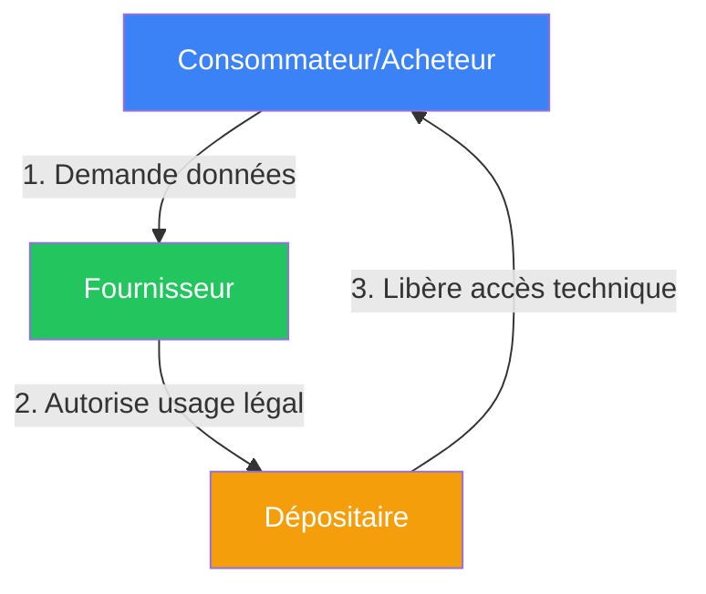
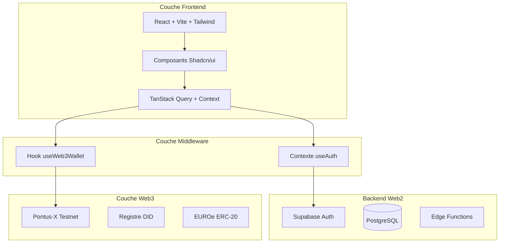
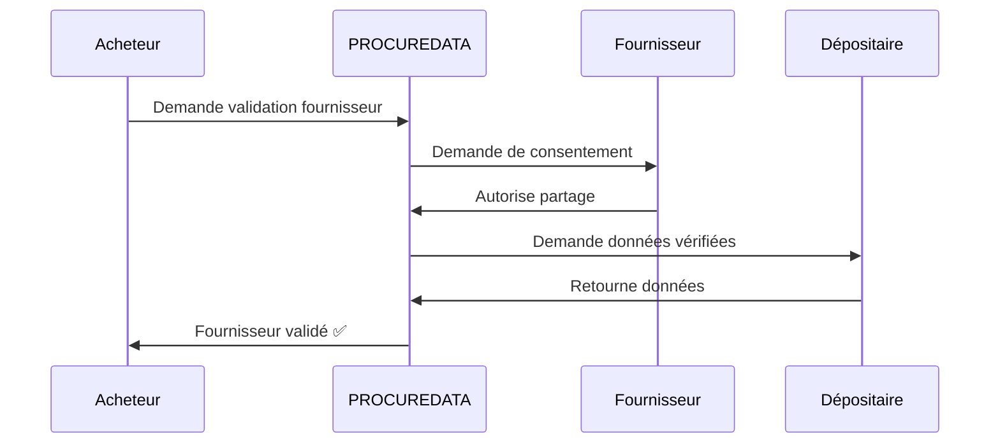
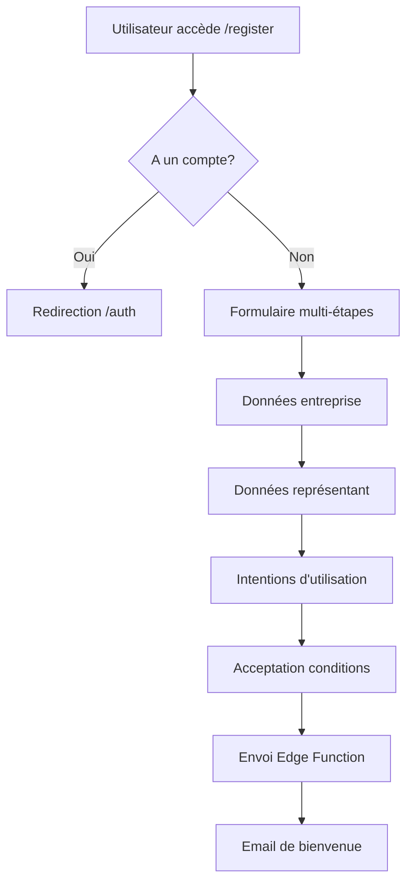

# DOCUMENT TECHNIQUE - PROCUREDATA v3.2

## Plateforme de Souveraineté des Données pour les Chaînes d'Approvisionnement

**Version:** 3.2 (Système d'Inscription + Onboarding)  
**Dernière mise à jour:** 13 Janvier 2026  
**Classification:** Documentation Technique Interne  
**État:** Production-Ready ✅ | Web3 Activé ✅ | Onboarding ✅

---

## Index

1. [Changelog depuis v3.1](#1-changelog-depuis-v31)
2. [Vue d'Ensemble du Système](#2-vue-densemble-du-système)
3. [Architecture de la Plateforme](#3-architecture-de-la-plateforme)
4. [Composants de l'Espace de Données (Gaia-X)](#4-composants-de-lespace-de-données-gaia-x)
5. [Catalogue des Composants Techniques](#5-catalogue-des-composants-techniques)
6. [Hooks Personnalisés](#6-hooks-personnalisés)
7. [Interfaces et Pages Principales](#7-interfaces-et-pages-principales)
8. [Personas Utilisateur (Rôles Techniques)](#8-personas-utilisateur-rôles-techniques)
9. [Modèle de Gouvernance Technique](#9-modèle-de-gouvernance-technique)
10. [Sécurité et Audit](#10-sécurité-et-audit)
11. [Cas d'Usage Principaux](#11-cas-dusage-principaux)
12. [Améliorations UX v3.1](#12-améliorations-ux-v31)
13. [Edge Functions](#13-edge-functions)
14. [Système d'Inscription et Onboarding (v3.2)](#14-système-dinscription-et-onboarding-v32)
15. [Guide de Développement](#15-guide-de-développement)
16. [État de l'Audit](#16-état-de-laudit)
17. [Annexes](#17-annexes)
18. [Historique des Versions](#18-historique-des-versions)

---

## 1. Changelog depuis v3.1

### v3.2 - 13 Janvier 2026

#### 📝 Système d'Inscription et Onboarding
- **Table `registration_requests`**: Nouvelle table pour la gestion des demandes d'adhésion
  - États: pending, under_review, approved, rejected, needs_info
  - Validation des doublons par `tax_id`
  - Champs pour données fiscales, représentant légal, intentions d'utilisation
- **Edge Function `submit-registration`**: Traitement des demandes d'inscription avec:
  - Validation du payload avec schémas Zod
  - Détection des doublons par numéro fiscal
  - Insertion dans la table `registration_requests`
  - Déclenchement d'email de bienvenue
- **Edge Function `send-welcome-email`**: Emails différenciés par rôle (Acheteur/Fournisseur)
  - Template Fournisseur: "Activez votre visibilité" - focus certifications
  - Template Acheteur: "Vérification de Sécurité" - focus KYB
  - Support multilingue: ES, EN, FR, PT, DE, IT, NL
  - Intégration API Resend

#### 🔐 Système d'Accès Différencié
- **Mode Démo**: Utilisateurs non authentifiés avec données synthétiques
- **Mode Configuration en Attente**: Utilisateurs inscrits en processus d'onboarding
- **Mode Actif**: Utilisateurs avec organisation vérifiée et données réelles

---

## 2. Vue d'Ensemble du Système

### 2.1 Objectif

PROCUREDATA est une **plateforme de souveraineté des données** conçue pour faciliter l'échange sécurisé et traçable d'informations commerciales entre les organisations de la chaîne d'approvisionnement.

La plateforme implémente les principes de l'écosystème **Gaia-X** et le standard **IDSA** pour garantir:

- **Souveraineté des Données**: Les propriétaires maintiennent un contrôle total sur l'accès à leurs informations
- **Traçabilité Immuable**: Chaque accès est enregistré sur blockchain
- **Interopérabilité**: Compatibilité avec les ERP existants (SAP, Oracle, Salesforce)
- **Conformité Réglementaire**: Conçu pour RGPD, CSRD et réglementations sectorielles

### 2.2 Modèle Tripartite de Rôles



| Rôle | Responsabilité | Exemple |
|------|----------------|---------|
| **Data Consumer** | Demande accès aux données | Entreprise acheteuse |
| **Data Subject** | Propriétaire original des données | Fournisseur |
| **Data Holder** | Dépositaire technique | Agence fiscale, certificateur |

---

## 3. Architecture de la Plateforme

### 3.1 Stack Technologique

#### Frontend

| Technologie | Version | Objectif |
|-------------|---------|----------|
| **React** | 18.3.1 | Bibliothèque UI avec hooks |
| **Vite** | Latest | Bundler avec HMR instantané |
| **TypeScript** | 5.x | Typage statique |
| **Tailwind CSS** | 3.x | Utilitaires CSS |
| **Shadcn/ui** | Latest | 49 composants accessibles |

#### Backend (Cloud AI)

| Technologie | Version | Objectif |
|-------------|---------|----------|
| **PostgreSQL** | 15.x | Base de données avec RLS (28 tables) |
| **Supabase Auth** | Latest | Authentification JWT |
| **Edge Functions** | Deno | Fonctions serverless |

#### Couche Web3

| Technologie | Version | Objectif |
|-------------|---------|----------|
| **Ethers.js** | 6.16.0 | Interaction blockchain |
| **Pontus-X Testnet** | Chain 0x7ECC | Réseau Gaia-X |
| **Token EUROe** | ERC-20 | Paiements stablecoin |

### 3.2 Diagramme d'Architecture



---

## 4. Composants de l'Espace de Données (Gaia-X)

### 4.1 Identité Auto-Souveraine (SSI)

PROCUREDATA implémente les **Identifiants Décentralisés (DIDs)** suivant le standard W3C DID Core 1.0.

```typescript
// Génération de DID
generateDID(address: string): string {
  return `did:ethr:${chainId}:${address.toLowerCase()}`;
}
// Résultat: did:ethr:0x7ecc:0x742d35cc6634c0532925a3b844bc9e7595f8fe00
```

---

## 5. Catalogue des Composants Techniques

### 5.1 Composants UI (49 Shadcn/ui)

| Catégorie | Composants |
|-----------|------------|
| **Formulaires** | Button, Input, Select, Checkbox, Switch |
| **Navigation** | Tabs, Menu, Breadcrumb, Pagination |
| **Feedback** | Toast, Alert, Progress, Skeleton |
| **Overlay** | Dialog, Sheet, Popover, Tooltip |

---

## 6. Hooks Personnalisés

| Hook | Objectif |
|------|----------|
| `useAuth` | Authentification hybride Supabase + Web3 |
| `useWeb3Wallet` | Gestion connexion wallet |
| `useUserAccessMode` | Détermine mode Démo/Pending/Actif |
| `usePrivacyPreferences` | Préférences de confidentialité |

---

## 7. Interfaces et Pages Principales

| Route | Composant | Description |
|-------|-----------|-------------|
| `/` | `Index.tsx` | Page d'accueil publique |
| `/auth` | `Auth.tsx` | Connexion/Inscription |
| `/dashboard` | `Dashboard.tsx` | Tableau de bord |
| `/catalog` | `DataCatalog.tsx` | Catalogue de données |
| `/register` | `Register.tsx` | Formulaire d'adhésion |

---

## 8. Personas Utilisateur

| Rôle | Permissions |
|------|-------------|
| `admin` | Accès complet |
| `approver` | Approuver/refuser demandes |
| `viewer` | Lecture seule |
| `api_configurator` | Configuration API/ERP |

---

## 9. Modèle de Gouvernance Technique

### 9.1 Politiques ODRL

```json
{
  "@context": "http://www.w3.org/ns/odrl.jsonld",
  "@type": "Agreement",
  "permission": [{
    "target": "asset:données-fiscales-fournisseur",
    "action": "read",
    "constraint": [{
      "leftOperand": "purpose",
      "operator": "eq",
      "rightOperand": "validation-fournisseur"
    }]
  }]
}
```

---

## 10. Sécurité et Audit

| Couche | Implémentation |
|--------|----------------|
| **Authentification** | Supabase Auth + signature wallet |
| **Autorisation** | Row Level Security PostgreSQL |
| **Chiffrement** | TLS 1.3 en transit, AES-256 au repos |
| **Audit** | Logs complets avec IP et user-agent |

---

## 11. Cas d'Usage Principaux

### 11.1 Onboarding Automatique Fournisseur (KYB)



---

## 12. Améliorations UX v3.1

- États de chargement individuels par action
- Dialogues de confirmation avant actions destructives
- Validation en temps réel des formulaires
- Composants Skeleton pendant le chargement

---

## 13. Edge Functions

| Fonction | Objectif |
|----------|----------|
| `submit-registration` | Traiter demandes d'adhésion |
| `send-welcome-email` | Emails de bienvenue différenciés |
| `generate-odrl-policy` | Génération politique ODRL |

---

## 14. Système d'Inscription et Onboarding (v3.2)

### 14.1 Flux d'Inscription



---

## 15. Guide de Développement

```bash
# Installation
git clone <repository>
npm install

# Configuration
cp .env.example .env

# Démarrage
npm run dev
```

---

## 16. État de l'Audit

| Domaine | État | Dernière Révision |
|---------|------|-------------------|
| Politiques RLS | ✅ Complet | Jan 2026 |
| Edge Functions | ✅ Validé | Jan 2026 |
| Intégration Web3 | ✅ Fonctionnel | Jan 2026 |
| Internationalisation | ✅ 7 langues | Jan 2026 |

---

## 17. Annexes

- A. Schéma complet de la base de données
- B. Documentation API
- C. Diagrammes Mermaid

---

## 18. Historique des Versions

| Version | Date | Changements |
|---------|------|-------------|
| 3.2 | 13 Jan 2026 | Système inscription, accès différencié |
| 3.1 | 5 Jan 2026 | Intégration Web3, documentation interactive |
| 3.0 | Déc 2025 | Migration Cloud AI |

---

**Document maintenu par l'Équipe Technique PROCUREDATA**  
**Dernière mise à jour: Janvier 2026**
