# DOCUMENTO TECNICO - PROCUREDATA v3.2

## Piattaforma di Sovranità dei Dati per le Catene di Approvvigionamento

**Versione:** 3.2 (Sistema di Registrazione + Onboarding)  
**Ultimo Aggiornamento:** 13 Gennaio 2026  
**Classificazione:** Documentazione Tecnica Interna  
**Stato:** Production-Ready ✅ | Web3 Abilitato ✅ | Onboarding ✅

---

## Indice

1. [Changelog da v3.1](#1-changelog-da-v31)
2. [Panoramica del Sistema](#2-panoramica-del-sistema)
3. [Architettura della Piattaforma](#3-architettura-della-piattaforma)
4. [Componenti dello Spazio Dati (Gaia-X)](#4-componenti-dello-spazio-dati-gaia-x)
5. [Catalogo Componenti Tecnici](#5-catalogo-componenti-tecnici)
6. [Hook Personalizzati](#6-hook-personalizzati)
7. [Interfacce e Pagine Principali](#7-interfacce-e-pagine-principali)
8. [Personas Utente (Ruoli Tecnici)](#8-personas-utente-ruoli-tecnici)
9. [Modello di Governance Tecnica](#9-modello-di-governance-tecnica)
10. [Sicurezza e Audit](#10-sicurezza-e-audit)
11. [Casi d'Uso Principali](#11-casi-duso-principali)
12. [Miglioramenti UX v3.1](#12-miglioramenti-ux-v31)
13. [Edge Functions](#13-edge-functions)
14. [Sistema di Registrazione e Onboarding (v3.2)](#14-sistema-di-registrazione-e-onboarding-v32)
15. [Guida allo Sviluppo](#15-guida-allo-sviluppo)
16. [Stato dell'Audit](#16-stato-dellaudit)
17. [Allegati](#17-allegati)
18. [Cronologia delle Versioni](#18-cronologia-delle-versioni)

---

## 1. Changelog da v3.1

### v3.2 - 13 Gennaio 2026

#### 📝 Sistema di Registrazione e Onboarding
- **Tabella `registration_requests`**: Nuova tabella per gestione richieste di adesione
  - Stati: pending, under_review, approved, rejected, needs_info
  - Validazione duplicati per `tax_id`
  - Campi per dati fiscali, rappresentante legale, intenzioni d'uso
- **Edge Function `submit-registration`**: Elaborazione richieste di registrazione
- **Edge Function `send-welcome-email`**: Email differenziate per ruolo (Acquirente/Fornitore)

#### 🔐 Sistema di Accesso Differenziato
- **Modalità Demo**: Utenti non autenticati con dati sintetici
- **Modalità Pending Setup**: Utenti registrati in processo di onboarding
- **Modalità Attiva**: Utenti con organizzazione verificata

---

## 2. Panoramica del Sistema

### 2.1 Scopo

PROCUREDATA è una **piattaforma di sovranità dei dati** per facilitare lo scambio sicuro e tracciabile di informazioni aziendali tra organizzazioni della catena di approvvigionamento.

La piattaforma implementa i principi **Gaia-X** e lo standard **IDSA**:

- **Sovranità dei Dati**: I proprietari mantengono il controllo totale
- **Tracciabilità Immutabile**: Registrazione su blockchain
- **Interoperabilità**: Compatibilità con ERP esistenti
- **Conformità Normativa**: GDPR, CSRD

### 2.2 Modello Tripartito di Ruoli


| Ruolo | Responsabilità | Esempio |
|-------|----------------|---------|
| **Data Consumer** | Richiede accesso ai dati | Azienda acquirente |
| **Data Subject** | Proprietario originale dei dati | Fornitore |
| **Data Holder** | Custode tecnico | Agenzia fiscale, certificatore |

---

## 3. Architettura della Piattaforma

### 3.1 Stack Tecnologico

#### Frontend

| Tecnologia | Versione | Scopo |
|------------|----------|-------|
| **React** | 18.3.1 | Libreria UI con hooks |
| **Vite** | Latest | Bundler con HMR istantaneo |
| **TypeScript** | 5.x | Tipizzazione statica |
| **Tailwind CSS** | 3.x | Utility CSS |
| **Shadcn/ui** | Latest | 49 componenti accessibili |

#### Backend (Cloud AI)

| Tecnologia | Versione | Scopo |
|------------|----------|-------|
| **PostgreSQL** | 15.x | Database con RLS (28 tabelle) |
| **Supabase Auth** | Latest | Autenticazione JWT |
| **Edge Functions** | Deno | Funzioni serverless |

#### Layer Web3

| Tecnologia | Versione | Scopo |
|------------|----------|-------|
| **Ethers.js** | 6.16.0 | Interazione blockchain |
| **Pontus-X Testnet** | Chain 0x7ECC | Rete Gaia-X |
| **Token EUROe** | ERC-20 | Pagamenti stablecoin |

### 3.2 Diagramma di Architettura


---

## 4. Componenti dello Spazio Dati (Gaia-X)

### 4.1 Identità Auto-Sovrana (SSI)

PROCUREDATA implementa **Identificatori Decentralizzati (DID)** secondo lo standard W3C DID Core 1.0.

```typescript
// Generazione DID
generateDID(address: string): string {
  return `did:ethr:${chainId}:${address.toLowerCase()}`;
}
// Risultato: did:ethr:0x7ecc:0x742d35cc6634c0532925a3b844bc9e7595f8fe00
```

---

## 5. Catalogo Componenti Tecnici

### 5.1 Componenti UI (49 Shadcn/ui)

| Categoria | Componenti |
|-----------|------------|
| **Form** | Button, Input, Select, Checkbox, Switch |
| **Navigazione** | Tabs, Menu, Breadcrumb, Pagination |
| **Feedback** | Toast, Alert, Progress, Skeleton |
| **Overlay** | Dialog, Sheet, Popover, Tooltip |

---

## 6. Hook Personalizzati

| Hook | Scopo |
|------|-------|
| `useAuth` | Autenticazione ibrida Supabase + Web3 |
| `useWeb3Wallet` | Gestione connessione wallet |
| `useUserAccessMode` | Modalità Demo/Pending/Attiva |
| `usePrivacyPreferences` | Preferenze di privacy |

---

## 7. Interfacce e Pagine Principali

| Route | Componente | Descrizione |
|-------|------------|-------------|
| `/` | `Index.tsx` | Pagina iniziale pubblica |
| `/auth` | `Auth.tsx` | Login/Registrazione |
| `/dashboard` | `Dashboard.tsx` | Dashboard principale |
| `/catalog` | `DataCatalog.tsx` | Catalogo dati |
| `/register` | `Register.tsx` | Form di adesione |

---

## 8. Personas Utente

| Ruolo | Permessi |
|-------|----------|
| `admin` | Accesso completo |
| `approver` | Approvare/rifiutare richieste |
| `viewer` | Solo lettura |
| `api_configurator` | Configurazione API/ERP |

---

## 9. Modello di Governance Tecnica

### 9.1 Policy ODRL

```json
{
  "@context": "http://www.w3.org/ns/odrl.jsonld",
  "@type": "Agreement",
  "permission": [{
    "target": "asset:dati-fiscali-fornitore",
    "action": "read",
    "constraint": [{
      "leftOperand": "purpose",
      "operator": "eq",
      "rightOperand": "validazione-fornitore"
    }]
  }]
}
```

---

## 10. Sicurezza e Audit

| Layer | Implementazione |
|-------|-----------------|
| **Autenticazione** | Supabase Auth + firma wallet |
| **Autorizzazione** | Row Level Security PostgreSQL |
| **Crittografia** | TLS 1.3 in transito, AES-256 a riposo |
| **Audit** | Log completi con IP e user-agent |

---

## 11. Casi d'Uso Principali

### 11.1 Onboarding Automatico Fornitore (KYB)

```mermaid
sequenceDiagram
    participant A as Acquirente
    participant P as PROCUREDATA
    participant F as Fornitore
    participant D as Detentore

    A->>P: Richiede validazione fornitore
    P->>F: Richiesta di consenso
    F->>P: Autorizza condivisione
    P->>D: Richiede dati verificati
    D->>P: Restituisce dati
    P->>A: Fornitore validato ✅
```



---

## 12. Miglioramenti UX v3.1

- Stati di caricamento individuali per azione
- Dialog di conferma prima di azioni distruttive
- Validazione form in tempo reale
- Componenti Skeleton durante caricamento

---

## 13. Edge Functions

| Funzione | Scopo |
|----------|-------|
| `submit-registration` | Elaborare richieste di adesione |
| `send-welcome-email` | Email di benvenuto differenziate |
| `generate-odrl-policy` | Generazione policy ODRL |

---

## 14. Sistema di Registrazione e Onboarding (v3.2)

### 14.1 Flusso di Registrazione

```mermaid
graph TD
    A[Utente accede /register] --> B{Ha un account?}
    B -->|Sì| C[Redirect a /auth]
    B -->|No| D[Form multi-step]
    D --> E[Dati azienda]
    E --> F[Dati rappresentante]
    F --> G[Intenzioni d'uso]
    G --> H[Accettazione termini]
    H --> I[Invio a Edge Function]
    I --> J[Email di benvenuto]
```



---

## 15. Guida allo Sviluppo

```bash
# Installazione
git clone <repository>
npm install

# Configurazione
cp .env.example .env

# Avvio sviluppo
npm run dev
```

---

## 16. Stato dell'Audit

| Area | Stato | Ultima Revisione |
|------|-------|------------------|
| Policy RLS | ✅ Completo | Gen 2026 |
| Edge Functions | ✅ Validato | Gen 2026 |
| Integrazione Web3 | ✅ Funzionale | Gen 2026 |
| Internazionalizzazione | ✅ 7 lingue | Gen 2026 |

---

## 17. Allegati

- A. Schema completo del database
- B. Documentazione API
- C. Diagrammi Mermaid

---

## 18. Cronologia delle Versioni

| Versione | Data | Modifiche |
|----------|------|-----------|
| 3.2 | 13 Gen 2026 | Sistema registrazione, accesso differenziato |
| 3.1 | 5 Gen 2026 | Integrazione Web3, documentazione interattiva |
| 3.0 | Dic 2025 | Migrazione Cloud AI |

---

**Documento mantenuto dal Team Tecnico PROCUREDATA**  
**Ultimo aggiornamento: Gennaio 2026**
