# TECHNISCH DOCUMENT - PROCUREDATA v3.2

## Datasoevereiniteitsplatform voor Toeleveringsketens

**Versie:** 3.2 (Registratie + Onboarding Systeem)  
**Laatste Update:** 13 Januari 2026  
**Classificatie:** Interne Technische Documentatie  
**Status:** Production-Ready ✅ | Web3 Geactiveerd ✅ | Onboarding ✅

---

## Inhoudsopgave

1. [Changelog sinds v3.1](#1-changelog-sinds-v31)
2. [Systeemoverzicht](#2-systeemoverzicht)
3. [Platformarchitectuur](#3-platformarchitectuur)
4. [Data Space Componenten (Gaia-X)](#4-data-space-componenten-gaia-x)
5. [Technische Componentencatalogus](#5-technische-componentencatalogus)
6. [Custom Hooks](#6-custom-hooks)
7. [Hoofdinterfaces en Pagina's](#7-hoofdinterfaces-en-paginas)
8. [Gebruikerspersona's (Technische Rollen)](#8-gebruikerspersonas-technische-rollen)
9. [Technisch Governance Model](#9-technisch-governance-model)
10. [Beveiliging en Audit](#10-beveiliging-en-audit)
11. [Belangrijkste Use Cases](#11-belangrijkste-use-cases)
12. [UX Verbeteringen v3.1](#12-ux-verbeteringen-v31)
13. [Edge Functions](#13-edge-functions)
14. [Registratie- en Onboardingsysteem (v3.2)](#14-registratie--en-onboardingsysteem-v32)
15. [Ontwikkelingshandleiding](#15-ontwikkelingshandleiding)
16. [Auditstatus](#16-auditstatus)
17. [Bijlagen](#17-bijlagen)
18. [Versiegeschiedenis](#18-versiegeschiedenis)

---

## 1. Changelog sinds v3.1

### v3.2 - 13 Januari 2026

#### 📝 Registratie- en Onboardingsysteem
- **Tabel `registration_requests`**: Nieuwe tabel voor lidmaatschapsaanvragen
  - Staten: pending, under_review, approved, rejected, needs_info
  - Duplicaatvalidatie op `tax_id`
  - Velden voor fiscale gegevens, wettelijke vertegenwoordiger, gebruiksintenties
- **Edge Function `submit-registration`**: Verwerking van registratieaanvragen
- **Edge Function `send-welcome-email`**: Rol-gedifferentieerde welkomst-e-mails

#### 🔐 Gedifferentieerd Toegangssysteem
- **Demo-modus**: Niet-geauthenticeerde gebruikers met synthetische gegevens
- **Pending Setup-modus**: Geregistreerde gebruikers in onboardingproces
- **Actieve modus**: Gebruikers met geverifieerde organisatie

---

## 2. Systeemoverzicht

### 2.1 Doel

PROCUREDATA is een **datasoevereiniteitsplatform** voor veilige en traceerbare uitwisseling van bedrijfsinformatie tussen toeleveringsketenorganisaties.

Het platform implementeert **Gaia-X** principes en de **IDSA** standaard:

- **Datasoevereiniteit**: Eigenaren behouden volledige controle
- **Onveranderlijke Traceerbaarheid**: Blockchain-registratie
- **Interoperabiliteit**: Compatibiliteit met bestaande ERP-systemen
- **Regelgevingsconformiteit**: AVG, CSRD

### 2.2 Tripartiet Rolmodel


| Rol | Verantwoordelijkheid | Voorbeeld |
|-----|----------------------|-----------|
| **Data Consumer** | Vraagt gegevenstoegang aan | Kopend bedrijf |
| **Data Subject** | Oorspronkelijke gegevenseigenaar | Leverancier |
| **Data Holder** | Technische bewaarder | Belastingdienst, certificeerder |

---

## 3. Platformarchitectuur

### 3.1 Technologie Stack

#### Frontend

| Technologie | Versie | Doel |
|-------------|--------|------|
| **React** | 18.3.1 | UI-bibliotheek met hooks |
| **Vite** | Latest | Bundler met instant HMR |
| **TypeScript** | 5.x | Statische typing |
| **Tailwind CSS** | 3.x | CSS utilities |
| **Shadcn/ui** | Latest | 49 toegankelijke componenten |

#### Backend (Cloud AI)

| Technologie | Versie | Doel |
|-------------|--------|------|
| **PostgreSQL** | 15.x | Database met RLS (28 tabellen) |
| **Supabase Auth** | Latest | JWT-authenticatie |
| **Edge Functions** | Deno | Serverloze functies |

#### Web3 Laag

| Technologie | Versie | Doel |
|-------------|--------|------|
| **Ethers.js** | 6.16.0 | Blockchain-interactie |
| **Pontus-X Testnet** | Chain 0x7ECC | Gaia-X netwerk |
| **EUROe Token** | ERC-20 | Stablecoin betalingen |

### 3.2 Architectuurdiagram


---

## 4. Data Space Componenten (Gaia-X)

### 4.1 Self-Sovereign Identity (SSI)

PROCUREDATA implementeert **Gedecentraliseerde Identifiers (DIDs)** volgens W3C DID Core 1.0.

```typescript
// DID-generatie
generateDID(address: string): string {
  return `did:ethr:${chainId}:${address.toLowerCase()}`;
}
// Resultaat: did:ethr:0x7ecc:0x742d35cc6634c0532925a3b844bc9e7595f8fe00
```

---

## 5. Technische Componentencatalogus

### 5.1 UI Componenten (49 Shadcn/ui)

| Categorie | Componenten |
|-----------|-------------|
| **Formulieren** | Button, Input, Select, Checkbox, Switch |
| **Navigatie** | Tabs, Menu, Breadcrumb, Pagination |
| **Feedback** | Toast, Alert, Progress, Skeleton |
| **Overlay** | Dialog, Sheet, Popover, Tooltip |

---

## 6. Custom Hooks

| Hook | Doel |
|------|------|
| `useAuth` | Hybride Supabase + Web3 authenticatie |
| `useWeb3Wallet` | Wallet-verbindingsbeheer |
| `useUserAccessMode` | Demo/Pending/Actief modus |
| `usePrivacyPreferences` | Privacyvoorkeuren |

---

## 7. Hoofdinterfaces en Pagina's

| Route | Component | Beschrijving |
|-------|-----------|--------------|
| `/` | `Index.tsx` | Publieke startpagina |
| `/auth` | `Auth.tsx` | Inloggen/Registreren |
| `/dashboard` | `Dashboard.tsx` | Hoofddashboard |
| `/catalog` | `DataCatalog.tsx` | Gegevenscatalogus |
| `/register` | `Register.tsx` | Lidmaatschapsformulier |

---

## 8. Gebruikerspersona's

| Rol | Machtigingen |
|-----|--------------|
| `admin` | Volledige toegang |
| `approver` | Aanvragen goedkeuren/afwijzen |
| `viewer` | Alleen lezen |
| `api_configurator` | API/ERP configuratie |

---

## 9. Technisch Governance Model

### 9.1 ODRL Beleid

```json
{
  "@context": "http://www.w3.org/ns/odrl.jsonld",
  "@type": "Agreement",
  "permission": [{
    "target": "asset:leverancier-fiscale-gegevens",
    "action": "read",
    "constraint": [{
      "leftOperand": "purpose",
      "operator": "eq",
      "rightOperand": "leverancier-validatie"
    }]
  }]
}
```

---

## 10. Beveiliging en Audit

| Laag | Implementatie |
|------|---------------|
| **Authenticatie** | Supabase Auth + wallet-handtekening |
| **Autorisatie** | Row Level Security PostgreSQL |
| **Encryptie** | TLS 1.3 in transit, AES-256 at rest |
| **Audit** | Volledige logs met IP en user-agent |

---

## 11. Belangrijkste Use Cases

### 11.1 Automatische Leverancier Onboarding (KYB)

```mermaid
sequenceDiagram
    participant K as Koper
    participant P as PROCUREDATA
    participant L as Leverancier
    participant H as Houder

    K->>P: Vraagt leveranciersvalidatie
    P->>L: Toestemmingsverzoek
    L->>P: Autoriseert gegevensdeling
    P->>H: Vraagt geverifieerde gegevens
    H->>P: Retourneert gegevens
    P->>K: Leverancier gevalideerd ✅
```



---

## 12. UX Verbeteringen v3.1

- Individuele laadstatussen per actie
- Bevestigingsdialogen voor destructieve acties
- Realtime formuliervalidatie
- Skeleton-componenten tijdens laden

---

## 13. Edge Functions

| Functie | Doel |
|---------|------|
| `submit-registration` | Lidmaatschapsaanvragen verwerken |
| `send-welcome-email` | Gedifferentieerde welkomst-e-mails |
| `generate-odrl-policy` | ODRL-beleidsgenerate |

---

## 14. Registratie- en Onboardingsysteem (v3.2)

### 14.1 Registratiestroom


---

## 15. Ontwikkelingshandleiding

```bash
# Installatie
git clone <repository>
npm install

# Configuratie
cp .env.example .env

# Ontwikkeling starten
npm run dev
```

---

## 16. Auditstatus

| Gebied | Status | Laatste Review |
|--------|--------|----------------|
| RLS Beleid | ✅ Compleet | Jan 2026 |
| Edge Functions | ✅ Gevalideerd | Jan 2026 |
| Web3 Integratie | ✅ Functioneel | Jan 2026 |
| Internationalisatie | ✅ 7 talen | Jan 2026 |

---

## 17. Bijlagen

- A. Volledig databaseschema
- B. API-documentatie
- C. Mermaid-diagrammen

---

## 18. Versiegeschiedenis

| Versie | Datum | Wijzigingen |
|--------|-------|-------------|
| 3.2 | 13 Jan 2026 | Registratiesysteem, gedifferentieerde toegang |
| 3.1 | 5 Jan 2026 | Web3-integratie, interactieve documentatie |
| 3.0 | Dec 2025 | Cloud AI migratie |

---

**Document onderhouden door het PROCUREDATA Technisch Team**  
**Laatste update: Januari 2026**
