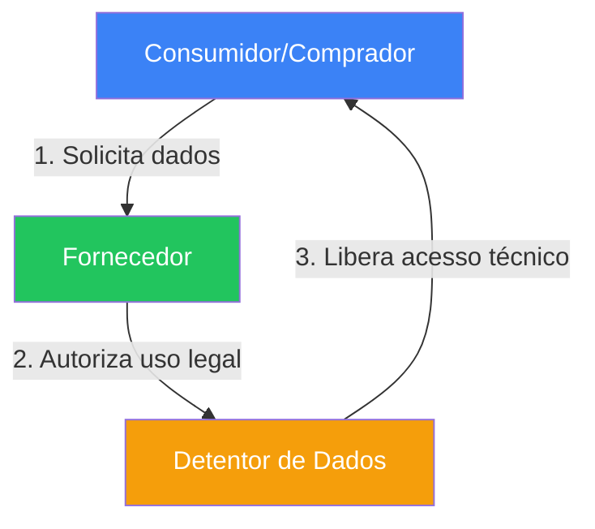
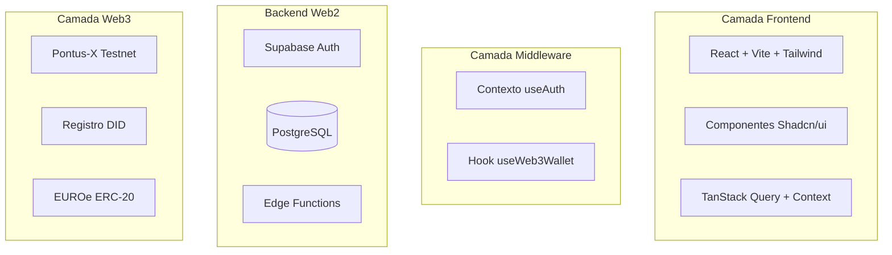
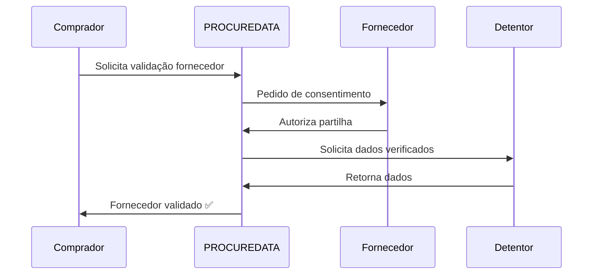
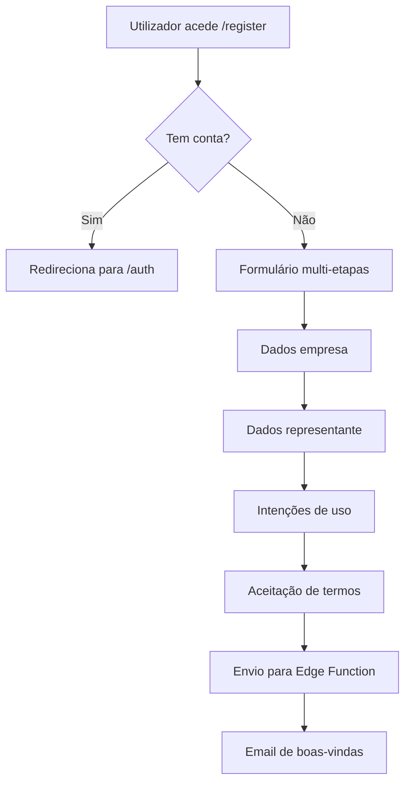

# DOCUMENTO TÉCNICO - PROCUREDATA v3.2

## Plataforma de Soberania de Dados para Cadeias de Abastecimento

**Versão:** 3.2 (Sistema de Registro + Onboarding)  
**Última Atualização:** 13 Janeiro 2026  
**Classificação:** Documentação Técnica Interna  
**Estado:** Production-Ready ✅ | Web3 Ativado ✅ | Onboarding ✅

---

## Índice

1. [Changelog desde v3.1](#1-changelog-desde-v31)
2. [Visão Geral do Sistema](#2-visão-geral-do-sistema)
3. [Arquitetura da Plataforma](#3-arquitetura-da-plataforma)
4. [Componentes do Espaço de Dados (Gaia-X)](#4-componentes-do-espaço-de-dados-gaia-x)
5. [Catálogo de Componentes Técnicos](#5-catálogo-de-componentes-técnicos)
6. [Hooks Personalizados](#6-hooks-personalizados)
7. [Interfaces e Páginas Principais](#7-interfaces-e-páginas-principais)
8. [Personas de Utilizador (Funções Técnicas)](#8-personas-de-utilizador-funções-técnicas)
9. [Modelo de Governança Técnica](#9-modelo-de-governança-técnica)
10. [Segurança e Auditoria](#10-segurança-e-auditoria)
11. [Casos de Uso Principais](#11-casos-de-uso-principais)
12. [Melhorias de UX v3.1](#12-melhorias-de-ux-v31)
13. [Edge Functions](#13-edge-functions)
14. [Sistema de Registro e Onboarding (v3.2)](#14-sistema-de-registro-e-onboarding-v32)
15. [Guia de Desenvolvimento](#15-guia-de-desenvolvimento)
16. [Estado da Auditoria](#16-estado-da-auditoria)
17. [Anexos](#17-anexos)
18. [Histórico de Versões](#18-histórico-de-versões)

---

## 1. Changelog desde v3.1

### v3.2 - 13 Janeiro 2026

#### 📝 Sistema de Registro e Onboarding
- **Tabela `registration_requests`**: Nova tabela para gestão de pedidos de adesão
  - Estados: pending, under_review, approved, rejected, needs_info
  - Validação de duplicados por `tax_id`
  - Campos para dados fiscais, representante legal, intenções de uso
- **Edge Function `submit-registration`**: Processamento de pedidos de registro
- **Edge Function `send-welcome-email`**: Emails diferenciados por função (Comprador/Fornecedor)

#### 🔐 Sistema de Acesso Diferenciado
- **Modo Demo**: Utilizadores não autenticados com dados sintéticos
- **Modo Pending Setup**: Utilizadores registados em processo de onboarding
- **Modo Ativo**: Utilizadores com organização verificada

---

## 2. Visão Geral do Sistema

### 2.1 Objetivo

PROCUREDATA é uma **plataforma de soberania de dados** para facilitar a troca segura e rastreável de informações empresariais entre organizações da cadeia de abastecimento.

A plataforma implementa os princípios **Gaia-X** e o padrão **IDSA**:

- **Soberania de Dados**: Proprietários mantêm controlo total
- **Rastreabilidade Imutável**: Registo em blockchain
- **Interoperabilidade**: Compatibilidade com ERPs existentes
- **Conformidade Regulatória**: RGPD, CSRD

### 2.2 Modelo Tripartido de Funções



| Função | Responsabilidade | Exemplo |
|--------|------------------|---------|
| **Data Consumer** | Solicita acesso a dados | Empresa compradora |
| **Data Subject** | Proprietário original dos dados | Fornecedor |
| **Data Holder** | Custodiante técnico | Autoridade fiscal, certificadora |

---

## 3. Arquitetura da Plataforma

### 3.1 Stack Tecnológico

#### Frontend

| Tecnologia | Versão | Objetivo |
|------------|--------|----------|
| **React** | 18.3.1 | Biblioteca UI com hooks |
| **Vite** | Latest | Bundler com HMR instantâneo |
| **TypeScript** | 5.x | Tipagem estática |
| **Tailwind CSS** | 3.x | Utilitários CSS |
| **Shadcn/ui** | Latest | 49 componentes acessíveis |

#### Backend (Cloud AI)

| Tecnologia | Versão | Objetivo |
|------------|--------|----------|
| **PostgreSQL** | 15.x | Base de dados com RLS (28 tabelas) |
| **Supabase Auth** | Latest | Autenticação JWT |
| **Edge Functions** | Deno | Funções serverless |

#### Camada Web3

| Tecnologia | Versão | Objetivo |
|------------|--------|----------|
| **Ethers.js** | 6.16.0 | Interação blockchain |
| **Pontus-X Testnet** | Chain 0x7ECC | Rede Gaia-X |
| **Token EUROe** | ERC-20 | Pagamentos stablecoin |

### 3.2 Diagrama de Arquitetura



---

## 4. Componentes do Espaço de Dados (Gaia-X)

### 4.1 Identidade Auto-Soberana (SSI)

PROCUREDATA implementa **Identificadores Descentralizados (DIDs)** seguindo o padrão W3C DID Core 1.0.

```typescript
// Geração de DID
generateDID(address: string): string {
  return `did:ethr:${chainId}:${address.toLowerCase()}`;
}
// Resultado: did:ethr:0x7ecc:0x742d35cc6634c0532925a3b844bc9e7595f8fe00
```

---

## 5. Catálogo de Componentes Técnicos

### 5.1 Componentes UI (49 Shadcn/ui)

| Categoria | Componentes |
|-----------|-------------|
| **Formulários** | Button, Input, Select, Checkbox, Switch |
| **Navegação** | Tabs, Menu, Breadcrumb, Pagination |
| **Feedback** | Toast, Alert, Progress, Skeleton |
| **Overlay** | Dialog, Sheet, Popover, Tooltip |

---

## 6. Hooks Personalizados

| Hook | Objetivo |
|------|----------|
| `useAuth` | Autenticação híbrida Supabase + Web3 |
| `useWeb3Wallet` | Gestão de conexão wallet |
| `useUserAccessMode` | Modo Demo/Pending/Ativo |
| `usePrivacyPreferences` | Preferências de privacidade |

---

## 7. Interfaces e Páginas Principais

| Rota | Componente | Descrição |
|------|------------|-----------|
| `/` | `Index.tsx` | Página inicial pública |
| `/auth` | `Auth.tsx` | Login/Registro |
| `/dashboard` | `Dashboard.tsx` | Painel principal |
| `/catalog` | `DataCatalog.tsx` | Catálogo de dados |
| `/register` | `Register.tsx` | Formulário de adesão |

---

## 8. Personas de Utilizador

| Função | Permissões |
|--------|------------|
| `admin` | Acesso total |
| `approver` | Aprovar/rejeitar pedidos |
| `viewer` | Apenas leitura |
| `api_configurator` | Configuração API/ERP |

---

## 9. Modelo de Governança Técnica

### 9.1 Políticas ODRL

```json
{
  "@context": "http://www.w3.org/ns/odrl.jsonld",
  "@type": "Agreement",
  "permission": [{
    "target": "asset:dados-fiscais-fornecedor",
    "action": "read",
    "constraint": [{
      "leftOperand": "purpose",
      "operator": "eq",
      "rightOperand": "validação-fornecedor"
    }]
  }]
}
```

---

## 10. Segurança e Auditoria

| Camada | Implementação |
|--------|---------------|
| **Autenticação** | Supabase Auth + assinatura wallet |
| **Autorização** | Row Level Security PostgreSQL |
| **Encriptação** | TLS 1.3 em trânsito, AES-256 em repouso |
| **Auditoria** | Logs completos com IP e user-agent |

---

## 11. Casos de Uso Principais

### 11.1 Onboarding Automático de Fornecedor (KYB)



---

## 12. Melhorias de UX v3.1

- Estados de carregamento individuais por ação
- Diálogos de confirmação antes de ações destrutivas
- Validação de formulários em tempo real
- Componentes Skeleton durante carregamento

---

## 13. Edge Functions

| Função | Objetivo |
|--------|----------|
| `submit-registration` | Processar pedidos de adesão |
| `send-welcome-email` | Emails de boas-vindas diferenciados |
| `generate-odrl-policy` | Geração de política ODRL |

---

## 14. Sistema de Registro e Onboarding (v3.2)

### 14.1 Fluxo de Registro



---

## 15. Guia de Desenvolvimento

```bash
# Instalação
git clone <repository>
npm install

# Configuração
cp .env.example .env

# Iniciar desenvolvimento
npm run dev
```

---

## 16. Estado da Auditoria

| Área | Estado | Última Revisão |
|------|--------|----------------|
| Políticas RLS | ✅ Completo | Jan 2026 |
| Edge Functions | ✅ Validado | Jan 2026 |
| Integração Web3 | ✅ Funcional | Jan 2026 |
| Internacionalização | ✅ 7 idiomas | Jan 2026 |

---

## 17. Anexos

- A. Esquema completo da base de dados
- B. Documentação API
- C. Diagramas Mermaid

---

## 18. Histórico de Versões

| Versão | Data | Alterações |
|--------|------|------------|
| 3.2 | 13 Jan 2026 | Sistema registro, acesso diferenciado |
| 3.1 | 5 Jan 2026 | Integração Web3, documentação interativa |
| 3.0 | Dez 2025 | Migração Cloud AI |

---

**Documento mantido pela Equipa Técnica PROCUREDATA**  
**Última atualização: Janeiro 2026**
