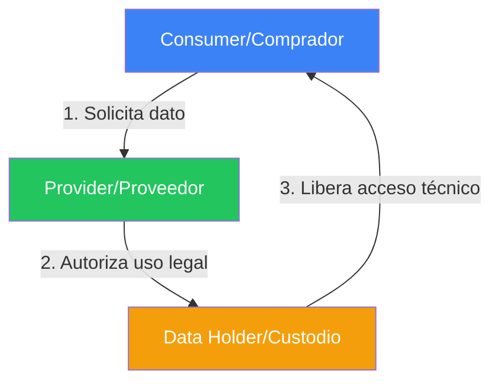
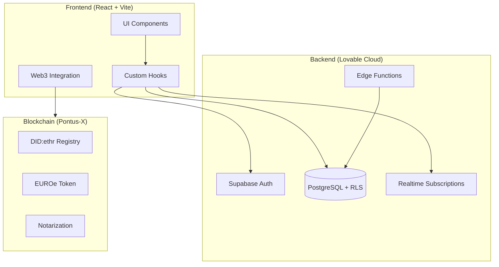
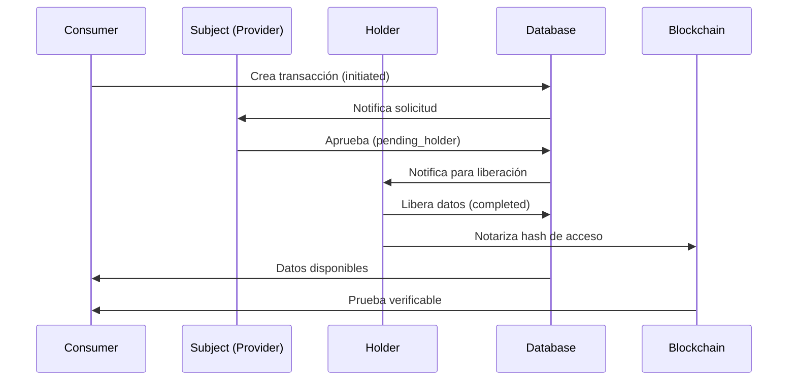
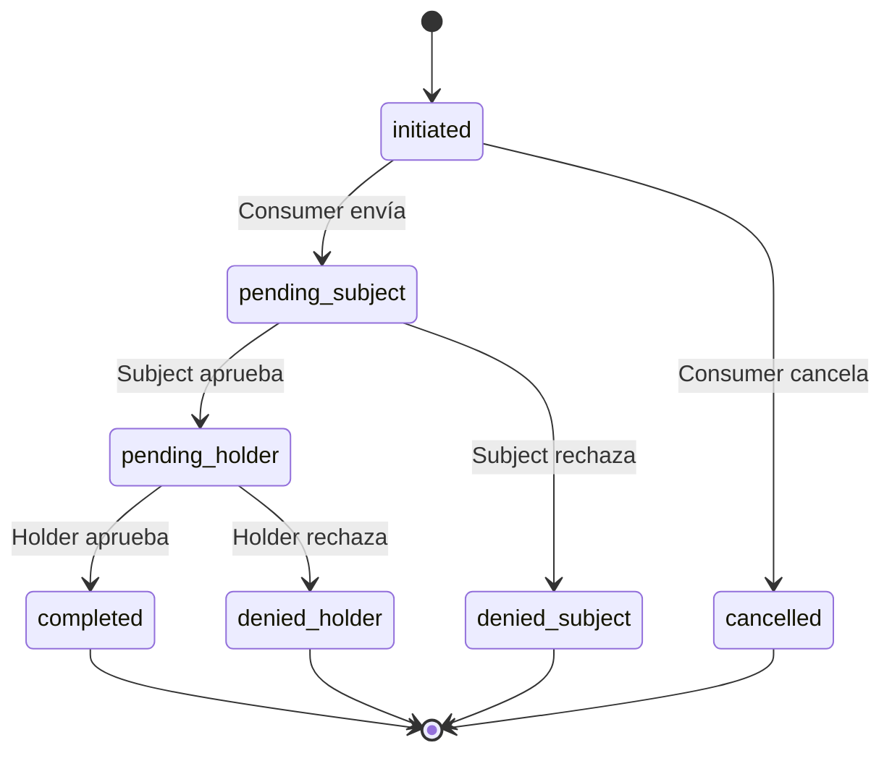
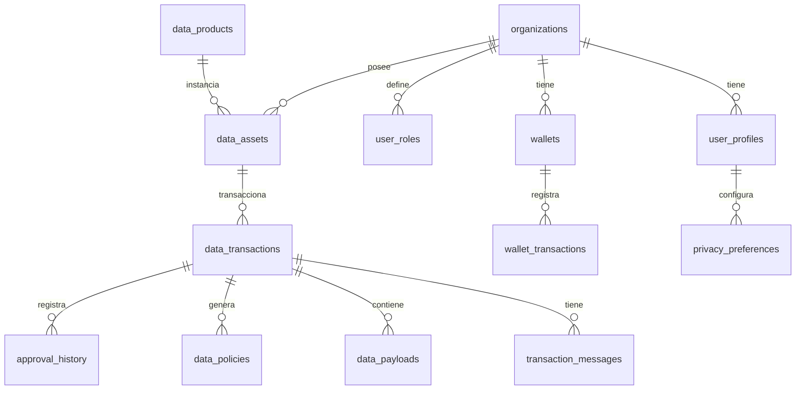
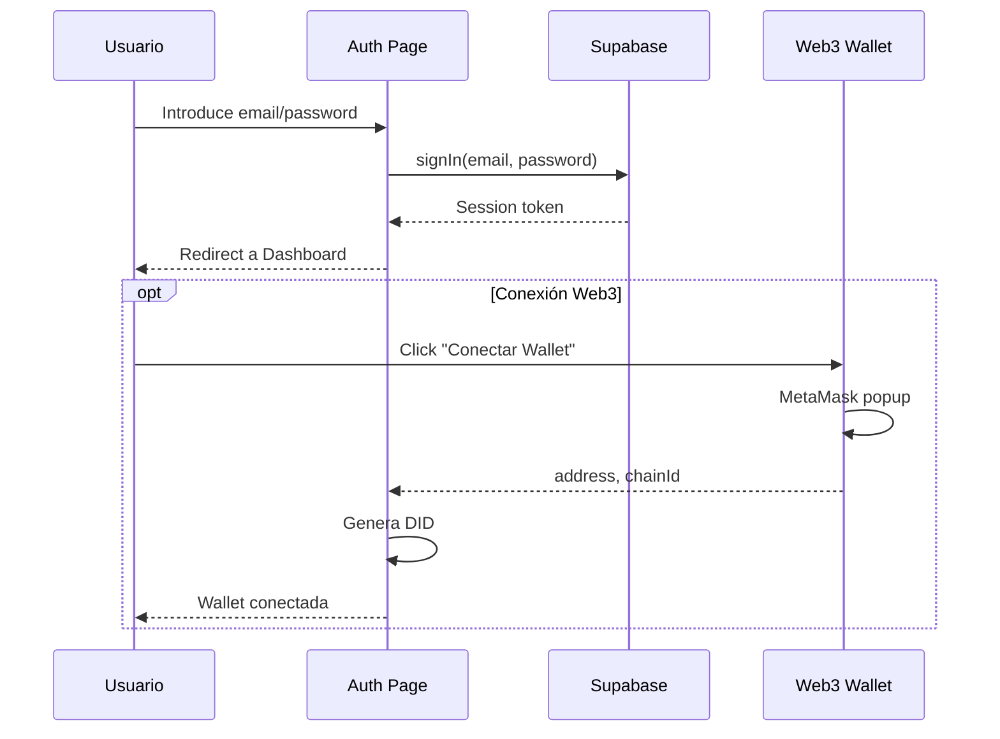

# PROCUREDATA - Especificación Técnica v3.1

> **Versión**: 3.1 (Web3 Enabled + UX Improvements)  
> **Última actualización**: 2026-01-05  
> **Propósito**: Documentación técnica completa para desarrolladores y agentes de IA

---

## 📋 Tabla de Contenidos

1. [Changelog desde v3.0](#1-changelog-desde-v30)
2. [Resumen Ejecutivo](#2-resumen-ejecutivo)
3. [Arquitectura del Sistema](#3-arquitectura-del-sistema)
4. [Tech Stack Completo](#4-tech-stack-completo)
5. [Estructura del Proyecto](#5-estructura-del-proyecto)
6. [Base de Datos](#6-base-de-datos)
7. [Autenticación Híbrida](#7-autenticación-híbrida)
8. [Integración Web3](#8-integración-web3)
9. [Catálogo de Componentes](#9-catálogo-de-componentes)
10. [Mapa de Rutas](#10-mapa-de-rutas)
11. [Edge Functions](#11-edge-functions)
12. [Mejoras de UX](#12-mejoras-de-ux)
13. [Guía de Desarrollo](#13-guía-de-desarrollo)
14. [Estado de Auditoría](#14-estado-de-auditoría)

---

## 1. Changelog desde v3.0

### v3.1 - 2026-01-05

#### 🔗 Integración Web3 Completa
- **Web3StatusWidget**: Nuevo widget en Dashboard mostrando:
  - Balance EUROe (token ERC-20)
  - Balance GX (gas nativo Pontus-X)
  - DID verificado (did:ethr:0x7ecc:...)
  - Link al Block Explorer
- **AuthContext híbrido**: Fusión de autenticación Supabase + Web3 wallet
- **Hook useWeb3Wallet**: Gestión dedicada de conexión/desconexión wallet
- **Servicio pontusXService**: Singleton para todas las operaciones blockchain

#### 📊 Capacidades Realtime
- **ActivityFeed**: Suscripción a `approval_history` via Supabase Realtime
- Invalidación automática de queries con `queryClient.invalidateQueries`
- Cleanup correcto con `supabase.removeChannel()`

#### 🎨 Mejoras de UX
- **Requests.tsx**: Estados de carga individuales por botón (`processingId`)
- **Opportunities.tsx**: AlertDialog de confirmación antes de propuestas
- **Auth.tsx**: Validación Zod para email y contraseña
- **SettingsPreferences.tsx**: Skeleton de carga durante fetch de preferencias
- **EmptyState component**: Estados vacíos consistentes con iconos y acciones

#### 🔒 Seguridad y Privacidad
- **usePrivacyPreferences hook**: Persistencia de preferencias de privacidad
- Updates optimistas con rollback en error
- Campos: `profile_visible`, `show_access_history`, `access_alerts`, `anonymous_research`

#### 🛠 Infraestructura
- Limpieza de logs de desarrollo en producción
- Tipos Web3 en `src/types/web3.types.ts`
- Extensión global de `Window.ethereum`

---

## 2. Resumen Ejecutivo

### ¿Qué es PROCUREDATA?

**PROCUREDATA** es una plataforma de orquestación de datos para la **Economía Descentralizada**. No almacena datos; gestiona **acuerdos soberanos** entre quienes tienen los datos y quienes los necesitan.

### Modelo de Negocio: El Triángulo de Confianza



| Rol | Descripción | Ejemplo |
|-----|-------------|---------|
| **Provider** | Dueño intelectual del dato. Define precio y reglas ODRL | Iberdrola Data Hub |
| **Data Holder** | Infraestructura técnica que almacena y sirve los datos | AWS S3, Azure |
| **Consumer** | Adquirente que paga y usa el dato bajo licencia | NovaTech Solutions |

### Estado Actual

- **Production-Ready** ✅
- **Web3 Enabled** ✅
- Auditoría de seguridad completada
- Modo Demo funcional con datos sintéticos
- Tour guiado interactivo (6 pasos)

---

## 3. Arquitectura del Sistema

### 3.1 Diagrama de Alto Nivel



### 3.2 Flujo de Datos Principal



### 3.3 Máquina de Estados de Transacciones



---

## 4. Tech Stack Completo

### Frontend

| Tecnología | Versión | Propósito |
|------------|---------|-----------|
| React | 18.3.1 | Framework UI |
| Vite | - | Build tool |
| TypeScript | - | Tipado estático |
| Tailwind CSS | - | Estilos utility-first |
| Framer Motion | 12.23.24 | Animaciones |
| ethers.js | 6.16.0 | Interacción Blockchain |

### Componentes UI

| Librería | Cantidad | Notas |
|----------|----------|-------|
| Shadcn/UI | 49 componentes | En `/src/components/ui/` |
| Lucide React | 0.462.0 | Iconografía |
| Recharts | 2.15.4 | Gráficos |

### Estado y Data Fetching

| Tecnología | Propósito |
|------------|-----------|
| TanStack Query v5 | Cache y fetching |
| React Context | Estado global (Auth, Org) |
| React Hook Form | Formularios |
| Zod | Validación de esquemas |

### Backend (Lovable Cloud)

| Servicio | Uso |
|----------|-----|
| PostgreSQL | Base de datos principal |
| Supabase Auth | Autenticación |
| Edge Functions | Lógica serverless |
| RLS (Row Level Security) | Seguridad multi-tenant |
| Realtime | WebSocket subscriptions |

### Blockchain & Identity

| Tecnología | Propósito |
|------------|-----------|
| Pontus-X Testnet | Red Gaia-X Ecosystem (chainId: 0x7ecc / 32460) |
| EUROe (ERC-20) | Stablecoin para pagos |
| DID (did:ethr) | Identidad Descentralizada SSI |
| MetaMask / Rabby | Conexión de billeteras |

### Utilidades

| Librería | Propósito |
|----------|-----------|
| date-fns | Manejo de fechas |
| jsPDF | Generación de PDFs |
| React Joyride | Tours guiados |
| Sonner | Notificaciones toast |

---

## 5. Estructura del Proyecto

```
procuredata/
├── docs/                          # Documentación técnica
│   ├── ContextDocument.md         # Contexto v3.0
│   └── TechnicalSpecification_v3.1.md  # Este archivo
│
├── src/
│   ├── components/                # 40+ componentes custom
│   │   ├── ui/                    # 49 componentes Shadcn/UI (NO EDITAR)
│   │   ├── AppLayout.tsx          # Layout principal con Sidebar
│   │   ├── AppSidebar.tsx         # Navegación lateral
│   │   ├── Web3StatusWidget.tsx   # Widget estado wallet (NUEVO v3.1)
│   │   ├── WalletButton.tsx       # Botón conexión Web3
│   │   ├── ActivityFeed.tsx       # Feed con Realtime (MEJORADO v3.1)
│   │   ├── DataLineageBlockchain.tsx  # Trazabilidad on-chain
│   │   ├── NegotiationChat.tsx    # Chat en tiempo real
│   │   ├── PaymentGateway.tsx     # Modal de pago
│   │   ├── SmartContractViewer.tsx    # Visor ODRL
│   │   ├── EmptyState.tsx         # Estados vacíos (NUEVO v3.1)
│   │   └── ...
│   │
│   ├── pages/                     # 27 páginas de la aplicación
│   │   ├── Landing.tsx            # Página principal pública
│   │   ├── Auth.tsx               # Login/Registro (Zod validation)
│   │   ├── Dashboard.tsx          # Centro de mando + Web3Widget
│   │   ├── Catalog.tsx            # Marketplace federado
│   │   ├── ProductDetail.tsx      # Detalle de producto
│   │   ├── Requests.tsx           # Lista de transacciones (loading states)
│   │   ├── RequestWizard.tsx      # Wizard de solicitud (5 pasos)
│   │   ├── Opportunities.tsx      # Demandas de datos (AlertDialog)
│   │   ├── SettingsPreferences.tsx    # Preferencias (privacy hook)
│   │   ├── InteractiveWhitepaper.tsx  # Tech Whitepaper
│   │   └── ...
│   │
│   ├── hooks/                     # 8 hooks personalizados
│   │   ├── useAuth.tsx            # Autenticación híbrida
│   │   ├── useWeb3Wallet.tsx      # Gestión de wallet (NUEVO v3.1)
│   │   ├── useOrganizationContext.tsx  # Contexto multi-tenant
│   │   ├── usePrivacyPreferences.tsx   # Preferencias privacidad (NUEVO v3.1)
│   │   ├── useNotifications.tsx   # Sistema notificaciones
│   │   └── ...
│   │
│   ├── services/
│   │   └── pontusX.ts             # Servicio Web3 (Blockchain)
│   │
│   ├── types/
│   │   ├── database.extensions.ts # Extensiones TypeScript
│   │   └── web3.types.ts          # Tipos Web3 (DID, WalletState)
│   │
│   └── integrations/
│       └── supabase/
│           ├── client.ts          # Cliente Supabase (NO EDITAR)
│           └── types.ts           # Tipos auto-generados (NO EDITAR)
│
├── supabase/
│   ├── functions/                 # 3 Edge Functions
│   │   ├── erp-api-tester/        # Test conexión ERP
│   │   ├── erp-data-uploader/     # Envío datos a ERP
│   │   └── notification-handler/  # Emails Resend
│   │
│   ├── migrations/                # Migraciones SQL (NO EDITAR)
│   └── config.toml                # Configuración (NO EDITAR)
│
└── public/                        # Assets estáticos
```

---

## 6. Base de Datos

### 6.1 Diagrama Entidad-Relación



### 6.2 Catálogo de Tablas (28 tablas)

#### Organizaciones y Usuarios

| Tabla | Columnas Clave | Descripción |
|-------|----------------|-------------|
| `organizations` | id, name, type, sector, kyb_verified | Empresas del sistema |
| `user_profiles` | user_id, organization_id, full_name | Perfiles de usuario |
| `user_roles` | user_id, organization_id, role | Roles por organización |
| `privacy_preferences` | user_id, profile_visible, access_alerts | Preferencias de privacidad |

#### Catálogo de Datos

| Tabla | Columnas Clave | Descripción |
|-------|----------------|-------------|
| `data_products` | id, name, category, schema_definition | Plantillas de productos |
| `data_assets` | id, product_id, holder_org_id, price | Activos disponibles |
| `catalog_metadata` | asset_id, tags, categories, visibility | Metadatos de catálogo |

#### Transacciones

| Tabla | Columnas Clave | Descripción |
|-------|----------------|-------------|
| `data_transactions` | id, asset_id, consumer_org_id, subject_org_id, holder_org_id, status | Transacciones |
| `approval_history` | transaction_id, actor_org_id, action, notes | Historial de aprobaciones (Realtime) |
| `data_policies` | transaction_id, odrl_policy_json | Smart Contracts ODRL |
| `data_payloads` | transaction_id, schema_type, data_content | Contenido de datos |
| `transaction_messages` | transaction_id, sender_org_id, content | Chat de negociación |

#### Finanzas

| Tabla | Columnas Clave | Descripción |
|-------|----------------|-------------|
| `wallets` | organization_id, balance, currency, address | Billeteras |
| `wallet_transactions` | from_wallet_id, to_wallet_id, amount, type | Movimientos |

#### Sistema y Seguridad

| Tabla | Columnas Clave | Descripción |
|-------|----------------|-------------|
| `notifications` | user_id, type, title, message, is_read | Sistema Realtime |
| `login_attempts` | email, ip_address, success, attempted_at | Rate Limiting |
| `audit_logs` | actor_id, action, resource, details | Trazabilidad |
| `export_logs` | transaction_id, format, exported_by | Auditoría exportaciones |

#### Otros

| Tabla | Descripción |
|-------|-------------|
| `esg_reports` | Reportes de sostenibilidad |
| `marketplace_opportunities` | Demandas de datos |
| `marketplace_listings` | Vista del marketplace |
| `erp_configurations` | Integraciones ERP |
| `supplier_data` | Datos estructurados de proveedores |
| `value_services` | Servicios adicionales |
| `organization_reviews` | Reseñas entre organizaciones |
| `success_stories` | Casos de éxito |
| `innovation_lab_concepts` | Conceptos del Innovation Lab |

### 6.3 Enums

```typescript
type organization_type = 'consumer' | 'provider' | 'data_holder';

type transaction_status = 
  | 'initiated'       // Creada por consumer
  | 'pending_subject' // Esperando provider
  | 'pending_holder'  // Esperando holder
  | 'approved'        // Lista para entrega
  | 'denied_subject'  // Rechazada por provider
  | 'denied_holder'   // Rechazada por holder
  | 'completed'       // Datos entregados
  | 'cancelled';      // Cancelada

type app_role = 'admin' | 'approver' | 'viewer' | 'api_configurator';

type approval_action = 'pre_approve' | 'approve' | 'deny' | 'cancel';
```

---

## 7. Autenticación Híbrida

### 7.1 Contexto de Autenticación (useAuth)

```typescript
interface AuthContextType {
  // Supabase Auth
  user: User | null;
  session: Session | null;
  loading: boolean;
  signUp: (email: string, password: string) => Promise<AuthResponse>;
  signIn: (email: string, password: string) => Promise<AuthResponse>;
  signOut: () => Promise<void>;
  
  // Web3 Identity (NUEVO v3.1)
  walletAddress: string | null;
  did: string | null;
  isWeb3Connected: boolean;
  connectWallet: (silent?: boolean) => Promise<void>;
  disconnectWallet: () => void;
}
```

### 7.2 Flujo de Autenticación



### 7.3 Validación Zod (Auth.tsx)

```typescript
const authSchema = z.object({
  email: z
    .string()
    .trim()
    .min(1, "El email es obligatorio")
    .email("Introduce un email válido")
    .max(255, "Email demasiado largo"),
  password: z
    .string()
    .min(6, "La contraseña debe tener al menos 6 caracteres")
    .max(72, "Contraseña demasiado larga"),
});
```

---

## 8. Integración Web3

### 8.1 Configuración de Red (Pontus-X Testnet)

```typescript
const PONTUSX_NETWORK_CONFIG = {
  chainId: '0x7ecc',  // 32460 en decimal
  chainName: 'Pontus-X Testnet',
  nativeCurrency: {
    name: 'GX',
    symbol: 'GX',
    decimals: 18,
  },
  rpcUrls: ['https://rpc.test.pontus-x.eu'],
  blockExplorerUrls: ['https://explorer.pontus-x.eu/pontusx/test'],
};
```

### 8.2 Servicio pontusXService

| Método | Descripción | Retorno |
|--------|-------------|---------|
| `isWeb3Available()` | Detecta wallet instalada | `boolean` |
| `connectWallet()` | Conecta + switch red + balances | `WalletState` |
| `disconnect()` | Limpia estado de wallet | `void` |
| `switchNetwork()` | Fuerza cambio a Pontus-X | `void` |
| `getEUROeBalance(address)` | Lee balance del token ERC-20 | `string` |
| `generateDID(address)` | Genera `did:ethr:chainId:address` | `string` |
| `signMessage(message)` | Firma SIWE para verificación | `string` |
| `revokeAccess(did, resourceId)` | Simula revocación on-chain | `string` (txHash) |

### 8.3 Hook useWeb3Wallet

```typescript
const { 
  wallet,        // WalletState
  isConnecting,  // boolean
  hasWeb3,       // boolean
  connect,       // (silent?: boolean) => Promise<void>
  disconnect,    // () => void
} = useWeb3Wallet();
```

### 8.4 Tipos Web3

```typescript
interface WalletState {
  address: string | null;
  chainId: string | null;
  balance: string | null;      // Balance nativo (GX)
  euroeBalance: string | null; // Balance EUROe
  did: string | null;
  isConnected: boolean;
}

interface DecentralizedIdentifier {
  did: string;           // did:ethr:0x7ecc:0x...
  address: string;       // 0x...
  chainId: string;       // 0x7ecc
  verified: boolean;
}
```

### 8.5 Web3StatusWidget

Ubicación: `src/components/Web3StatusWidget.tsx`

**Estados:**
1. **Sin Web3**: Muestra botón para instalar MetaMask
2. **No conectado**: Muestra botón "Conectar Wallet"
3. **Conectado**: Muestra:
   - Balance EUROe
   - Balance GX (gas)
   - DID truncado con botón copiar
   - Link al Block Explorer

---

## 9. Catálogo de Componentes

### 9.1 Componentes de Layout

| Componente | Ubicación | Propósito |
|------------|-----------|-----------|
| `AppLayout` | `/components/AppLayout.tsx` | Layout principal con Sidebar, Header, Outlet |
| `AppSidebar` | `/components/AppSidebar.tsx` | Navegación lateral colapsable |
| `DynamicBreadcrumbs` | `/components/DynamicBreadcrumbs.tsx` | Breadcrumbs automáticos |
| `ProtectedRoute` | `/components/ProtectedRoute.tsx` | Guard de autenticación |

### 9.2 Componentes de Negocio

| Componente | Propósito | Versión |
|------------|-----------|---------|
| `Web3StatusWidget` | Widget estado wallet + balances | v3.1 |
| `WalletButton` | Botón conexión MetaMask | v3.0 |
| `OrganizationSwitcher` | Selector de organización activa | v3.0 |
| `NotificationsBell` | Campana de notificaciones | v3.0 |
| `ActivityFeed` | Feed con Realtime subscriptions | v3.1 |
| `AIConcierge` | Chat flotante con asistente IA | v3.0 |
| `DataLineage` | Visualización de flujo de datos | v3.0 |
| `DataLineageBlockchain` | Timeline con hashes verificados | v3.0 |
| `NegotiationChat` | Chat en sala de negociación | v3.0 |
| `PaymentGateway` | Modal de procesamiento de pagos | v3.0 |
| `SmartContractViewer` | Visualizador de políticas ODRL | v3.0 |
| `EmptyState` | Estados vacíos consistentes | v3.1 |

### 9.3 Componentes de Visualización

| Componente | Propósito |
|------------|-----------|
| `ESGDataView` | Visualización de datos ESG |
| `IoTDataView` | Visualización de telemetría IoT |
| `ArrayDataView` | Tablas de datos genéricas |
| `GenericJSONView` | Visualizador JSON |
| `InnovationChart` | Gráficos del Innovation Lab |
| `DashboardStats` | Tarjetas de estadísticas |

---

## 10. Mapa de Rutas

### 10.1 Rutas Públicas

| Ruta | Componente | Descripción |
|------|------------|-------------|
| `/` | `Landing` | Página marketing principal |
| `/auth` | `Auth` | Login/Registro con Zod |
| `/guide` | `Guide` | Guía del ecosistema |
| `/architecture` | `Architecture` | Documentación técnica |
| `/whitepaper` | `InteractiveWhitepaper` | Tech Whitepaper interactivo |

### 10.2 Rutas Protegidas (AppLayout)

| Ruta | Componente | Descripción |
|------|------------|-------------|
| `/dashboard` | `Dashboard` | Centro de mando + Web3Widget |
| `/catalog` | `Catalog` | Marketplace federado |
| `/catalog/product/:id` | `ProductDetail` | Detalle de producto |
| `/requests` | `Requests` | Lista de transacciones |
| `/requests/new` | `RequestWizard` | Wizard de solicitud (5 pasos) |
| `/data` | `Data` | Datos comprados |
| `/data/view/:id` | `DataView` | Visualización + Export |
| `/sustainability` | `Sustainability` | Panel ESG |
| `/services` | `Services` | Servicios de valor |
| `/innovation` | `InnovationLab` | Herramientas IA |
| `/opportunities` | `Opportunities` | Demandas de datos |
| `/reports` | `Reports` | Informes |
| `/analytics` | `SellerAnalytics` | Analytics vendedores |
| `/notifications` | `Notifications` | Centro notificaciones |
| `/settings` | `Settings` | Hub de configuración |
| `/settings/erp-config` | `ERPConfig` | Integraciones ERP |
| `/settings/organization` | `SettingsOrganization` | Config org + Team |
| `/settings/preferences` | `SettingsPreferences` | Preferencias privacidad |
| `/settings/webhooks` | `WebhookSettings` | Webhooks |
| `/settings/audit` | `AuditLogs` | Logs de auditoría |

---

## 11. Edge Functions

### 11.1 erp-api-tester

**Propósito**: Test de conectividad a APIs ERP externas

```typescript
// Endpoint: POST /functions/v1/erp-api-tester
// Body: { apiUrl, apiKey, method }
// Response: { success, responseTime, statusCode }
```

### 11.2 erp-data-uploader

**Propósito**: Envío de datos estructurados a sistemas ERP

```typescript
// Endpoint: POST /functions/v1/erp-data-uploader
// Body: { configId, transactionId, data }
// Response: { success, externalId }
```

### 11.3 notification-handler

**Propósito**: Emails transaccionales via Resend

```typescript
// Endpoint: POST /functions/v1/notification-handler
// Body: { type, transactionId, recipientEmail }
// Types: 'pre_approved' | 'approved' | 'denied' | 'completed'
```

---

## 12. Mejoras de UX

### 12.1 Loading States (Requests.tsx)

```typescript
const [processingId, setProcessingId] = useState<string | null>(null);

// En el botón:
<Button
  onClick={() => handleApprove(transaction.id, isSubject)}
  disabled={processingId !== null}
>
  {processingId === transaction.id ? (
    <Loader2 className="h-4 w-4 animate-spin" />
  ) : (
    <CheckCircle className="h-4 w-4" />
  )}
</Button>
```

### 12.2 Confirmación de Propuestas (Opportunities.tsx)

```tsx
<AlertDialog>
  <AlertDialogTrigger asChild>
    <Button>Proponer mis Datos</Button>
  </AlertDialogTrigger>
  <AlertDialogContent>
    <AlertDialogHeader>
      <AlertDialogTitle>Confirmar Propuesta</AlertDialogTitle>
      <AlertDialogDescription>
        ¿Estás seguro? Los datos serán compartidos según el contrato.
      </AlertDialogDescription>
    </AlertDialogHeader>
    <AlertDialogFooter>
      <AlertDialogCancel>Cancelar</AlertDialogCancel>
      <AlertDialogAction onClick={() => handleProposal(opp.id)}>
        Confirmar
      </AlertDialogAction>
    </AlertDialogFooter>
  </AlertDialogContent>
</AlertDialog>
```

### 12.3 Preferencias con Persistencia (usePrivacyPreferences)

```typescript
const { preferences, loading, updatePreference } = usePrivacyPreferences();

// Update optimista con rollback:
const updatePreference = async (key, value) => {
  const previous = preferences[key];
  setPreferences(prev => ({ ...prev, [key]: value }));
  
  const { error } = await supabase
    .from('privacy_preferences')
    .update({ [key]: value })
    .eq('user_id', userId);
    
  if (error) {
    setPreferences(prev => ({ ...prev, [key]: previous }));
    toast.error('Error al guardar');
  }
};
```

---

## 13. Guía de Desarrollo

### 13.1 Tokens de Diseño (index.css)

```css
:root {
  --background: 0 0% 100%;
  --foreground: 222.2 84% 4.9%;
  --primary: 221.2 83.2% 53.3%;
  --secondary: 210 40% 96.1%;
  --muted: 210 40% 96.1%;
  --accent: 210 40% 96.1%;
  --destructive: 0 84.2% 60.2%;
  /* ... */
}

.dark {
  --background: 222.2 84% 4.9%;
  --foreground: 210 40% 98%;
  /* ... */
}
```

### 13.2 Uso de Colores

```tsx
// ✅ CORRECTO: Usar tokens semánticos
<div className="bg-background text-foreground" />
<Button className="bg-primary text-primary-foreground" />
<Badge variant="destructive" />

// ❌ INCORRECTO: Colores hardcoded
<div className="bg-white text-black" />
<Button className="bg-blue-600" />
```

### 13.3 Archivos NO Editables

- `src/integrations/supabase/client.ts`
- `src/integrations/supabase/types.ts`
- `supabase/config.toml`
- `supabase/migrations/*`
- `.env`

---

## 14. Estado de Auditoría

### 14.1 Tareas Completadas

| Prioridad | Completadas | Total |
|-----------|-------------|-------|
| 🔴 Crítica | 6 | 6 |
| 🟠 Alta | 3 | 6 |
| 🟢 Mejora | 4 | 10 |

### 14.2 Críticos Completados

- [x] Limpieza de logs de desarrollo
- [x] Loading states en acciones destructivas
- [x] Validación Zod en formularios críticos
- [x] Confirmación antes de acciones irreversibles
- [x] Skeleton loaders para estados de carga
- [x] Integración Web3 en contexto de autenticación

### 14.3 Pendientes Alta Prioridad

- [ ] Integración EDC (Eclipse Dataspace Connector)
- [ ] SSI Wallet (requiere infraestructura Gaia-X)
- [ ] Indicadores visuales de EUROe en tarjetas de Catálogo

---

## Historial de Versiones

| Versión | Fecha | Cambios |
|---------|-------|---------|
| v3.1 | 2026-01-05 | Web3StatusWidget, usePrivacyPreferences, mejoras UX |
| v3.0 | 2025-12-15 | Integración blockchain Pontus-X, DIDs |
| v2.0 | 2025-11-01 | Innovation Lab, Edge Functions |
| v1.0 | 2025-09-15 | MVP inicial |

---

*Documento generado automáticamente por el sistema PROCUREDATA*
