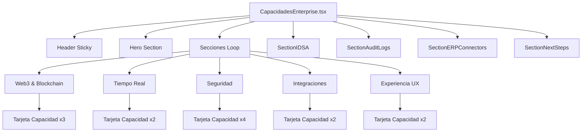
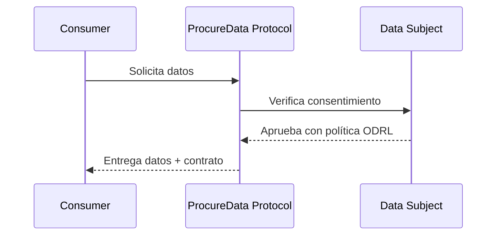
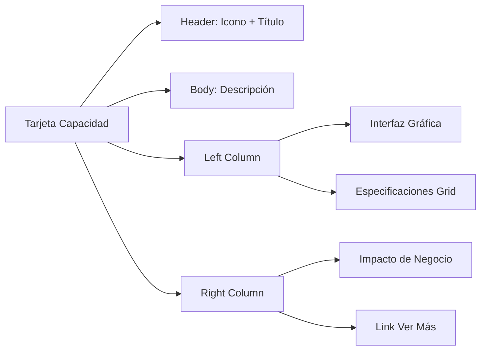

# Documento de Contexto: Capacidades Enterprise

> **Archivo Principal**: `/src/pages/CapacidadesEnterprise.tsx`  
> **Ruta URL**: `/capacidades-enterprise`  
> **Versión**: 1.0  
> **Última actualización**: 2026-01-07  
> **Propósito**: Transferencia de contexto a Google AI Studio para mejora de gráficos y configuración contextual

---

## 1. DESCRIPCIÓN GENERAL

### Tipo de Página
**Dossier Digital Corporativo Premium** - Un documento técnico interactivo diseñado para presentar las 13 capacidades enterprise del Motor de ProcureData.

### Modo Visual
**Whitepaper Mode (Modo Día Forzado)** - Fondo blanco permanente independiente del tema global de la aplicación, emulando la estética de informes profesionales tipo ISO, Gartner o documentos de la UE.

### Audiencia Objetivo
- Chief Procurement Officers (CPOs)
- Auditores legales y de compliance
- Equipos de IT enterprise
- Decision makers técnicos

### Estética
"Papel premium" - Fondo blanco puro con tipografía técnica impecable, sombras sutiles y el naranja ProcureData como acento principal.

---

## 2. ARQUITECTURA DE COMPONENTES

```
CapacidadesEnterprise.tsx (Página Principal)
├── Header Sticky con navegación por secciones
├── Hero Section con CTAs
├── Grid de 13 Capacidades (dinámico)
│   └── Tarjetas con specs, interfaz e impacto
├── SectionIDSA.tsx (Detalle Modelo IDSA)
├── SectionAuditLogs.tsx (Detalle Audit Logs)
├── SectionERPConnectors.tsx (Detalle Conectores ERP)
└── SectionNextSteps.tsx (CTAs y próximos pasos)
```

| Componente | Ruta | Propósito |
|------------|------|-----------|
| `CapacidadesEnterprise.tsx` | `src/pages/` | Página principal con las 13 capacidades |
| `SectionIDSA.tsx` | `src/components/enterprise/` | Detalle técnico del Modelo IDSA |
| `SectionAuditLogs.tsx` | `src/components/enterprise/` | Explorer de Audit Logs blockchain |
| `SectionERPConnectors.tsx` | `src/components/enterprise/` | Conectores ERP certificados |
| `SectionNextSteps.tsx` | `src/components/enterprise/` | CTAs finales y certificaciones |

---

## 3. LAS 13 CAPACIDADES DEL MOTOR

### Estructura de Datos por Capacidad

| Campo | Tipo | Descripción |
|-------|------|-------------|
| `id` | `string` | Identificador único (ej: "wallet-web3") |
| `seccion` | `string` | Categoría padre (ej: "Web3 & Blockchain") |
| `seccionColor` | `string` | Gradiente Tailwind para la sección |
| `icon` | `LucideIcon` | Componente de icono de Lucide React |
| `titulo` | `string` | Nombre de la capacidad |
| `descripcion` | `string` | Descripción técnica detallada |
| `interfaz` | `string` | Descripción de la experiencia UI/UX |
| `specs` | `string[]` | Array de especificaciones técnicas |
| `impacto` | `string` | Valor de negocio / ROI |
| `ruta` | `string` | Link a página detallada en /motor/ |

---

### 3.1 Web3 & Blockchain (3 capacidades)

#### Wallet Web3
- **ID**: `wallet-web3`
- **Icono**: `Wallet`
- **Descripción**: Billetera EUROe integrada con balance real, historial de transacciones y gestión de pagos tokenizados. Compatible con MetaMask y WalletConnect.
- **Interfaz**: Widget de balance con gráfico de actividad, lista de transacciones recientes y botones de envío/recepción.
- **Specs**: 
  - Balance EUROe en tiempo real
  - Historial de transacciones paginado
  - Firma de mensajes EIP-712
  - Red Pontus-X (Chain ID: 32457)
- **Impacto**: Elimina intermediarios bancarios, reduciendo comisiones de transacción hasta un 80%.
- **Ruta**: `/motor/wallet-web3`

#### Identidad SSI
- **ID**: `identidad-ssi`
- **Icono**: `Fingerprint`
- **Descripción**: Sistema de Identidad Auto-Soberana basado en DIDs (Decentralized Identifiers). Verificación criptográfica de credenciales sin dependencia de terceros.
- **Interfaz**: Tarjeta de identidad digital con QR de verificación, lista de credenciales verificables y estado de validación.
- **Specs**:
  - DIDs compatibles con W3C
  - Credenciales Verificables (VCs)
  - Resolución DID universal
  - Almacenamiento descentralizado
- **Impacto**: Onboarding de proveedores 10x más rápido con verificación instantánea de credenciales.
- **Ruta**: `/motor/identidad-ssi`

#### Pagos EUROe
- **ID**: `pagos-euroe`
- **Icono**: `Coins`
- **Descripción**: Pasarela de pagos con stablecoin EUROe (1:1 con EUR). Transacciones instantáneas, trazables y con liquidación automática en smart contracts.
- **Interfaz**: Formulario de pago con conversión EUR/EUROe, estado de transacción en tiempo real y recibo digital.
- **Specs**:
  - Token ERC-20 en Pontus-X
  - Liquidación < 3 segundos
  - Comisiones fijas 0.1%
  - Cumplimiento MiCA
- **Impacto**: Liquidación instantánea vs 2-5 días bancarios. Cash flow optimizado.
- **Ruta**: `/motor/pagos-euroe`

---

### 3.2 Tiempo Real (2 capacidades)

#### Activity Feed
- **ID**: `activity-feed`
- **Icono**: `Activity`
- **Descripción**: Feed en tiempo real de todas las acciones del ecosistema. Suscripción por canales con filtros por tipo de evento, organización y prioridad.
- **Interfaz**: Timeline infinito con avatares, badges de tipo y timestamps relativos. Filtros laterales.
- **Specs**:
  - WebSocket via Supabase Realtime
  - Canales por organización
  - Eventos tipados (transacción, aprobación, etc.)
  - Persistencia histórica
- **Impacto**: Visibilidad 360° de operaciones. Tiempo de respuesta a incidentes reducido en 60%.
- **Ruta**: `/motor/activity-feed`

#### Smart Alerts
- **ID**: `smart-alerts`
- **Icono**: `BellRing`
- **Descripción**: Sistema de alertas inteligentes con reglas configurables. Notificaciones por email, push y webhook con escalado automático.
- **Interfaz**: Panel de configuración de reglas, historial de alertas disparadas y métricas de respuesta.
- **Specs**:
  - Motor de reglas IFTTT
  - Canales: email, push, webhook
  - Escalado por severidad
  - Quiet hours configurables
- **Impacto**: Prevención proactiva de incumplimientos. SLA compliance +40%.
- **Ruta**: `/motor/smart-alerts`

---

### 3.3 Seguridad (4 capacidades)

#### Gobernanza ODRL
- **ID**: `gobernanza-odrl`
- **Icono**: `Gavel`
- **Descripción**: Políticas de uso de datos expresadas en ODRL (Open Digital Rights Language). Contratos legibles por máquinas con enforcement automático.
- **Interfaz**: Editor visual de políticas con preview JSON-LD, biblioteca de templates y validador de compliance.
- **Specs**:
  - ODRL 2.2 compliant
  - Actions: use, distribute, derive
  - Constraints: dateTime, count, purpose
  - Integración con smart contracts
- **Impacto**: Automatización del 90% de validaciones de compliance. Zero human error.
- **Ruta**: `/motor/gobernanza-odrl`

#### Multi-Tenant RLS
- **ID**: `multi-tenant-rls`
- **Icono**: `Database`
- **Descripción**: Row Level Security a nivel de base de datos. Aislamiento total entre organizaciones con políticas SQL declarativas.
- **Interfaz**: Dashboard de políticas activas, test de acceso por rol y logs de denegaciones.
- **Specs**:
  - PostgreSQL RLS nativo
  - Políticas por tabla
  - Roles: admin, approver, viewer
  - Audit de accesos
- **Impacto**: Cumplimiento GDPR por diseño. Zero data leakage entre tenants.
- **Ruta**: `/motor/multi-tenant-rls`

#### Audit Logs
- **ID**: `audit-logs`
- **Icono**: `History`
- **Descripción**: Registro inmutable de todas las acciones del sistema. Hash SHA-256 con anclaje opcional en blockchain para pruebas legales.
- **Interfaz**: Explorer de logs con filtros, verificador de integridad y exportador legal.
- **Specs**:
  - Hash SHA-256 por entrada
  - Anclaje Merkle en Pontus-X
  - Retención configurable
  - Formato legal (ISO 27001)
- **Impacto**: Evidencia digital admisible en juicio. Auditorías externas 5x más rápidas.
- **Ruta**: `/motor/audit-logs`

#### Modelo IDSA
- **ID**: `modelo-idsa`
- **Icono**: `Network`
- **Descripción**: Implementación del International Data Spaces Reference Architecture. Conectores certificados para intercambio soberano de datos.
- **Interfaz**: Diagrama de flujo de datos, panel de conectores activos y monitor de transacciones IDSA.
- **Specs**:
  - IDSA RAM 4.0
  - Conectores Dataspace
  - Usage Control enforcement
  - Catálogo DCAT-AP
- **Impacto**: Interoperabilidad con +200 dataspaces europeos. Acceso a Gaia-X.
- **Ruta**: `/motor/modelo-idsa`

---

### 3.4 Integraciones (2 capacidades)

#### Conectores ERP
- **ID**: `conectores-erp`
- **Icono**: `PlugZap`
- **Descripción**: Conectores pre-construidos para SAP, Oracle, Microsoft Dynamics y otros ERPs. Mapeo semántico automático y sincronización bidireccional.
- **Interfaz**: Wizard de configuración, test de conexión, monitor de sincronización y logs de errores.
- **Specs**:
  - SAP S/4HANA (RFC/OData)
  - Oracle Cloud (REST)
  - Dynamics 365 (Dataverse)
  - Mapeo JSON-LD ↔ ERP
- **Impacto**: Integración en días vs meses. ROI del proyecto de datos +300%.
- **Ruta**: `/motor/conectores-erp`

#### Edge Functions
- **ID**: `edge-functions`
- **Icono**: `Cpu`
- **Descripción**: Funciones serverless en el edge para lógica de negocio personalizada. Deploy automático, escalado infinito y latencia <50ms.
- **Interfaz**: Editor de código con logs en vivo, panel de métricas y gestión de secretos.
- **Specs**:
  - Deno runtime
  - Deploy automático
  - Secrets encriptados
  - Logs en tiempo real
- **Impacto**: Time-to-market de nuevas features reducido en 70%.
- **Ruta**: `/motor/edge-functions`

---

### 3.5 Experiencia UX (2 capacidades)

#### Tour Guiado
- **ID**: `tour-guiado`
- **Icono**: `Map`
- **Descripción**: Onboarding interactivo con tooltips contextuales. Progreso guardado, saltos permitidos y analytics de completitud.
- **Interfaz**: Overlay con spotlight en elementos, barra de progreso y botones de navegación.
- **Specs**:
  - React Joyride
  - Pasos configurables
  - Progreso persistente
  - Analytics de abandono
- **Impacto**: Adopción de usuarios +50%. Tickets de soporte -30%.
- **Ruta**: `/motor/tour-guiado`

#### Docs Interactivos
- **ID**: `docs-interactivos`
- **Icono**: `BookOpenCheck`
- **Descripción**: Documentación técnica con ejemplos ejecutables. Markdown enriquecido con componentes React embebidos.
- **Interfaz**: Navegación lateral, bloques de código copiables, widgets interactivos y feedback inline.
- **Specs**:
  - MDX renderizado
  - Syntax highlighting
  - Widgets embebidos
  - Versionado semántico
- **Impacto**: Tiempo de integración de desarrolladores -40%. Self-service documentation.
- **Ruta**: `/motor/docs-interactivos`

---

## 4. SECCIONES Y CATEGORÍAS

| Sección | Icono | Color Tailwind | IDs de Capacidades |
|---------|-------|----------------|-------------------|
| Web3 & Blockchain | `Shield` | `text-emerald-500` | wallet-web3, identidad-ssi, pagos-euroe |
| Tiempo Real | `Zap` | `text-blue-500` | activity-feed, smart-alerts |
| Seguridad | `Database` | `text-red-500` | gobernanza-odrl, multi-tenant-rls, audit-logs, modelo-idsa |
| Integraciones | `Globe` | `text-orange-500` | conectores-erp, edge-functions |
| Experiencia UX | `Users` | `text-purple-500` | tour-guiado, docs-interactivos |

### Gradientes por Sección (seccionColor)

```javascript
const gradientes = {
  "Web3 & Blockchain": "from-emerald-600 to-teal-500",
  "Tiempo Real": "from-blue-600 to-cyan-500",
  "Seguridad": "from-red-600 to-rose-500",
  "Integraciones": "from-orange-600 to-amber-500",
  "Experiencia UX": "from-purple-600 to-pink-500"
};
```

---

## 5. CONFIGURACIÓN VISUAL (WHITEPAPER MODE)

### Paleta de Colores Modo Día

| Variable CSS | Valor HSL | Color Visual | Uso |
|--------------|-----------|--------------|-----|
| `--background` | `0 0% 100%` | Blanco puro | Fondo principal |
| `--foreground` | `222.2 84% 4.9%` | Negro azulado | Texto principal |
| `--primary` | `32 94% 44%` | Naranja ProcureData | Acentos, CTAs |
| `--primary-foreground` | `0 0% 100%` | Blanco | Texto sobre primary |
| `--card` | `210 20% 98%` | Gris muy claro | Fondo de tarjetas |
| `--muted` | `210 40% 96.1%` | Gris suave | Fondos secundarios |
| `--muted-foreground` | `215 16% 47%` | Gris medio | Texto secundario |
| `--border` | `214.3 31.8% 91.4%` | Gris claro | Bordes |
| `--accent` | `32 94% 44%` | Naranja | Elementos destacados |

### Clases Tailwind Principales

| Elemento | Clases Tailwind |
|----------|-----------------|
| Contenedor principal | `bg-white text-slate-900 min-h-screen` |
| Header sticky | `bg-white/95 backdrop-blur-xl border-b border-slate-200 shadow-sm` |
| Tarjetas de capacidad | `bg-white border border-slate-200 shadow-lg rounded-2xl` |
| Cuadro Impacto de Negocio | `bg-orange-50 border border-orange-200 rounded-xl` |
| Texto impacto label | `text-primary font-bold text-xs uppercase` |
| Texto impacto contenido | `text-slate-700 font-medium` |
| Badges técnicos | `bg-slate-100 text-slate-700 border-0` |
| Cuadro interfaz gráfica | `bg-slate-50 border border-slate-200 rounded-xl` |
| Botones outline | `border-slate-300 hover:bg-slate-50 text-slate-600` |
| Links hover | `hover:text-primary transition-colors` |

### Sombras y Efectos

```css
/* Sombra principal para tarjetas */
shadow-lg = 0 10px 15px -3px rgba(0, 0, 0, 0.1), 0 4px 6px -2px rgba(0, 0, 0, 0.05);

/* Sombra sutil para header */
shadow-sm = 0 1px 2px 0 rgba(0, 0, 0, 0.05);

/* Backdrop blur para header sticky */
backdrop-blur-xl = blur(24px);
```

---

## 6. COMPONENTES DETALLADOS AVANZADOS

### 6.1 SectionIDSA.tsx

**Propósito**: Explicación detallada del modelo IDSA con diagrama interactivo.

**Elementos visuales**:
- Diagrama de 3 roles: Consumer, Subject, Protocol
- Tarjetas con iconos para cada rol
- Editor de código JSON-LD con syntax highlighting
- Botón de copiar al portapapeles
- Contrato de Acuerdo de Datos Soberano

**Paleta específica**:
- Fondo principal: `bg-white`
- Tarjetas de roles: `bg-white border border-slate-200`
- Cuadro de código: `bg-slate-900 text-green-400` (mantiene modo oscuro para contraste)
- Impacto: `bg-orange-50 border-orange-200`

### 6.2 SectionAuditLogs.tsx

**Propósito**: Explorer de logs con verificación blockchain.

**Elementos visuales**:
- Tabla de logs con columnas: Evento, Bloque, Hash
- Verificador de integridad "Integrity Check"
- Badges de certificaciones (ISO 27001, CSRD, Gaia-X)
- Indicador de red Pontus-X

**Paleta específica**:
- Fondo tabla: `bg-white`
- Filas alternadas: `bg-slate-50`
- Hash truncado: `font-mono text-xs text-slate-500`
- Badge verificado: `bg-green-100 text-green-700`

### 6.3 SectionERPConnectors.tsx

**Propósito**: Mostrar conectores ERP certificados y flujo de integración.

**Elementos visuales**:
- Diagrama de flujo: ProcureData → Transformer → ERP
- Tabla de sistemas certificados
- Cards explicativas: Bridge, Semantic Mapping, Webhooks

**Sistemas certificados**:
| Sistema | Método | Tipo | Estado |
|---------|--------|------|--------|
| SAP S/4HANA | RFC/OData | Bidireccional | Certificado |
| Microsoft Dynamics 365 | Dataverse API | Bidireccional | Certificado |
| Oracle Cloud ERP | REST API | Bidireccional | Certificado |
| Sage X3 | Web Services | Exportar | Beta |
| Odoo | XML-RPC | Bidireccional | Certificado |

### 6.4 SectionNextSteps.tsx

**Propósito**: CTAs finales y badges de certificación.

**Elementos visuales**:
- Grid 3 columnas: Demo Técnica, Consultoría, Dossier PDF
- Iconos: Calendar, Mail, FileDown
- Badges: Gaia-X Compliant, IDSA Certified, MiCA Ready
- Estado de validación con checkmark

**CTAs**:
```javascript
const ctas = [
  { titulo: "Demo Técnica", icono: Calendar, accion: "Agendar 45 min" },
  { titulo: "Consultoría", icono: Mail, accion: "Contactar equipo" },
  { titulo: "Dossier PDF", icono: FileDown, accion: "Descargar ahora" }
];
```

---

## 7. DEPENDENCIAS E IMPORTS

### Librerías Externas

```typescript
import { motion } from "framer-motion";        // Animaciones
import { Link } from "react-router-dom";        // Navegación
```

### Componentes UI (shadcn/ui)

```typescript
import { Button } from "@/components/ui/button";
import { Badge } from "@/components/ui/badge";
```

### Iconos Lucide React

```typescript
// Iconos de capacidades
import { 
  Wallet,        // Wallet Web3
  Fingerprint,   // Identidad SSI
  Coins,         // Pagos EUROe
  Activity,      // Activity Feed
  BellRing,      // Smart Alerts
  Gavel,         // Gobernanza ODRL
  Database,      // Multi-Tenant RLS
  History,       // Audit Logs
  Network,       // Modelo IDSA
  PlugZap,       // Conectores ERP
  Cpu,           // Edge Functions
  Map,           // Tour Guiado
  BookOpenCheck  // Docs Interactivos
} from "lucide-react";

// Iconos de secciones
import { 
  Shield,  // Web3 & Blockchain
  Zap,     // Tiempo Real
  Globe,   // Integraciones
  Users    // Experiencia UX
} from "lucide-react";

// Iconos de UI
import {
  ArrowRight,
  ChevronUp,
  ExternalLink,
  Layers,
  CheckCircle
} from "lucide-react";
```

---

## 8. INTERACTIVIDAD Y ESTADO

### Hooks y Estados

| Funcionalidad | Hook/Estado | Tipo | Descripción |
|---------------|-------------|------|-------------|
| Scroll to Top | `showScrollTop` | `useState<boolean>` | Muestra/oculta botón flotante |
| Sección activa | `activeSection` | `useState<string>` | Resalta link en nav sticky |
| Scroll listener | `useEffect` | Effect | Detecta posición de scroll |

### Lógica de Scroll

```typescript
useEffect(() => {
  const handleScroll = () => {
    // Mostrar botón cuando scroll > 300px
    setShowScrollTop(window.scrollY > 300);
    
    // Detectar sección activa por posición
    secciones.forEach(seccion => {
      const element = document.getElementById(seccion.nombre);
      if (element) {
        const rect = element.getBoundingClientRect();
        if (rect.top <= 200 && rect.bottom >= 200) {
          setActiveSection(seccion.nombre);
        }
      }
    });
  };
  
  window.addEventListener('scroll', handleScroll);
  return () => window.removeEventListener('scroll', handleScroll);
}, []);
```

### Scroll Suave a Sección

```typescript
const scrollToSection = (sectionId: string) => {
  document.getElementById(sectionId)?.scrollIntoView({ 
    behavior: 'smooth' 
  });
};
```

---

## 9. ANIMACIONES (FRAMER MOTION)

### Configuración de Animaciones

```typescript
// Hero entrance
const heroVariants = {
  initial: { opacity: 0, y: 20 },
  animate: { opacity: 1, y: 0 },
  transition: { duration: 0.6 }
};

// Stagger para tarjetas
const cardVariants = {
  initial: { opacity: 0, y: 30 },
  whileInView: { opacity: 1, y: 0 },
  viewport: { once: true },
  transition: { delay: index * 0.1, duration: 0.5 }
};

// Botón scroll to top
const scrollButtonVariants = {
  initial: { scale: 0.8, opacity: 0 },
  animate: { scale: 1, opacity: 1 },
  exit: { scale: 0.8, opacity: 0 }
};
```

### Elementos Animados

| Elemento | Animación | Trigger |
|----------|-----------|---------|
| Hero section | Fade in + slide up | On mount |
| Cada sección | Fade in | When in viewport |
| Tarjetas | Stagger fade in | When in viewport |
| Botón scroll | Scale in/out | Scroll position |
| Links hover | Color transition | On hover |

---

## 10. RESPONSIVE DESIGN

### Breakpoints Tailwind

| Breakpoint | Anchura | Comportamiento |
|------------|---------|----------------|
| Base (mobile) | < 768px | Stack vertical, nav oculta |
| `md` | ≥ 768px | Grid 2 columnas |
| `lg` | ≥ 1024px | Layout horizontal completo |
| `xl` | ≥ 1280px | Max-width containers |

### Adaptaciones por Breakpoint

**Mobile (base)**:
- Navegación de secciones oculta
- Tarjetas en stack vertical
- Hero con texto centrado
- Botones full-width

**Tablet (md)**:
- Grid de 2 columnas para secciones
- Navegación visible pero compacta
- Specs en 2 columnas

**Desktop (lg)**:
- Layout horizontal: contenido + sidebar impacto
- Navegación sticky completa
- Grid de specs en 4 columnas
- Componentes lado a lado

---

## 11. RUTAS Y NAVEGACIÓN

### Links Internos

| Destino | Ruta | Contexto de uso |
|---------|------|-----------------|
| Inicio | `/` | Logo header |
| Catálogo | `/catalog` | CTA footer |
| Whitepaper | `/whitepaper` | CTA footer |
| Dashboard | `/dashboard` | Tras login |

### Links a Páginas Motor

| Capacidad | Ruta |
|-----------|------|
| Wallet Web3 | `/motor/wallet-web3` |
| Identidad SSI | `/motor/identidad-ssi` |
| Pagos EUROe | `/motor/pagos-euroe` |
| Activity Feed | `/motor/activity-feed` |
| Smart Alerts | `/motor/smart-alerts` |
| Gobernanza ODRL | `/motor/gobernanza-odrl` |
| Multi-Tenant RLS | `/motor/multi-tenant-rls` |
| Audit Logs | `/motor/audit-logs` |
| Modelo IDSA | `/motor/modelo-idsa` |
| Conectores ERP | `/motor/conectores-erp` |
| Edge Functions | `/motor/edge-functions` |
| Tour Guiado | `/motor/tour-guiado` |
| Docs Interactivos | `/motor/docs-interactivos` |

---

## 12. DATOS RAW (JSON PARA GOOGLE AI STUDIO)

### Array de Capacidades

```json
[
  {
    "id": "wallet-web3",
    "seccion": "Web3 & Blockchain",
    "seccionColor": "from-emerald-600 to-teal-500",
    "titulo": "Wallet Web3",
    "descripcion": "Billetera EUROe integrada con balance real, historial de transacciones y gestión de pagos tokenizados. Compatible con MetaMask y WalletConnect.",
    "interfaz": "Widget de balance con gráfico de actividad, lista de transacciones recientes y botones de envío/recepción.",
    "specs": [
      "Balance EUROe en tiempo real",
      "Historial de transacciones paginado",
      "Firma de mensajes EIP-712",
      "Red Pontus-X (Chain ID: 32457)"
    ],
    "impacto": "Elimina intermediarios bancarios, reduciendo comisiones de transacción hasta un 80%.",
    "ruta": "/motor/wallet-web3"
  },
  {
    "id": "identidad-ssi",
    "seccion": "Web3 & Blockchain",
    "seccionColor": "from-emerald-600 to-teal-500",
    "titulo": "Identidad SSI",
    "descripcion": "Sistema de Identidad Auto-Soberana basado en DIDs (Decentralized Identifiers). Verificación criptográfica de credenciales sin dependencia de terceros.",
    "interfaz": "Tarjeta de identidad digital con QR de verificación, lista de credenciales verificables y estado de validación.",
    "specs": [
      "DIDs compatibles con W3C",
      "Credenciales Verificables (VCs)",
      "Resolución DID universal",
      "Almacenamiento descentralizado"
    ],
    "impacto": "Onboarding de proveedores 10x más rápido con verificación instantánea de credenciales.",
    "ruta": "/motor/identidad-ssi"
  },
  {
    "id": "pagos-euroe",
    "seccion": "Web3 & Blockchain",
    "seccionColor": "from-emerald-600 to-teal-500",
    "titulo": "Pagos EUROe",
    "descripcion": "Pasarela de pagos con stablecoin EUROe (1:1 con EUR). Transacciones instantáneas, trazables y con liquidación automática en smart contracts.",
    "interfaz": "Formulario de pago con conversión EUR/EUROe, estado de transacción en tiempo real y recibo digital.",
    "specs": [
      "Token ERC-20 en Pontus-X",
      "Liquidación < 3 segundos",
      "Comisiones fijas 0.1%",
      "Cumplimiento MiCA"
    ],
    "impacto": "Liquidación instantánea vs 2-5 días bancarios. Cash flow optimizado.",
    "ruta": "/motor/pagos-euroe"
  },
  {
    "id": "activity-feed",
    "seccion": "Tiempo Real",
    "seccionColor": "from-blue-600 to-cyan-500",
    "titulo": "Activity Feed",
    "descripcion": "Feed en tiempo real de todas las acciones del ecosistema. Suscripción por canales con filtros por tipo de evento, organización y prioridad.",
    "interfaz": "Timeline infinito con avatares, badges de tipo y timestamps relativos. Filtros laterales.",
    "specs": [
      "WebSocket via Supabase Realtime",
      "Canales por organización",
      "Eventos tipados (transacción, aprobación, etc.)",
      "Persistencia histórica"
    ],
    "impacto": "Visibilidad 360° de operaciones. Tiempo de respuesta a incidentes reducido en 60%.",
    "ruta": "/motor/activity-feed"
  },
  {
    "id": "smart-alerts",
    "seccion": "Tiempo Real",
    "seccionColor": "from-blue-600 to-cyan-500",
    "titulo": "Smart Alerts",
    "descripcion": "Sistema de alertas inteligentes con reglas configurables. Notificaciones por email, push y webhook con escalado automático.",
    "interfaz": "Panel de configuración de reglas, historial de alertas disparadas y métricas de respuesta.",
    "specs": [
      "Motor de reglas IFTTT",
      "Canales: email, push, webhook",
      "Escalado por severidad",
      "Quiet hours configurables"
    ],
    "impacto": "Prevención proactiva de incumplimientos. SLA compliance +40%.",
    "ruta": "/motor/smart-alerts"
  },
  {
    "id": "gobernanza-odrl",
    "seccion": "Seguridad",
    "seccionColor": "from-red-600 to-rose-500",
    "titulo": "Gobernanza ODRL",
    "descripcion": "Políticas de uso de datos expresadas en ODRL (Open Digital Rights Language). Contratos legibles por máquinas con enforcement automático.",
    "interfaz": "Editor visual de políticas con preview JSON-LD, biblioteca de templates y validador de compliance.",
    "specs": [
      "ODRL 2.2 compliant",
      "Actions: use, distribute, derive",
      "Constraints: dateTime, count, purpose",
      "Integración con smart contracts"
    ],
    "impacto": "Automatización del 90% de validaciones de compliance. Zero human error.",
    "ruta": "/motor/gobernanza-odrl"
  },
  {
    "id": "multi-tenant-rls",
    "seccion": "Seguridad",
    "seccionColor": "from-red-600 to-rose-500",
    "titulo": "Multi-Tenant RLS",
    "descripcion": "Row Level Security a nivel de base de datos. Aislamiento total entre organizaciones con políticas SQL declarativas.",
    "interfaz": "Dashboard de políticas activas, test de acceso por rol y logs de denegaciones.",
    "specs": [
      "PostgreSQL RLS nativo",
      "Políticas por tabla",
      "Roles: admin, approver, viewer",
      "Audit de accesos"
    ],
    "impacto": "Cumplimiento GDPR por diseño. Zero data leakage entre tenants.",
    "ruta": "/motor/multi-tenant-rls"
  },
  {
    "id": "audit-logs",
    "seccion": "Seguridad",
    "seccionColor": "from-red-600 to-rose-500",
    "titulo": "Audit Logs",
    "descripcion": "Registro inmutable de todas las acciones del sistema. Hash SHA-256 con anclaje opcional en blockchain para pruebas legales.",
    "interfaz": "Explorer de logs con filtros, verificador de integridad y exportador legal.",
    "specs": [
      "Hash SHA-256 por entrada",
      "Anclaje Merkle en Pontus-X",
      "Retención configurable",
      "Formato legal (ISO 27001)"
    ],
    "impacto": "Evidencia digital admisible en juicio. Auditorías externas 5x más rápidas.",
    "ruta": "/motor/audit-logs"
  },
  {
    "id": "modelo-idsa",
    "seccion": "Seguridad",
    "seccionColor": "from-red-600 to-rose-500",
    "titulo": "Modelo IDSA",
    "descripcion": "Implementación del International Data Spaces Reference Architecture. Conectores certificados para intercambio soberano de datos.",
    "interfaz": "Diagrama de flujo de datos, panel de conectores activos y monitor de transacciones IDSA.",
    "specs": [
      "IDSA RAM 4.0",
      "Conectores Dataspace",
      "Usage Control enforcement",
      "Catálogo DCAT-AP"
    ],
    "impacto": "Interoperabilidad con +200 dataspaces europeos. Acceso a Gaia-X.",
    "ruta": "/motor/modelo-idsa"
  },
  {
    "id": "conectores-erp",
    "seccion": "Integraciones",
    "seccionColor": "from-orange-600 to-amber-500",
    "titulo": "Conectores ERP",
    "descripcion": "Conectores pre-construidos para SAP, Oracle, Microsoft Dynamics y otros ERPs. Mapeo semántico automático y sincronización bidireccional.",
    "interfaz": "Wizard de configuración, test de conexión, monitor de sincronización y logs de errores.",
    "specs": [
      "SAP S/4HANA (RFC/OData)",
      "Oracle Cloud (REST)",
      "Dynamics 365 (Dataverse)",
      "Mapeo JSON-LD ↔ ERP"
    ],
    "impacto": "Integración en días vs meses. ROI del proyecto de datos +300%.",
    "ruta": "/motor/conectores-erp"
  },
  {
    "id": "edge-functions",
    "seccion": "Integraciones",
    "seccionColor": "from-orange-600 to-amber-500",
    "titulo": "Edge Functions",
    "descripcion": "Funciones serverless en el edge para lógica de negocio personalizada. Deploy automático, escalado infinito y latencia <50ms.",
    "interfaz": "Editor de código con logs en vivo, panel de métricas y gestión de secretos.",
    "specs": [
      "Deno runtime",
      "Deploy automático",
      "Secrets encriptados",
      "Logs en tiempo real"
    ],
    "impacto": "Time-to-market de nuevas features reducido en 70%.",
    "ruta": "/motor/edge-functions"
  },
  {
    "id": "tour-guiado",
    "seccion": "Experiencia UX",
    "seccionColor": "from-purple-600 to-pink-500",
    "titulo": "Tour Guiado",
    "descripcion": "Onboarding interactivo con tooltips contextuales. Progreso guardado, saltos permitidos y analytics de completitud.",
    "interfaz": "Overlay con spotlight en elementos, barra de progreso y botones de navegación.",
    "specs": [
      "React Joyride",
      "Pasos configurables",
      "Progreso persistente",
      "Analytics de abandono"
    ],
    "impacto": "Adopción de usuarios +50%. Tickets de soporte -30%.",
    "ruta": "/motor/tour-guiado"
  },
  {
    "id": "docs-interactivos",
    "seccion": "Experiencia UX",
    "seccionColor": "from-purple-600 to-pink-500",
    "titulo": "Docs Interactivos",
    "descripcion": "Documentación técnica con ejemplos ejecutables. Markdown enriquecido con componentes React embebidos.",
    "interfaz": "Navegación lateral, bloques de código copiables, widgets interactivos y feedback inline.",
    "specs": [
      "MDX renderizado",
      "Syntax highlighting",
      "Widgets embebidos",
      "Versionado semántico"
    ],
    "impacto": "Tiempo de integración de desarrolladores -40%. Self-service documentation.",
    "ruta": "/motor/docs-interactivos"
  }
]
```

### Array de Secciones

```json
[
  {
    "nombre": "Web3 & Blockchain",
    "icon": "Shield",
    "color": "text-emerald-500",
    "ids": ["wallet-web3", "identidad-ssi", "pagos-euroe"]
  },
  {
    "nombre": "Tiempo Real",
    "icon": "Zap",
    "color": "text-blue-500",
    "ids": ["activity-feed", "smart-alerts"]
  },
  {
    "nombre": "Seguridad",
    "icon": "Database",
    "color": "text-red-500",
    "ids": ["gobernanza-odrl", "multi-tenant-rls", "audit-logs", "modelo-idsa"]
  },
  {
    "nombre": "Integraciones",
    "icon": "Globe",
    "color": "text-orange-500",
    "ids": ["conectores-erp", "edge-functions"]
  },
  {
    "nombre": "Experiencia UX",
    "icon": "Users",
    "color": "text-purple-500",
    "ids": ["tour-guiado", "docs-interactivos"]
  }
]
```

---

## 13. DIAGRAMAS PARA GOOGLE AI STUDIO

### Arquitectura de la Página



### Flujo de Datos IDSA



### Estructura de Tarjeta de Capacidad



---

## 14. CONTEXTO DE MARCA

### Identidad Visual ProcureData

| Elemento | Valor |
|----------|-------|
| Color primario | Naranja (#D97706 / HSL 32 94% 44%) |
| Color secundario | Slate (#1e293b) |
| Tipografía | System fonts (Inter, SF Pro) |
| Estilo | Enterprise, técnico, confiable |
| Tono | Profesional pero accesible |

### Mensajes Clave

1. **Soberanía de datos**: Los datos son propiedad de quien los genera
2. **Eficiencia operativa**: Automatización y reducción de fricciones
3. **Cumplimiento normativo**: GDPR, MiCA, IDSA, Gaia-X ready
4. **Interoperabilidad**: Conecta con cualquier ERP o sistema
5. **Blockchain-powered**: Trazabilidad y pagos con EUROe

---

## 15. RECOMENDACIONES PARA GOOGLE AI STUDIO

### Para Mejora de Gráficos

1. **Paleta consistente**: Usar los colores HSL definidos en sección 5
2. **Jerarquía visual**: Impacto en naranja, specs en gris, títulos en slate
3. **Iconografía**: Lucide icons para consistencia
4. **Espaciado**: Seguir escala de Tailwind (4, 6, 8, 12, 16, 20, 24)

### Para Configuración Contextual

1. **Audiencia**: CPOs y equipos técnicos enterprise
2. **Objetivo**: Conversión a demo/consultoría
3. **Tono**: Técnico pero no intimidante
4. **Formato**: Dossier corporativo premium

### Métricas de Éxito Sugeridas

- Tiempo en página > 3 minutos
- Scroll depth > 70%
- Clicks en CTAs de demo
- Descargas de PDF

---

*Documento generado automáticamente para transferencia a Google AI Studio*
*ProcureData © 2026*
